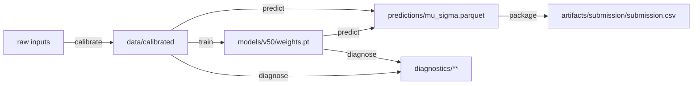

# 🛰️ `.dvc/ARCHITECTURE.md`

## SpectraMind V50 — Data Version Control (DVC) Subsystem

*Neuro-symbolic, physics-informed pipeline for the NeurIPS 2025 Ariel Data Challenge*

---

## 📌 Purpose of `.dvc/`

The `.dvc/` directory is the **control center for artifact reproducibility** in SpectraMind V50:

* **Git** controls *code + configs* → logic reproducibility.
* **DVC** controls *data + models + diagnostics* → artifact reproducibility.

Every run of the pipeline is anchored to:

1. A **Git commit hash** (immutable code + configs).
2. A **DVC snapshot** (datasets, calibration outputs, model weights, submissions, diagnostics).

🔗 See also: `docs/architecture.md` for the *full pipeline design*. Within that system, this `.dvc/` subsystem is the **Data & Artifact Layer**.

---

## 📂 Directory Layout (Authoritative)

```plaintext
.dvc/
├─ cache/            # Local blob cache (never commit)
├─ tmp/              # Ephemeral staging (safe to delete)
├─ config            # Project DVC config (committed; multi-remote ready)
├─ config.local      # Local overrides (ignored by Git)
├─ plots/            # Plot templates (loss, calibration, FFT, symbolic metrics)
├─ lock/             # Auto-generated locks (not committed)
└─ state/            # Experiments/state DB (ignored)
```

### 🔒 Commit Policy (enforced by `.gitignore` / `.gitattributes`)

* **Commit**: `.dvc/config`, `.dvcignore`, `dvc.yaml`, `*.dvc`, `.dvc/plots/**`
* **Ignore**: `.dvc/cache/**`, `.dvc/tmp/**`, `.dvc/config.local`, `.dvc/state/**`, `.dvc/lock/**`

Support files:

* `.dvc/.dvcignore.readme.md` — local ignore rationale
* `.dvc/.gitattributes.readme.md` — how Git attributes protect DVC data

---

## ⚙️ Integration with SpectraMind V50

### 1) Hydra Configs → Typer CLI → DVC Snapshots

* The Typer CLI (`spectramind …`) is the only entrypoint.
* Hydra composes configs → CLI executes stage → stage **declares** inputs/outs in `dvc.yaml`.
* DVC snapshots stage outputs → produces pointer files (`*.dvc`) or tracked `dvc.yaml` outs.

### 2) Reproducibility Loop (Glass-box)

```bash
git checkout <commit>        # exact code + config
dvc checkout                 # restore exact data/models/diagnostics versions
```

This pair **must** fully restore any historical run end-to-end.

### 3) CI/CD Enforcement

* GitHub Actions runs:

  * `dvc status -q` must be **clean** (no missing or deprecated outs).
  * `dvc doctor` sanity checks.
  * `spectramind test --fast` preflight (shapes/NaNs/paths).
* Any red status → **merge blocked**.

---

## 🧭 Data & Remote Topology

### Multi-remote Layout (S3/GCS/Azure/MinIO supported)

`dvc remote` is configured with a preferred primary and optional mirrors:

```bash
# Primary (S3)
dvc remote add -d storage s3://spectramind-v50/dvcstore
dvc remote modify storage endpointurl https://s3.amazonaws.com
dvc remote modify storage region us-east-1

# Mirror (GCS)
dvc remote add storage-gcs gs://spectramind-v50-dvc
dvc remote modify storage-gcs credentialpath ~/.config/gcloud/application_default_credentials.json

# Mirror (Azure)
dvc remote add storage-az az://spectramindv50/dvc
dvc remote modify storage-az connection_string "$AZURE_STORAGE_CONNECTION_STRING"
```

> **Secrets**: Remotes are parameterized via env vars or `config.local`. Never commit secrets. CI uses OpenID-Federation or masked secrets store.

### Cache Tuning (large files)

```bash
dvc cache dir .dvc/cache
dvc cache type "reflink,hardlink,symlink,copy"
dvc config cache.protected true      # prevent accidental local edits
```

---

## 🧱 Files, Stages & an Example `dvc.yaml`

Minimal stage pattern (all stages are CLI-driven and **never** call Python scripts directly):

```yaml
stages:
  calibrate:
    cmd: spectramind calibrate +data=ariel_nominal
    deps:
      - configs/data/ariel_nominal.yaml
      - src/spectramind/pipeline/calibrate.py
    outs:
      - data/calibrated @storage

  train:
    cmd: spectramind train +model=v50 +data=ariel_nominal
    deps:
      - data/calibrated
      - configs/model/v50.yaml
      - src/spectramind/train.py
    outs:
      - models/v50/weights.pt @storage
      - diagnostics/train/metrics.json
      - diagnostics/train/curves.json

  predict:
    cmd: spectramind predict +model=v50 +data=ariel_nominal
    deps:
      - models/v50/weights.pt
      - data/calibrated
      - src/spectramind/predict.py
    outs:
      - predictions/test/mu_sigma.parquet @storage
      - diagnostics/predict/summary.json

  submit:
    cmd: spectramind submit --src predictions/test/mu_sigma.parquet
    deps:
      - predictions/test/mu_sigma.parquet
      - src/spectramind/submit.py
    outs:
      - artifacts/submission/submission.csv
```

> `@storage` marks remote-pushed outs by default. All outs above are binary artifacts and thus **never** go to Git—only their pointers or `dvc.lock` metadata do.

---

## 🔁 Typical Workflows

### Track a dataset (ad-hoc artifact)

```bash
dvc add data/raw/fgs1_lightcurves.fits
git add data/raw/fgs1_lightcurves.fits.dvc .gitignore
git commit -m "Track raw FGS1 lightcurves with DVC"
```

### Reproduce pipeline

```bash
dvc repro
```

### Push/pull artifacts

```bash
dvc push -r storage           # upload new/changed outs
dvc pull -r storage           # fetch outs for current revision
```

### Time travel (reproduce a past leaderboard run)

```bash
git checkout tags/v50-lb-2025-08-14
dvc checkout
spectramind diagnose --dashboard report.html
```

---

## 📊 Plots & Metrics (First-class in DVC)

We ship re-usable plot templates under `.dvc/plots/`:

* Loss curves (train/val)
* Calibration reliability / coverage histograms
* FFT & autocorr diagnostics
* Symbolic violation heatmaps

**Usage**

```bash
dvc plots diff -t .dvc/plots/calibration.json \
  diagnostics/train/curves.json \
  -o outputs/plots/calibration.html
```

All rendered outputs are embedded into the generated diagnostics dashboard (`report.html`).

---

## 🧪 Experiments, Params & Compare

Use DVC Experiments to branch hyperparams without polluting Git history:

```bash
dvc exp run -S training.lr=1e-3 -S model.depth=12
dvc exp run -S training.lr=5e-4 -S model.depth=16
dvc exp show --no-pager
dvc exp gc --workspace         # clean up dangling exp data (be cautious)
```

> Keep canonical params in `configs/**` (Hydra). Use `-S` overrides for quick sweeps or wire DVC to Hydra param files via a small bridge script (optional).

---

## ✅ Acceptance Criteria (Mission-grade)

The `.dvc/` subsystem passes when:

* `git checkout && dvc checkout` **fully restores** any run.
* All pipeline stages (calibrate → train → predict → diagnose → submit) are declared in `dvc.yaml`.
* CI enforces **clean `dvc status`** and **no missing outs** before merges.
* Multi-cloud remotes (S3/GCS/Azure) are continuously synced & verified.
* **Kaggle submissions reproduce bit-identical artifacts** (same μ/σ & submission.csv for a given commit).
* **Local cache is clean**: no blobs or temp files are ever committed.

---

## 🛠 CI/CD: Guardrails & Health Checks

**Pre-merge job** (conceptual YAML):

```yaml
name: dvc-guardrails
on: [pull_request]
jobs:
  dvc-checks:
    runs-on: ubuntu-latest
    steps:
      - uses: actions/checkout@v4
        with: { fetch-depth: 0 }
      - uses: actions/setup-python@v5
        with: { python-version: "3.11" }
      - name: Install deps
        run: pip install -r requirements-ci.txt
      - name: DVC sanity
        run: |
          dvc doctor
          dvc status -q
      - name: Preflight CLI (fast mode)
        run: |
          python -m spectramind.cli selftest --fast
      - name: No-binary-in-git check
        run: |
          ! git ls-files | egrep -i '\.(npy|npz|pt|pth|ckpt|onnx|parquet|h5|hdf5|fits|zip|tar|gz)$'
```

> Add scheduled **artifact audit** to verify that all listed outs in `dvc.lock` exist in at least one remote.

---

## 🔐 Security & Compliance

* **Secrets** live only in CI secret store or local `config.local` (ignored).
* Prefer **workload identity** / OIDC over long-lived keys for clouds.
* Optional: enable **server-side encryption** and bucket policies that deny public access.
* Optional: keep **PII-free** by design—raw data never leaves approved remotes; Kaggle kernels operate offline.

---

## 🧯 Disaster Recovery & DRills

* Primary remote must be mirrored (e.g., `storage` → `storage-gcs`).
* Weekly job: `dvc fetch -r storage && dvc push -r storage-gcs` (or `dvc remote default` rotation).
* Quarterly DR drill: fresh clone → `dvc pull` → `dvc repro` minimal stage → validate checksum/metrics parity.

---

## 🧩 Interaction with Git LFS & Kaggle

* **Never** store pipeline data via Git LFS. LFS is limited to docs/media in `docs/**` and built sites.
* Kaggle notebooks read from `/kaggle/input/...` and **never** rely on internet; we export the minimal artifacts as Kaggle Datasets when needed.
* On Kaggle: generated submission (`artifacts/submission/submission.csv`) is saved locally and uploaded via Kaggle UI/API (per competition rules).

---

## 🧪 Failure Modes & How to Fix

| Symptom                            | Likely cause                 | Remedy                                             |
| ---------------------------------- | ---------------------------- | -------------------------------------------------- |
| `dvc status` shows missing outs    | Remote not pushed            | `dvc push -r storage`                              |
| `dvc checkout` restores empty dirs | Wrong commit/lock            | `git checkout <tag/sha>` then `dvc checkout`       |
| CI fails “No-binary-in-git”        | Blob committed by mistake    | `git rm` the file, `dvc add` it, re-commit pointer |
| Kaggle run diverges                | Local artifacts not exported | Publish as Kaggle Dataset; update notebook inputs  |
| Remote 403/401                     | Expired creds                | Rotate keys, prefer OIDC, update `config.local`    |

---

## 🌌 Best Practices (Operator’s Checklist)

* Always run via **CLI (`spectramind …`)**; avoid direct scripts.
* Use **Hydra overrides** (`+data=… +model=…`)—never hardcode paths.
* Push artifacts after green run: `dvc push`.
* Keep `dvc.yaml` small, composable; one purpose per stage.
* Use **`dvc exp`** for quick sweeps; promote to Git tag when blessed.
* Keep `.dvc/plots/**` light and reusable; render plots into reports, not Git.

---

## 🗺️ Data Lineage (Mermaid)



Each node (A..F) is a DVC-tracked out; edges are **declared** as `deps/outs` in `dvc.yaml`.

---

## ✅ Final Alignment with Root Architecture

* **Glass-box reproducibility**: `git checkout && dvc checkout` is the law.
* **CLI-first**: All compute routes through `spectramind` subcommands.
* **Config-as-code**: Hydra controls; DVC records; CI enforces.
* **Artifact integrity**: no blobs in Git, multi-remote DR, audit trails in `dvc.lock`.

This subsystem guarantees the Data & Artifact Layer of SpectraMind V50 remains **fully transparent, scientifically verifiable, and Kaggle/CI reproducible**.
