# ⚙️ GitHub Actions Workflows — SpectraMind V50

This folder contains all **GitHub Actions workflows** that power CI/CD, diagnostics, reproducibility checks, and guarded Kaggle submissions for **SpectraMind V50** (NeurIPS 2025 Ariel Data Challenge).

Workflows are engineered for:

* **NASA-grade reproducibility** — Hydra configs, DVC-tracked artifacts, MLflow/JSON logs.
* **Terminal-first integrity** — the **`spectramind`** CLI is the *single entrypoint* for every job.
* **Security & auditability** — run-hash manifests, artifact retention, SBOM/image scans, least-privilege.
* **End-to-end automation** — calibration → training → diagnostics → packaging → (guarded) submission.

---

## 📂 Workflow Index

### ✅ CI / Testing / Quality

* `ci.yml` — Core CI build & smoke tests.
* `tests.yml` — Unit, integration, and regression tests.
* `lint.yml` — Style & static checks (`ruff`, `black --check`, `isort --check-only`, optional `mypy`).
* `bandit.yml` — Security static analysis.
* `codeql.yml` — GitHub Advanced Security code scanning.
* `pip-audit.yml` — Dependency vulnerability scan.

### 🔬 Pipeline & Diagnostics

* `calibration-ci.yml` — Verifies calibration stage on sample inputs.
* `nightly-e2e.yml` — Nightly mini end-to-end run (deterministic).
* `diagnostics.yml` — FFT/UMAP/SHAP/GLL/symbolic diagnostics; exports JSON/PNG/HTML.
* `ci-dashboard.yml` — Bundles and publishes the diagnostics dashboard.
* `hash-check.yml` — Validates `run_hash_summary_v50.json` / manifests.
* `submission.yml` — Build & validate the Kaggle submission ZIP.
* `kaggle-submit.yml` — **Manual** guarded submission to Kaggle (review + env gate).

### 📦 Packaging, Docs & Releases

* `docs.yml` — Build docs (MkDocs/Sphinx).
* `pages.yml` — Deploy docs/diagnostics to GitHub Pages.
* `release.yml` — Tagging, changelog, and artifact upload (submission, SBOM, dashboard snapshot).

### 🛡️ Containers, SBOM & Security

* `docker-trivy.yml` — Container image scanning.
* `hadolint.yml` — Dockerfile lint.
* `sbom-refresh.yml` — Generate Software Bill of Materials (CycloneDX/SPDX/Syft).

### 🧹 Housekeeping & Automation

* `artifact-sweeper.yml` — Cleanup old CI artifacts per policy.
* `branch-protection.yml` — Ensure rules remain enforced.
* `dependabot-auto-merge.yml` — Auto-merge *only* after required checks pass.
* `labeler.yml` — Auto-label PRs.
* `pr-title-lint.yml` — Enforce Conventional Commits.
* `stale.yml` — Triage dormant PRs/issues.

### 📊 Benchmarking & Visualization

* `benchmark.yml` — Perf regression detection; comments deltas on PRs.
* `mermaid-export.yml` — Renders architecture/DAG Mermaid diagrams for docs.

---

## 🧭 Triggers & Flow (at a glance)

```mermaid
flowchart TD
  subgraph PR["Pull Request → main"]
    A[ci.yml] --> B[lint.yml]
    A --> C[bandit.yml]
    A --> D[tests.yml]
    A --> E[hash-check.yml]
    B --> F{All required checks pass?}
    C --> F
    D --> F
    E --> F
    F --> G[Merge Allowed]
  end

  subgraph Nightly["Scheduled (cron)"]
    H[nightly-e2e.yml] --> I[diagnostics.yml]
    I --> J[ci-dashboard.yml]
    J --> K[pages.yml]
    H --> L[benchmark.yml]
    H --> M[sbom-refresh.yml]
    H --> N[docker-trivy.yml]
  end

  subgraph Manual["workflow_dispatch (Maintainer)"]
    O[submission.yml] --> P[kaggle-submit.yml]
    P -. guarded env .-> Q[(Kaggle)]
  end
```



**Routing summary**

* `pull_request` → `ci.yml`, `tests.yml`, `lint.yml`, `bandit.yml`, `hash-check.yml`
* `push` to `main` → `ci.yml`, plus `docs.yml`/`ci-dashboard.yml` if relevant paths changed
* `schedule` → `nightly-e2e.yml`, `benchmark.yml`, `sbom-refresh.yml`, `docker-trivy.yml`
* `workflow_dispatch` → `submission.yml`, `kaggle-submit.yml`, `diagnostics.yml`

---

## 🔐 Best Practices (applies to all workflows)

```yaml
permissions:
  contents: read
  actions: read
  checks: read
  security-events: write   # only when used (CodeQL/Trivy)
  id-token: write          # only when using OIDC (cloud/registry)

concurrency:
  group: ${{ github.workflow }}-${{ github.ref }}
  cancel-in-progress: true
```

* **Least privilege** by default; elevate only in deploy/publish jobs.
* **Guarded environments** for `staging` (Pages), `release` (tags), and `kaggle` (submissions).
* **Secrets** available *only* to jobs that publish/submit; never to PR jobs.

---

## 🧩 Common Setup Pattern

Use a consistent setup across workflows to speed builds and reduce flake:

```yaml
- uses: actions/checkout@v4

- uses: actions/setup-python@v5
  with: { python-version: '3.11' }

- uses: actions/cache@v4
  with:
    path: |
      ~/.cache/pip
      .venv
    key: ${{ runner.os }}-py311-${{ hashFiles('**/poetry.lock', '**/requirements*.txt') }}
    restore-keys: |
      ${{ runner.os }}-py311-

- name: Install
  shell: bash
  run: |
    python -m venv .venv
    source .venv/bin/activate
    pip install -U pip
    if [ -f poetry.lock ]; then
      pip install poetry && poetry install --no-interaction
    else
      pip install -r requirements.txt
    fi

- name: Show CLI
  run: |
    source .venv/bin/activate
    spectramind --version || true
```

**Matrix example (when needed)**

```yaml
strategy:
  fail-fast: false
  matrix:
    os: [ubuntu-latest]
    py: ['3.10', '3.11']
runs-on: ${{ matrix.os }}
steps:
  - uses: actions/setup-python@v5
    with: { python-version: ${{ matrix.py }} }
```

**Artifact upload convention**

```yaml
- uses: actions/upload-artifact@v4
  with:
    name: logs-${{ github.sha }}
    path: |
      logs/**
      outputs/reports/**
      outputs/diagnostics/**
    retention-days: 14
```

---

## 🧾 Required PR Checks (branch protection)

Enable these checks on PR → `main`:

* `ci / build`
* `tests / unit+integration`
* `lint / style`
* `security / bandit`
* `hash-check / manifests`

**Optional (recommended):** require signed commits; require linear history; dismiss stale reviews on new commits.

---

## 🧰 Hash & Reproducibility Guard

* The pipeline writes a **`run_hash_summary_v50.json`** and related manifests (config hash, data version, CLI version).
* `hash-check.yml` fails if the summary is missing/outdated, or if paths drift.
* Nightly runs re-compute and publish diagnostics; `pages.yml` hosts the dashboard as evidence.

---

## 🧨 Troubleshooting (quick guide)

* **Cache miss / slow runs** → ensure Python version matches cache key; pin lockfile; add `restore-keys`.
* **Hash check fails** → re-generate `run_hash_summary_v50.json`; confirm included paths.
* **Pages deploy fails** → artifact name mismatch; environment permission; check `pages.yml` inputs.
* **Kaggle submit blocked** → secrets must be scoped to `kaggle` env; reviewer approval required.
* **CodeQL timeouts** → move to nightly or reduce matrix; exclude generated code.

---

## 🧱 Retention & Cost Controls

* **Artifacts**: logs/diagnostics 14 days; release artifacts 90 days.
* **Pages**: keep last successful build.
* **Cache**: keyed by lock hash; multi-key restore for resilience.
* **Nightlies**: compress outputs; prefer JSON over CSV.

---

## ⚠️ Misplaced Files

These belong in `.github/` (not in `workflows/`):

* `CONTRIBUTING.md` → `.github/CONTRIBUTING.md`
* `SECURITY.md` → `.github/SECURITY.md`
* `FUNDING.yml` → `.github/FUNDING.yml`
* `PULL_REQUEST_TEMPLATE.md` → `.github/PULL_REQUEST_TEMPLATE.md`

Keeping only workflows here ensures everything is runnable by GitHub Actions.

---

## 🔒 Kaggle Env Guardrails

* `submission.yml` only **packages & validates** the ZIP; no network.
* `kaggle-submit.yml` requires:

  * `environment: kaggle`
  * Reviewer approval (environment protection)
  * `KAGGLE_USERNAME`, `KAGGLE_KEY` secrets
  * Explicit **dataset/competition target** inputs
* All submission logs redact secrets; upload only the final ZIP + validation report.

---

## 🧪 MCP-Style Evidence

* Every pipeline run produces **config snapshots**, **CLI banners**, **metrics JSON**, and **plots** (DVC templates under `.dvc/plots/**`).
* Nightly dashboards compile these into `report.html`; published via Pages for audit.
* Re-running with the same commit + config must reproduce the same submission (bit-identical within floating-point tolerance).

---

## 🔁 Migration Checklist

* New workflow? Copy **permissions** and **concurrency** blocks; re-use the common setup.
* Renaming? Keep **kebab-case** and update required checks in branch protection.
* Secrets rotation? Bind to the **environment**, *not* repo-wide `secrets.*` in general jobs.
* Reusable logic? Prefer `workflow_call` and local composite actions.

---
