# 🚀 SpectraMind V50 — NeurIPS 2025 Ariel Data Challenge

**ARCHITECTURE.md (root)**

> Neuro-symbolic, physics-informed pipeline for ESA Ariel’s simulated data.
> Design pillars: **NASA-grade reproducibility**, **CLI-first automation**, **Hydra configs**, **DVC-tracked data**, **symbolic physics constraints**, **diagnostics by default**.

---

## 1) System Overview

SpectraMind V50 predicts **exoplanet transmission spectra** — mean **μ** and uncertainty **σ** over **283 wavelength bins** — from raw **FGS1 photometry** and **AIRS spectroscopy**. The pipeline is end-to-end automated via a Typer CLI (`spectramind …`) and expressed entirely in Hydra-composable configs. Every run writes artifacts, hashes, and logs for deterministic reproduction.

### 1.1 High-Level Dataflow

```mermaid
flowchart TD
  U[User] -->|spectramind ...| CLI[Typer CLI]
  CLI --> CFG["Hydra Compose<br/>configs/* + overrides"]
  CFG --> ORCH["Pipeline Orchestrator"]
  ORCH --> CAL["Calibration<br/>FGS1/AIRS preprocessing"]
  CAL --> ENC["Encoders<br/>FGS1 → Mamba SSM<br/>AIRS → GNN"]
  ENC --> DEC["Decoders → μ and σ"]
  DEC --> CALIB["Uncertainty Calibration<br/>Temp scaling · COREL · Conformal"]
  CALIB --> DIAG["Diagnostics & Explainability<br/>GLL · FFT · UMAP · t-SNE · SHAP · Symbolic"]
  DIAG --> BUNDLE["Submission Bundler<br/>selftest · manifest · zip"]
  BUNDLE --> KAG["Kaggle Leaderboard"]

  %% artifact side rails
  CFG -. "logs / overrides" .-> ART["Artifacts<br/>outputs/YYYY-MM-DD/HH-MM-SS"]
  CAL -. "DVC data" .-> ART
  ENC -. "checkpoints / metrics" .-> ART
  DIAG -. "HTML / PNG / JSON" .-> ART
  BUNDLE -. "submission.zip" .-> ART
```



---

## 2) Core Components

### 2.1 CLI (Typer)

* Single entry (`spectramind`) with subcommands: `train`, `predict`, `calibrate`, `diagnose`, `submit`, `test`, `ablate`, `analyze-log`, `corel-train`.
* Flags: `--dry-run`, `--debug`, `--config-path`, `--version`.
* All invocations append to `v50_debug_log.md` and write a structured JSONL event stream.

### 2.2 Config (Hydra)

* Layered YAML groups: `data/`, `model/`, `train/`, `diagnostics/`, `submit/`, `profiles/`.
* Deterministic composition via defaults list; overrides allowed on CLI (e.g., `model.v50.encoder.fgs1.mamba.d_state=64`).
* Run hashes persisted (`run_hash_summary_v50.json`).

### 2.3 Data Management (DVC + lakeFS optional)

* Raw → calibrated light curves are **never** checked into Git.
* DVC tracks inputs, intermediates, and model checkpoints; remote can be S3/GCS/SSH.
* Hash lineage printed in dashboard and logs.

### 2.4 Modeling

* **FGS1**: Mamba **State-Space Model** for long photometric sequences; jitter augmentation and transit-shape priors.
* **AIRS**: Graph Neural Network with edges for **wavelength proximity**, **molecule regions**, **detector segments**; optional edge features and positional encodings.
* **Decoders**: dual-head for μ and σ with physics-aware regularization and symbolic fusion (smoothness, non-negativity, asymmetry, molecular priors).
* **Loss**: Gaussian log-likelihood (GLL) + FFT smoothness + asymmetry penalty + symbolic terms; curriculum-stage toggles.

### 2.5 Uncertainty Calibration

* Temperature scaling, **COREL** bin-wise conformalization, instance-level tuning; coverage reports and heatmaps.

### 2.6 Diagnostics & Explainability

* **GLL** heatmaps, **FFT**/autocorr, **UMAP/t-SNE** latents, **SHAP overlays**, **symbolic violation** tables, calibration checks.
* Unified **HTML dashboard** with versioned exports (`diagnostic_report_vN.html`).

### 2.7 CI/CD

* GitHub Actions: unit + CLI tests, security scans, docs build, dashboard artifacts, optional Kaggle packaging job.
* Badges: CI, Tests, Coverage, Container.

---

## 3) Config Composition & Overrides

```mermaid
flowchart LR
  R[Root Defaults] --> D1[data/nominal]
  R --> D2[model/v50]
  R --> D3[train/standard]
  R --> D4[diagnostics/default]
  R --> D5[submit/kaggle]
  subgraph Hydra Composition
    D1 --> H[(Hydra)]
    D2 --> H
    D3 --> H
    D4 --> H
    D5 --> H
  end
  UO[CLI Overrides\n(e.g., optimizer.lr=1e-3)] --> H
  H --> RC[Resolved Config\n.frozen yaml + hash]
```

**Rules**

* All parameters have explicit defaults.
* Overrides are logged verbatim and saved with the resolved config file for replay.
* `--multirun` used for ablations integrates with the ablation engine and leaderboard.

---

## 4) Reproducibility Stack


**Guarantees**

* Every artifact links back to a **config hash**, **git commit**, **DVC rev**, and **env lock**.
* **Self-test** validates shapes, paths, configs, and submission format before long jobs.

---

## 5) Training & Ablation

```mermaid
flowchart TD
  A0[spectramind ablate] --> A1[Hydra Multirun]
  A1 --> A2[Ablation Engine\n(grid/random/smart)]
  A2 --> A3[Runner\ntrain → diagnose]
  A3 --> A4[Collector\nmetrics.json]
  A4 --> A5[Leaderboard\nmd/html/csv]
  A5 -->|top-N| A6[Bundle Artifacts\nzip]
```

**Metrics included**: GLL, RMSE/MAE (dev), entropy, violation norms, FFT power, coverage deltas, runtime.

---

## 6) Directory Layout (Top Level)

```
.
├─ configs/              # Hydra groups: data/, model/, train/, diagnostics/, submit/, profiles/
├─ src/                  # Pipeline code: data/, models/, calibrate/, cli/, diagnostics/, utils/
├─ tests/                # Unit + CLI integration tests; fast and deep modes
├─ docs/                 # This file, READMEs, diagrams, GUI/Server docs
├─ artifacts/            # Versioned outputs: html/png/json, logs, leaderboards
├─ .github/workflows/    # CI (lint/test/sbom/build/docs/release)
├─ pyproject.toml        # Poetry; pinned deps; tools config
├─ dvc.yaml              # Optional DVC stages for calibration/cache
└─ v50_debug_log.md      # CLI call log (human-readable), plus events.jsonl
```

---

## 7) Command Matrix

| Purpose      | Command                                      | Notes                                                                 |
| ------------ | -------------------------------------------- | --------------------------------------------------------------------- |
| Smoke check  | `spectramind test`                           | Fast/Deep modes; validates paths, shapes, config, submission template |
| Calibration  | `spectramind calibrate data=nominal`         | Writes DVC-tracked calibrated cubes and logs                          |
| Train        | `spectramind train model=v50 trainer.gpus=1` | AMP, cosine LR, curriculum stages                                     |
| Predict      | `spectramind predict ckpt=… outputs.dir=…`   | μ, σ tensors + CSV/NPZ export                                         |
| Diagnose     | `spectramind diagnose dashboard --open`      | Generates HTML report with UMAP/t-SNE/SHAP/FFT/calibration            |
| COREL        | `spectramind corel-train`                    | Bin-wise conformal σ calibration and coverage plots                   |
| Ablate       | `spectramind ablate +grid=…`                 | Multirun with leaderboard (HTML/MD/CSV)                               |
| Submit       | `spectramind submit --selftest`              | Validates, packs `submission.zip`, writes manifest                    |
| Log Analysis | `spectramind analyze-log --md --csv`         | Summarizes `v50_debug_log.md` with hash groups                        |

---

## 8) Artifacts & Manifests

* `outputs/<date>/<time>/`

  * `resolved_config.yaml`, `run_hash_summary_v50.json`
  * `metrics.json`, `gll_heatmap.png`, `fft_*`, `umap.html`, `tsne.html`
  * `shap_overlay/*.png|json`, `symbolic/*.json|html`
  * `calibration/*.png|json`, `corel/*.csv`
  * `diagnostic_report_vN.html` (versioned; embeds links to all artifacts)
  * `submission/manifest.json`, `submission.zip`
* Global logs: `v50_debug_log.md`, `events.jsonl`

---

## 9) CI/CD Workflow (Simplified)


**Jobs**

* **Lint**: black/ruff/mypy
* **Tests**: pytest (fast), CLI smoke, optional GPU mock
* **Security**: pip-audit, trivy, CodeQL (repo-wide)
* **SBOM**: CycloneDX/SPDX via Syft/Grype
* **Docs/Diagrams**: Mermaid render check
* **Package**: Poetry build, Docker image, GHCR publish
* **Release**: tag, changelog, assets (HTML dashboards optional)

---

## 10) Symbolic Logic & Physics Constraints

* **Smoothness / TV / FFT** regularization in wavelength space.
* **Non-negativity** and **molecular coherence** constraints by region.
* **Photonic alignment**: FGS1 transit shape informs AIRS alignment and data augmentation.
* Violations are scored, visualized, and fed into targeted retraining and calibration.

---

## 11) Security, Ethics, and Governance

* No private data; model/dataset licenses respected.
* Reproducibility and audit trails mandated (config, hash, DVC lineage).
* **Deterministic seeds** and run metadata stamped on every artifact.
* Optional role-based API wrapper for GUI orchestration; **no analytics in server**.

---

## 12) Troubleshooting (Quick)

* **CI fails on diagrams**: ensure Mermaid nodes avoid HTML tags; use `\n` for newlines.
* **Hydra not composing**: check `defaults:` order and group names; validate with `--cfg job --package _global_`.
* **DVC missing files**: `dvc pull` with proper remote; verify `.dvc/config`.
* **Submission invalid**: run `spectramind submit --selftest` and inspect the emitted `manifest.json`.
* **Dashboard empty**: confirm diagnostics enabled and paths in `generate_html_report.py`.

---

## 13) Glossary

* **FGS1**: Fine Guidance Sensor 1 photometry time series.
* **AIRS**: Ariel InfraRed Spectrometer frames (wavelength × time).
* **μ, σ**: Predicted mean spectrum and predictive uncertainty per bin.
* **GLL**: Gaussian Log-Likelihood (primary leaderboard metric).
* **COREL**: Conformal calibration method for bin-wise σ coverage.

---

## 14) Getting Started (TL;DR)

```bash
# 1) Self-test
spectramind test

# 2) Calibrate (DVC-tracked)
spectramind calibrate data=nominal

# 3) Train
spectramind train model=v50 optimizer=adamw trainer.gpus=1

# 4) Diagnose + dashboard
spectramind diagnose dashboard --open

# 5) Package submission
spectramind submit --selftest
```

All operations are reproducible with the emitted **config hash**, **git commit**, **DVC revision**, and **env lock**.
