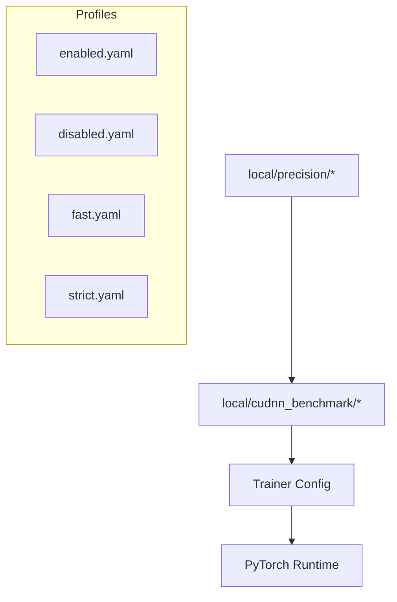

Here’s a **clean drop** of the upgraded `configs/local/cudnn_benchmark/ARCHITECTURE.md` you can copy-paste directly:

````markdown
# 📂 `configs/local/cudnn_benchmark/` — cuDNN Autotune Policies

---

## 0) Purpose & Scope

This config group isolates **cuDNN autotuner behavior** from precision and device configs.  
It controls whether PyTorch’s cuDNN backend dynamically benchmarks multiple convolution kernels  
to pick the fastest implementation, or locks into a fixed deterministic kernel.  

This separation enables **runtime portability**:  
- **Leaderboards / throughput** → autotune enabled  
- **CI / audits / ablations** → autotune disabled (strict reproducibility)

---

## 1) Design Philosophy

- **Hydra-first modularity**  
  Each policy is a standalone YAML (`enabled.yaml`, `disabled.yaml`, etc.).  
  Users compose them via `defaults` in the main config.

- **Audit vs. Speed tradeoff**  
  *Aggressive autotune* may yield 5–20% speedup on static workloads,  
  but can break reproducibility (different kernels across runs/hardware).  
  *Strict mode* ensures determinism but is slower.

- **Layered controls**  
  Combine with `local/precision/*` for full numerical control:  
  - `precision: 16-mixed` + `cudnn_benchmark: true` → fastest Kaggle runs  
  - `precision: 32` + `cudnn_benchmark: false` → strict audits

---

## 2) Available Profiles

| File                  | Policy                        | Use-case |
|-----------------------|-------------------------------|----------|
| `enabled.yaml`        | cuDNN autotuner **enabled**   | High-throughput when shapes are consistent |
| `disabled.yaml`       | cuDNN autotuner **disabled**  | Debugging, reproducibility |
| `fast.yaml`           | Autotune **aggressive**       | Kaggle leaderboard runs, fixed batch/shape |
| `strict.yaml`         | Autotune **off** + determinism | CI, ablations, audits |

---

## 3) Usage

In `configs/train.yaml`:

```yaml
defaults:
  - local/cudnn_benchmark: fast
  - local/precision: 16_mixed
````

Or via CLI override:

```bash
spectramind train local/cudnn_benchmark=strict
```

---

## 4) Rule of Thumb

* **Kaggle / Leaderboard** → `fast` (max throughput)
* **HPC static workloads** → `enabled`
* **CI pipelines** → `disabled`
* **Audits / publications** → `strict` (+ precision/strict\_deterministic)

---

## 5) Integration Notes

* **PyTorch settings** affected:

  * `torch.backends.cudnn.benchmark`
  * `torch.use_deterministic_algorithms` (when paired with strict)

* **Reproducibility**: Combine with:

  * `deterministic: true`
  * `PYTHONHASHSEED=0`
  * `torch.manual_seed` / `numpy.random.seed`

* **Performance caveats**:

  * Autotune is most effective when input tensor shapes do **not change**.
  * For highly variable shapes (dynamic batches), benefits diminish.

---

## 6) Visual Overview



---

📌 **Summary**
This folder cleanly separates **autotune control knobs** from precision/determinism settings.
It supports both **max-speed Kaggle leaderboard submissions** and **mission-grade reproducibility audits**,
with Hydra overrides providing flexible composition.

```

