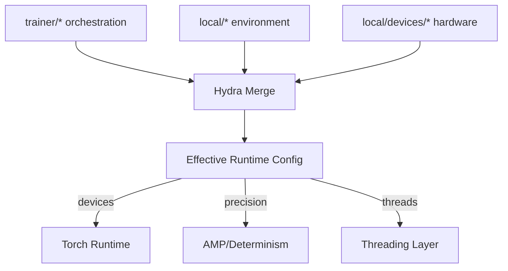

Here’s a complete `configs/local/devices/architecture.md` written in the same **SpectraMind V50 mission-grade style** we’ve used for the rest of the config docs. It explains the purpose, scope, structure, and usage of device profiles:

```markdown
# 📂 `configs/local/devices/` — Device Profiles Architecture

---

## 0) Purpose & Scope

This folder defines **device-specific Hydra profiles** for SpectraMind V50.  
These configs encapsulate **hardware and runtime constraints** (CPU, single-GPU, multi-GPU, Kaggle runtimes, HPC clusters), while leaving **execution strategy** (DDP, logging cadence, gradient accumulation) in the `trainer/*` profiles.

Together:
- **`local/devices/*` → hardware knobs** (devices, precision, determinism, threads, seeds, walltime)
- **`trainer/*` → orchestration knobs** (DDP vs DP, logging, scheduling)

This clean separation ensures:
- Portability between **CPU, workstation, Kaggle, and HPC**
- Auditability & reproducibility (every run’s hardware context is logged)
- Modularity (swap device configs without changing code)

---

## 1) Directory Layout

```

configs/local/devices/
├─ cpu.yaml         # force CPU-only mode (CI, portability)
├─ single\_gpu.yaml  # default local single-GPU dev
├─ multi\_gpu.yaml   # 2–4 GPU local workstation runs
├─ kaggle\_t4.yaml   # Kaggle default GPU (16 GB T4)
├─ kaggle\_a10.yaml  # Kaggle upgraded GPU (24 GB A10, Ampere)
├─ kaggle\_l4.yaml   # Kaggle experimental GPU (24 GB L4, Ada)
├─ hpc\_a100.yaml    # HPC profile for 4–8 A100 GPUs (DGX, SLURM)
└─ architecture.md  # (this file)

````

---

## 2) Design Philosophy

- **Hydra-first modularity**  
  Each profile is standalone and composable via Hydra `defaults:`.  
  Example:
  ```yaml
  defaults:
    - trainer: multi_gpu
    - local: hpc
    - local/devices: hpc_a100
````

* **Reproducibility-first**
  Every profile sets seeds (`seed`, `numpy_seed`, `pythonhashseed`) and determinism flags by default. Kaggle profiles cap walltime at ≤ 9h.

* **Minimal duplication**
  Shared knobs (precision, deterministic, cudnn\_benchmark, seeds) appear in all profiles, so they remain swappable without runtime surprises.

* **Portability-aware**
  Profiles mirror real execution environments:

  * `cpu.yaml`: CI pipelines, portability checks
  * `single_gpu.yaml`: everyday dev with CUDA:0
  * `multi_gpu.yaml`: local rigs with 2–4 GPUs (DDP)
  * `kaggle_*`: Kaggle runtimes with GPU quotas
  * `hpc_a100.yaml`: large-scale cluster runs (8×A100)

---

## 3) Key Fields

| Field                 | Purpose                                   | Typical Values                 |
| --------------------- | ----------------------------------------- | ------------------------------ |
| `devices`             | Number/type of accelerators               | `"cpu"`, `1`, `4`, `"mps"`     |
| `precision`           | AMP/precision policy                      | `16-mixed`, `bf16-mixed`, `32` |
| `deterministic`       | Enforce deterministic kernels             | `true` / `false`               |
| `cudnn_benchmark`     | cuDNN autotune for conv layers            | `true` / `false`               |
| `seed` / `numpy_seed` | RNG reproducibility                       | `1337`, `2025`                 |
| `timeout_hours`       | Walltime guard (esp. Kaggle, HPC)         | `9`, `30`, `null`              |
| `max_threads`         | Cap OpenMP threads                        | `2`, `8`, `16`                 |
| `gradient_clip_val`   | Protect from exploding grads              | `1.0`                          |
| `log_device_info`     | Log device metadata on startup            | `true`                         |
| `profile_runtime`     | Enable per-op profiling (for diagnostics) | `false` / `true`               |

---

## 4) Common CLI Recipes

```bash
# CPU-only smoke test
spectramind train local=default local/devices=cpu

# Local dev on single GPU (CUDA:0)
spectramind train local=default local/devices=single_gpu

# Multi-GPU workstation (4×RTX 3090)
spectramind train trainer=multi_gpu local=hpc local/devices=multi_gpu devices=4

# Kaggle T4 run (competition submission)
spectramind train trainer=kaggle_safe local=default local/devices=kaggle_t4

# Kaggle A10 run
spectramind train trainer=kaggle_safe local=default local/devices=kaggle_a10

# Kaggle L4 run (experimental Ada GPU)
spectramind train trainer=kaggle_safe local=default local/devices=kaggle_l4

# HPC cluster (8×A100 with bf16)
spectramind train trainer=multi_gpu local=hpc local/devices=hpc_a100 devices=8
```

---

## 5) Reproducibility Guardrails

All device configs:

* Set **global seeds** (`torch`, `numpy`, `pythonhashseed`)
* Use **deterministic kernels** unless explicitly overridden (`hpc_a100` for speed)
* Log **device metadata** (GPU name, memory, driver, CUDA version)
* Enforce **runtime guardrails** (walltime ≤ 9h in Kaggle, ≤30m elastic timeout in HPC)
* Clip gradients (`gradient_clip_val=1.0`) by default

---

## 6) Extension Patterns

* Add `kaggle_h100.yaml` (future-proof for Hopper GPUs, bf16/fp8 AMP).
* Add `workstation_3090.yaml` or `lab_4090.yaml` for site-specific overrides.
* Add `cloud_v100.yaml` for cloud TPU/GPU environments.

---

## 7) Visual Overview



---

## 8) Summary

`configs/local/devices/` encapsulates all **hardware-specific runtime choices** for SpectraMind V50.
By separating devices from trainers, the pipeline remains **portable, reproducible, and competition-safe** across:

* CI (CPU-only)
* Local workstation dev (single- and multi-GPU)
* Kaggle competition runs (T4, A10, L4)
* HPC clusters (A100 DGX/SLURM)

**👉 Rule of thumb:** *Pick `trainer/*` for orchestration, `local/*` for environment, `local/devices/*` for hardware.*

```
