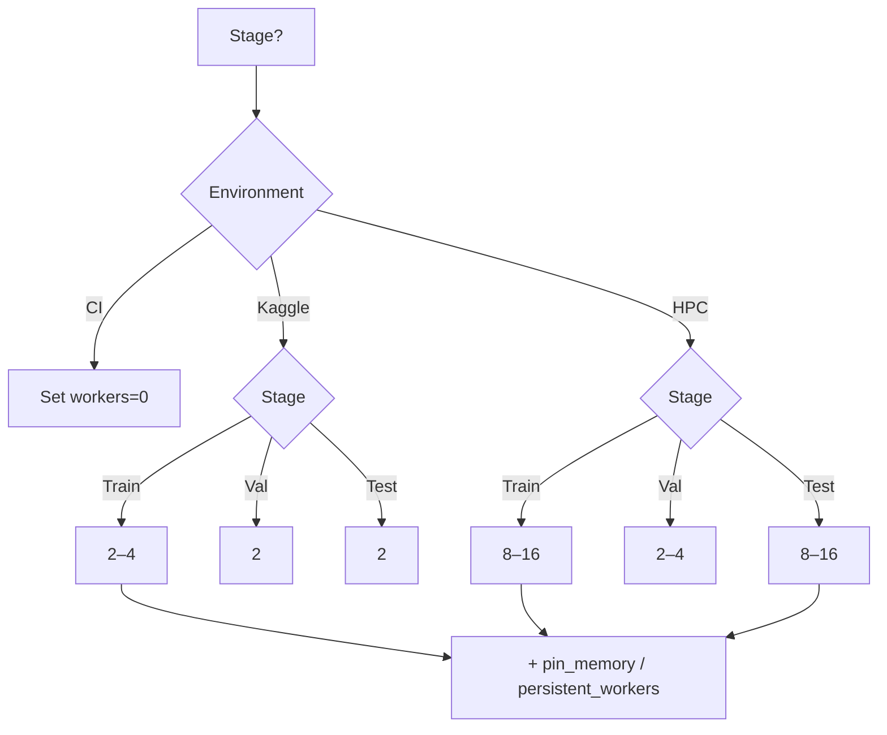
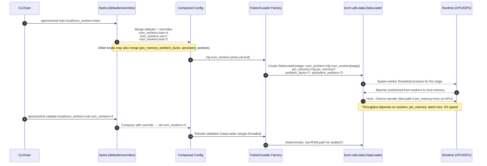

Here’s the **clean, updated `ARCHITECTURE.md`** for `/configs/local/num_workers/` in a copy-paste box, written in the same MCP-aligned style as your other subsystem docs:

````markdown
# 📂 `configs/local/num_workers/` — DataLoader Worker Policies

---

## 🎯 Purpose

This config group isolates **PyTorch DataLoader worker counts** for each pipeline stage:

- `train.yaml` → training loaders  
- `val.yaml`   → validation loaders  
- `test.yaml`  → inference / submission loaders  

Why separate? Training, validation, and inference have **different priorities** (throughput vs. determinism vs. stability). Splitting them enables Hydra-safe overrides without touching code.

---

## 🏗️ Design

- **Hydra-first**: one YAML per stage; composed via `defaults` in top-level configs.  
- **Stage isolation**: `train/val/test` configs don’t leak into each other.  
- **Environment-aware**: each file documents Kaggle, HPC, and CI guidance.  

Example (`configs/train.yaml`):

```yaml
defaults:
  - local/num_workers: train
  - local/num_workers@val_loader: val
  - local/num_workers@test_loader: test
```

CLI usage:

```bash
spectramind train local/num_workers=train
spectramind validate local/num_workers=val
spectramind predict local/num_workers=test
```

---

## 📜 Profiles

### `train.yaml`
- **Default**: `num_workers: 4`  
- **Intent**: overlap CPU preprocessing with GPU compute.  
- **Notes**:  
  - CI/audits → `0` (reproducible order)  
  - Kaggle → `2–4` (safe under 9h limit)  
  - HPC → `8–16` (if cores allow)

### `val.yaml`
- **Default**: `num_workers: 2`  
- **Intent**: checkpoint gating; prioritize stability.  
- **Notes**:  
  - CI → `0`  
  - Kaggle → `2`  
  - HPC → `2–4` if large val set

### `test.yaml`
- **Default**: `num_workers: 2`  
- **Intent**: read-once inference; Kaggle submission sweeps.  
- **Notes**:  
  - CI → `0`  
  - Kaggle → `2`  
  - HPC sweeps → `8–16`

Optional extras (supported by many trainers):
```yaml
prefetch_factor: 2
persistent_workers: true
pin_memory: true
```

---

## 📊 Rule-of-Thumb Matrix

| Runtime        | Train          | Val             | Test            |
|----------------|----------------|-----------------|-----------------|
| **CI/Audits**  | 0              | 0               | 0               |
| **Kaggle**     | 2–4            | 2               | 2               |
| **HPC**        | 8–16           | 2–4             | 8–16            |

**Guidelines**
- Kaggle OOM/watchdog? → lower workers.  
- GPU underutilized on HPC? → raise workers, enable `pin_memory`.  
- For papers/audits → force all = 0.

---

## 🗺️ Decision Flow (Mermaid)



---

## 🔧 Tuning Checklist

1. Watch GPU utilization (<70% → raise workers).  
2. Guardrails on Kaggle → 2–4 train, 2 val/test.  
3. HPC large nodes → start at 8, scale up.  
4. CI/audits → set all = 0, log worker counts.  
5. Use `prefetch_factor` & `persistent_workers` to cut loader churn.

---

## 🧪 CI / Reproducibility Policy

- All CI jobs run with `num_workers=0` across train/val/test.  
- Worker settings are logged into `v50_debug_log.md` and run manifests for traceability.  

---

## 🚀 Quick Presets

- **Kaggle safe** → Train 4 • Val 2 • Test 2  
- **HPC max-throughput** → Train 12–16 • Val 2–4 • Test 12–16  
- **Audit/CI strict** → Train 0 • Val 0 • Test 0  

---

## 📎 Examples

**Kaggle training run**  
```bash
spectramind train local/num_workers=train
```

**CI validation job**  
```bash
spectramind validate local/num_workers=val num_workers=0
```

**HPC inference sweep**  
```bash
spectramind predict local/num_workers=test pin_memory=true
```
````
---

## 🔄 Sequence Diagram — Hydra → DataLoader → Runtime



### What this clarifies

- **Hydra is the single source of truth**: the selected profile(s) (`train/val/test`) determine worker counts per stage.
- **Factory pattern**: your trainer/loader factory reads the composed config and constructs each `DataLoader` with the right knobs.
- **Runtime effects**:
  - `num_workers>0` → parallel disk I/O / preprocessing, better GPU feed.
  - `pin_memory=true` (GPU) → faster host→device copies.
  - `num_workers=0` → deterministic ordering, minimal RAM, ideal for CI/audits.

> Tip: Log the *effective* `num_workers`, `pin_memory`, `prefetch_factor`, and `persistent_workers` per stage into `v50_debug_log.md` on startup so runs are fully traceable.
