````markdown
# 📂 `configs/local/num_workers/` — DataLoader Worker Policies

---

## 🎯 Purpose

This config group isolates **DataLoader worker counts** for each pipeline phase:
- `train.yaml` — training loaders
- `val.yaml` — validation loaders
- `test.yaml` — inference/submission loaders

Why separate? Training, validation, and inference have **different priorities** (throughput vs. determinism vs. stability). Keeping them split lets you tune each independently and swap via Hydra without touching code.

---

## 🏗️ Design

- **Hydra-first**: one YAML per stage; compose in `defaults` or via CLI.
- **Stage isolation**: `train/val/test` worker counts don’t leak into each other.
- **Environment-aware**: values chosen per runtime (Kaggle, HPC, CI).

Example (in `configs/train.yaml`):
```yaml
defaults:
  - local/num_workers: train
  - local/num_workers@val_loader: val
  - local/num_workers@test_loader: test
````

Or via CLI:

```bash
spectramind train local/num_workers=train
spectramind validate local/num_workers=val
spectramind predict local/num_workers=test
```

---

## 📜 Profiles (per-file intent)

### `train.yaml`

* **Default**: `num_workers: 4`
* **Use**: overlap CPU preprocessing with GPU compute during training.
* **Notes**: 0 for strict CI/audit runs; 2–4 for Kaggle; 8–16 for HPC if cores allow.

### `val.yaml`

* **Default**: `num_workers: 2`
* **Use**: checkpoint gating; favor determinism/stability over speed.
* **Notes**: 0 in CI; 2 is safe for Kaggle/HPC; cautiously 4 on large val sets.

### `test.yaml`

* **Default**: `num_workers: 2`
* **Use**: fast read-once inference (Kaggle submissions / batch scoring).
* **Notes**: raise to 8–16 on HPC sweeps; use 0 for audit-grade repeatability.

> Optional keys supported by many trainers (place in files if desired):
>
> * `prefetch_factor: 2` — batches prefetched per worker
> * `persistent_workers: true` — keep workers alive across epochs
> * `pin_memory: true` — speed GPU host→device transfer

---

## 📊 Rule-of-Thumb Matrix

| Runtime \ Stage | **Train**             | **Validation**       | **Test / Inference**    |
| --------------- | --------------------- | -------------------- | ----------------------- |
| **CI / Audits** | **0** (reproducible)  | **0** (reproducible) | **0** (reproducible)    |
| **Kaggle**      | **2–4** (safe)        | **2** (stable)       | **2** (stable/fast)     |
| **HPC**         | **8–16** (throughput) | **2–4** (large sets) | **8–16** (batch sweeps) |

**Guidelines**

* If you hit OOM/watchdog on Kaggle → **lower** workers.
* If GPU is underutilized on HPC → **raise** workers (and consider `pin_memory: true`).
* For exact reproducibility (papers/audits/CI) → **0** workers across the board.

---

## 🗺️ Decision Flow (Mermaid)

```mermaid
flowchart TD
  A[Choose Stage] --> B{Environment?}

  B -->|CI/Audit| C0[Set num_workers = 0]
  B -->|Kaggle| CK{Stage?}
  CK -->|Train| C1[Set 2–4]
  CK -->|Val| C2[Set 2]
  CK -->|Test| C3[Set 2]

  B -->|HPC| CH{Stage?}
  CH -->|Train| H1[Set 8–16]
  CH -->|Val| H2[Set 2–4]
  CH -->|Test| H3[Set 8–16]

  C1 --> T[Optional: pin_memory:true, persistent_workers:true]
  H1 --> T
  H3 --> T
```



---

## 🔧 Tuning Checklist

1. **Watch GPU Utilization**: if GPU < 70% during training, increase `num_workers` and enable `pin_memory`.
2. **Guardrails on Kaggle**: prefer smaller worker counts (2–4 train, 2 val/test) to avoid watchdog/OOM.
3. **Large CPU Nodes**: on HPC, start at 8 and scale up while monitoring CPU load and RAM.
4. **Determinism**: for reproducible CI/audit runs, set **all** stages to `0` and log the worker counts.
5. **Prefetch/Persistence**: `prefetch_factor: 2` and `persistent_workers: true` reduce loader churn.

---

## 🧪 CI / Reproducibility Policy

* CI jobs: `num_workers=0` for **train/val/test** to guarantee stable ordering and bitwise comparability.
* Log worker settings into your run manifest (e.g., `v50_debug_log.md` / run JSON) for every job.

---

## 🚀 Quick Presets

* **Kaggle throughput-safe**

  * Train: `4` • Val: `2` • Test: `2`
* **HPC max-throughput**

  * Train: `12–16` • Val: `2–4` • Test: `12–16`
* **Audit/CI strict**

  * Train: `0` • Val: `0` • Test: `0`

---

## 📎 Examples

**Kaggle training run**

```bash
spectramind train local/num_workers=train
```

**CI validation job**

```bash
spectramind validate local/num_workers=val num_workers=0
```

**HPC inference sweep**

```bash
spectramind predict local/num_workers=test pin_memory=true
```
