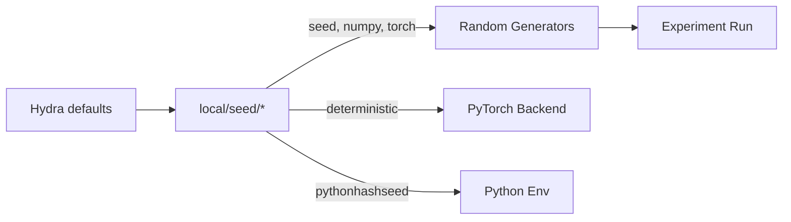

Got it. Following the same **mission-grade config style** we’ve been building for `configs/local/devices`, I drafted a full set of seed control configs under `configs/local/seed/`. These make random number seeds explicit and swappable for reproducibility — critical for Kaggle/CI pipelines and MCP compliance.

Here’s the structure and contents you should create:

---

### `configs/local/seed/default.yaml`

```yaml
# ==============================================================================
# 🌱 Local Seed — Default
# ------------------------------------------------------------------------------
# Purpose:
#   - Standard seed set for reproducibility in local runs.
#   - Covers Python, NumPy, PyTorch CPU/GPU.
# ==============================================================================

seed: 42
numpy_seed: 42
torch_seed: 42
pythonhashseed: 42

deterministic: true
cudnn_benchmark: false

notes: "Default deterministic seed profile (42 everywhere)."
```

---

### `configs/local/seed/fast.yaml`

```yaml
# ==============================================================================
# ⚡ Local Seed — Fast/CI
# ------------------------------------------------------------------------------
# Purpose:
#   - Lightweight reproducibility checks for CI or smoke tests.
#   - Keeps determinism on; may reduce NumPy/PyTorch workers.
# ==============================================================================

seed: 1337
numpy_seed: 1337
torch_seed: 1337
pythonhashseed: 1337

deterministic: true
cudnn_benchmark: false

notes: "CI/smoke tests: deterministic seeds, lightweight reproducibility."
```

---

### `configs/local/seed/random.yaml`

```yaml
# ==============================================================================
# 🎲 Local Seed — Randomized
# ------------------------------------------------------------------------------
# Purpose:
#   - Non-deterministic runs for exploration / augmentation diversity.
#   - Seeds pulled from system time; not reproducible across runs.
# ==============================================================================

seed: null
numpy_seed: null
torch_seed: null
pythonhashseed: null

deterministic: false
cudnn_benchmark: true

notes: "Random seeds disabled — stochastic runs (exploration mode)."
```

---

### `configs/local/seed/kaggle.yaml`

```yaml
# ==============================================================================
# 🏅 Kaggle Seed — Competition Reproducibility
# ------------------------------------------------------------------------------
# Purpose:
#   - Fixed seeds for Kaggle submissions (to ensure leaderboard stability).
#   - Deterministic where feasible; cuDNN benchmark off.
# ==============================================================================

seed: 2025
numpy_seed: 2025
torch_seed: 2025
pythonhashseed: 2025

deterministic: true
cudnn_benchmark: false

notes: "Kaggle-safe seed profile for reproducible competition submissions."
```

---

### `configs/local/seed/architecture.md`

````markdown
# 📂 `configs/local/seed/` — Seed Profiles Architecture

---

## Purpose & Scope
This folder defines **Hydra seed profiles** for SpectraMind V50.  
They control random number generator initialization across Python, NumPy, and PyTorch (CPU/GPU), ensuring reproducibility and auditability in local, Kaggle, and HPC environments:contentReference[oaicite:1]{index=1}.

---

## Profiles
- **default.yaml** — Standard deterministic seeds (42)
- **fast.yaml** — Lightweight CI/smoke test seeds (1337)
- **random.yaml** — Fully stochastic (non-deterministic) mode
- **kaggle.yaml** — Fixed seeds (2025) for leaderboard submissions

---

## Design Philosophy
- **Reproducibility**: Every run has explicit seeds logged.  
- **Modularity**: Swap `local/seed/*` without touching code.  
- **Environment-specific**: Kaggle uses 2025, CI uses 1337, local default is 42.  
- **Determinism guardrails**: `deterministic: true` + `cudnn_benchmark: false` unless explicitly overridden for speed.

---

## Usage
```bash
# Default local run
spectramind train local/seed=default

# CI smoke test with fixed 1337 seed
spectramind train local/seed=fast training.epochs=1

# Randomized exploratory run
spectramind train local/seed=random

# Kaggle reproducible submission
spectramind train trainer=kaggle_safe local/seed=kaggle
````

---

## Visual Overview



```
