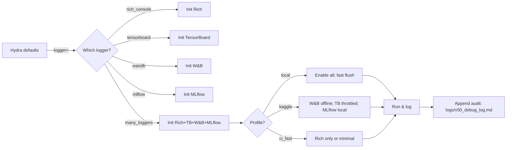

# `configs/logger/` — Logging Profiles for SpectraMind V50

This folder defines **Hydra-selectable logger profiles** for SpectraMind V50’s **CLI-first** pipeline.  
Pick one (or **compose several**) to control **where and how** metrics, artifacts, and audit trails are recorded — with **Kaggle/CI-safe** defaults and **NASA-grade reproducibility** baked in.

> Why this matters  
> V50 is CLI-first (Typer) with Hydra-safe configs. Every run must be **traceable** (config snapshot + code/data hashes + metrics). These profiles keep console UX delightful while preserving a **machine-readable audit trail** for post-hoc analysis.

---

## What’s included

- **`rich_console.yaml`** — Colorful, low-overhead console UX (progress bars, live metrics, pretty tracebacks) powered by Rich. Ideal for local dev; Kaggle/CI-safe (auto-degrades to plain output).
- **`tensorboard.yaml`** — File-based event logging for scalars/histograms/graphs; throttled flush & images off in Kaggle mode.
- **`wandb.yaml`** — Weights & Biases tracking (**online/offline**). Forced **offline** in Kaggle; can sync later.
- **`mlflow.yaml`** — MLflow tracking (**local `mlruns/` by default**; remote optional). CI/Kaggle profiles reduce churn.
- **`many_loggers.yaml`** — Composed profile that initializes **Rich + TensorBoard + W&B + MLflow** (with per-env auto-pruning).

All of these can **coexist**. Select one as the default, or use **`many_loggers`** to multi-log a run.  

---

## Quick start

### Choose one logger (simple)
In your main Hydra config (e.g., `configs/train.yaml`):
```yaml
defaults:
  - logger: rich_console   # pick one: rich_console | tensorboard | wandb | mlflow | many_loggers
````

### Switch at CLI

```bash
# Switch logger
spectramind train logger=tensorboard

# Tune any param on the fly (Hydra override)
spectramind train logger=wandb logger.wandb.offline=true
```

### Compose multiple (single-run multi-logging)

```bash
# Use the prebuilt composition
spectramind train logger=many_loggers

# Or add a side logger where supported
spectramind train \
  logger=rich_console \
  logger.rich_console.extra_loggers=[mlflow]
```

Hydra composition keeps orchestration **code-free** and **reproducible**; the merged config is snapshotted with outputs.

---

## Profiles at a glance

| Logger         | Best for                          | Network  | Artifacts | Notes                                                                 |
| -------------- | --------------------------------- | -------- | --------- | --------------------------------------------------------------------- |
| `rich_console` | Local dev, readable CLI UX        | None     | No        | Live progress/metrics; mirrors key events to `logs/v50_debug_log.md`. |
| `tensorboard`  | Lightweight scalar dashboards     | None     | TB events | Throttled flush & histograms/images disabled by default in Kaggle.    |
| `wandb`        | Collaboration & model registry    | Optional | Yes       | `offline=true` in Kaggle; sync later when allowed.                    |
| `mlflow`       | Lab/on-prem tracking, comparisons | Optional | Yes       | Defaults to local `mlruns/`; remote URI optional; CI reduces uploads. |
| `many_loggers` | One-shot “log everywhere” locally | Mixed    | Yes       | Auto-prunes per env (Kaggle/CI); see **Environment profiles** below.  |

**Kaggle:** avoid network calls; use offline/local backends and throttle I/O to meet **≤ 9 h** & storage constraints.

---

## Environment profiles (auto-safe presets)

Use **`many_loggers.yaml`** for one-shot composition and per-environment pruning. Select a profile with:

```bash
spectramind train logger=many_loggers many_loggers.profile=<local|kaggle|ci_fast>
```

* **`local`** — Rich + TB + W\&B(online) + MLflow(local/remote). Faster flush; full UX.
* **`kaggle`** — Rich + TB(throttled) + W\&B(**offline**) + MLflow(**local `mlruns/`**). No internet; minimal I/O.
* **`ci_fast`** — Rich only (TB/W\&B/MLflow disabled) or heavily throttled; keeps pipelines fast & deterministic.

> Tip: Even when not using `many_loggers`, each individual logger file includes **Kaggle/CI guardrails** you can flip via CLI overrides.

---

## Guardrails & reproducibility contract

All profiles adhere to V50’s reproducibility tenets:

* **Hydra snapshot** — Persist the fully merged config with each run.
* **Audit log** — Append key CLI call + run metadata + config hash + results to `logs/v50_debug_log.md`.
* **Data/code hashes** — Capture Git SHA and DVC pointers so anyone can re-create exact conditions.

---

## Examples

### 1) Rich console only (local dev)

```bash
spectramind train \
  logger=rich_console \
  logger.rich_console.level=DEBUG \
  logger.rich_console.dashboard_refresh=0.25
```

### 2) Rich console + MLflow (local file backend)

```bash
spectramind train \
  logger=rich_console \
  logger.rich_console.extra_loggers=[mlflow] \
  logger.mlflow.tracking_uri=mlruns \
  logger.mlflow.experiment_name="V50_local"
```

### 3) Kaggle-safe TB

```bash
spectramind train \
  logger=tensorboard \
  logger.tensorboard.flush_secs=300 \
  logger.tensorboard.histogram_freq=0 \
  logger.tensorboard.write_images=false
```

### 4) W\&B offline (Kaggle), sync later

```bash
spectramind train \
  logger=wandb \
  logger.wandb.offline=true \
  logger.wandb.mode=offline \
  logger.wandb.log_model=false
```

### 5) One-shot composition with auto-prune

```bash
# Local
spectramind train logger=many_loggers many_loggers.profile=local

# Kaggle (no internet)
spectramind train logger=many_loggers many_loggers.profile=kaggle

# CI smoke
spectramind train logger=many_loggers many_loggers.profile=ci_fast
```

---

## Operational flow (at a glance)



---

## Troubleshooting

* **No colors / garbled progress on remote terminals**
  Your terminal may not support rich rendering; Rich will degrade gracefully. You can also set `logger.rich_console.enabled=false`.

* **W\&B permission/network errors**
  On Kaggle, enforce `logger.wandb.offline=true` and `logger.wandb.mode=offline`. Locally, export a valid `WANDB_API_KEY` if using online mode.

* **MLflow writes too much in CI**
  Use `logger=mlflow logger.mlflow.ci_fast.enabled_override=true` or disable artifacts; alternatively set `logger=many_loggers many_loggers.profile=ci_fast`.

* **Large TB logs**
  Reduce `histogram_freq`, increase `flush_secs`, and keep `write_images=false` in constrained environments.

* **Mixed ownership of artifact directories**
  When running inside containers/CI, ensure `logs/` and `mlruns/` are writable (mount volumes or set proper UID/GID).

* **Conflicting multi-logger initializations**
  If you write custom init code, respect `many_loggers.order` and `many_loggers.active.*` to avoid double-init.

---

## Security & privacy notes

* **Secrets**: do not hard-code tokens in YAML. Use environment variables (e.g., `WANDB_API_KEY`) or CI secrets.
* **PII**: avoid sending PII to external trackers. Prefer anonymized run names and local MLflow in restricted environments.
* **Network policy**: Kaggle/CI profiles assume **no outbound traffic** unless explicitly allowed. Keep W\&B **offline** and MLflow **local** by default.

---

## References

* CLI-first architecture, Rich console dashboards, and Markdown audit trails
* Hydra composition & config snapshots (override-driven experiments)
* Kaggle runtime guardrails (no internet, limited time/storage)
* V50 reproducibility (Git/DVC, CI sanity tests, deterministic runs)

---

### Pro tip

Keep `logger=rich_console` as your **default** for a great DX. **Add** `mlflow` or `tensorboard` when you need artifacts or dashboards. For “everything at once,” use `logger=many_loggers` and select the appropriate **profile**.

```
```
