# 🧭 SpectraMind V50 — Architecture (System Context & Subsystems)

/diagrams/architecture.md provides **top-level architecture views** for SpectraMind V50 (NeurIPS 2025 Ariel Data Challenge), tying together the CLI, Hydra configs, calibration, training, diagnostics, DVC, and submission packaging.

**Companion diagrams:**
- [`pipeline_overview.md`](./pipeline_overview.md)
- [`train_ablation.md`](./train_ablation.md)
- [`ci_pipeline.md`](./ci_pipeline.md)
- [`symbolic_engine.md`](./symbolic_engine.md)
- [`calibration_chain.md`](./calibration_chain.md)

---

## 0) Table of Contents
1. [System Context (C4 L1)](#1-system-context-c4-l1)
2. [Containers & Subsystems (C4 L2)](#2-containers--subsystems-c4-l2)
3. [Hydra Config Composition](#3-hydra-config-composition)
4. [Data & Artifacts (DVC + Logs)](#4-data--artifacts-dvc--logs)
5. [End-to-End Execution (Sequence)](#5-end-to-end-execution-sequence)
6. [Failure Modes & Guardrails](#6-failure-modes--guardrails)
7. [Module Ownership (Class View)](#7-module-ownership-class-view)
8. [Links & Next Steps](#8-links--next-steps)

---

## 1) System Context (C4 L1)

```mermaid
flowchart LR
  U[User / Runner] --> CLI[Typer CLI: spectramind]
  CLI --> HY[Hydra Configs (YAML)]
  CLI --> CAL[Calibration Pipeline]
  CAL --> PREP[Preprocess & Feature Packaging]
  PREP --> TRN[Training / Inference Engine]
  TRN --> DIAG[Diagnostics & HTML Reports]
  DIAG --> SUB[Submission Bundle]
  subgraph Stores
    DVC[DVC Data/Models]
    LOG[Logs: events.jsonl, v50_debug_log.md]
    SNAP[Run Snapshots (resolved YAML)]
  end
  CAL --- DVC
  TRN --- DVC
  DIAG --- DVC
  CLI --- LOG
  HY --- SNAP
````

**Purpose:** Show all major actors and the direction of data/config/control flow at a glance.

---

## 2) Containers & Subsystems (C4 L2)

```mermaid
flowchart TB
  subgraph CLI[CLI Layer]
    TYP[Typer Commands\n(calibrate/train/diagnose/ablate/submit)]
    HYD[Hydra Launcher\n(defaults + overrides)]
  end

  subgraph PIPE[Data/Model Pipeline]
    CAL[Calibration Kill Chain]
    PKG[Feature Packaging\n(AIRS/FGS1/metadata)]
    TRN[Trainer/Inferencer\n(μ, σ)]
    SYM[Symbolic Engine\n(overlay & scoring)]
    DGN[Diagnostics Orchestrator\n(UMAP/t-SNE, GLL, overlays)]
    SUB[Submission Validator/Packager]
  end

  subgraph STORES[Storage/Versioning]
    DVC[DVC Cache/Remote\n(large data & models)]
    LOG[events.jsonl / v50_debug_log.md]
    CFG[Resolved Config Snapshots\n(run_hash_summary_v50.json)]
  end

  TYP --> HYD
  HYD --> CAL
  CAL --> PKG --> TRN --> SYM --> DGN --> SUB
  CAL --- DVC
  TRN --- DVC
  DGN --- DVC
  TYP --- LOG
  HYD --- CFG
```

**Highlights**

* **CLI-first**: every operation is invoked via Typer.
* **Hydra** composes all configs deterministically.
* **DVC** holds large immutable assets (data, models, artifacts).

---

## 3) Hydra Config Composition

```mermaid
flowchart LR
  R0[train.yaml] --> D1[{defaults}]
  D1 --> M0[model/*.yaml]
  D1 --> T0[trainer/*.yaml]
  D1 --> O0[optimizer/*.yaml]
  D1 --> L0[loss/*.yaml]
  D1 --> D0[data/*.yaml]
  R0 --> OV[CLI Overrides]
  OV -->|merge| RES[Resolved DictConfig]
  M0 --> RES
  T0 --> RES
  O0 --> RES
  L0 --> RES
  D0 --> RES
  RES --> SNAP[Saved YAML Snapshot]
```

**Usage patterns**

* Switch groups: `model=v50_gnn`, `trainer=kaggle_safe`, `data=nominal`.
* Fine-grained: `loss.composite.smoothness.weight=0.1`.

---

## 4) Data & Artifacts (DVC + Logs)


**Conventions**

* **DVC**: large files → reproducible data lineage.
* **Logs**: human-readable Markdown + machine JSONL.
* **Snapshots**: resolved configs for exact reruns.

---

## 5) End-to-End Execution (Sequence)

```mermaid
sequenceDiagram
  participant U as User
  participant C as CLI (Typer)
  participant H as Hydra
  participant K as Calibration
  participant P as Packaging
  participant T as Trainer/Infer
  participant S as Symbolic
  participant D as Diagnostics
  participant B as Bundler
  participant V as DVC/Stores

  U->>C: spectramind calibrate/train/diagnose/submit
  C->>H: compose configs
  H-->>C: resolved DictConfig + snapshot
  C->>K: run calibration
  K-->>V: write artifacts (calibrated/)
  K->>P: package features
  P-->>V: batches/
  P->>T: train/infer
  T-->>V: checkpoints, preds
  T->>S: μ, σ + metadata
  S-->>D: overlays, rule scores
  D-->>V: HTML/PNG, metrics
  D->>B: validate & zip submission
  B-->>U: ready-for-upload bundle
```



---

## 6) Failure Modes & Guardrails


**Principles**

* **Fail fast, explain clearly**.
* **Safe fallbacks**: AMP off → FP32, smaller batches, resume from ckpt.
* **Never lose provenance**: always log context and outcomes.

---

## 7) Module Ownership (Class View)


---

## 8) Links & Next Steps

* See [`pipeline_overview.md`](./pipeline_overview.md) for the end-to-end DAG.
* See [`train_ablation.md`](./train_ablation.md) for ablation orchestration.
* See [`symbolic_engine.md`](./symbolic_engine.md) for symbolic overlays/feedback.
* See [`calibration_chain.md`](./calibration_chain.md) for instrument corrections.
* See [`ci_pipeline.md`](./ci_pipeline.md) for CI smoke and artifact publishing.

**Want a deep-dive diagram for the Diagnostics HTML Report (UMAP/t-SNE, GLL heatmaps, CLI log heatmaps)?**
I can add `diagnostics_dashboard.md` with a dedicated Mermaid flow plus iframe embedding structure.

```
```
