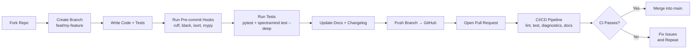

# 🤝 Contributing Guide — SpectraMind V50 (ArielSensorArray)

Welcome! 🎉  
This document complements the root [CONTRIBUTING.md](../CONTRIBUTING.md) by providing a **visual guide** to the contribution workflow, showing how your code flows from branch creation to merge.

---

## 🧭 Contribution Workflow (Visual)



✅ **Flow:** Fork → Branch → Code → Test → Docs → PR → CI → Merge.

---

## 🧪 Pre-commit & Tests

* **Hooks:** `pre-commit install -t pre-commit -t pre-push`  
  Enforces: `ruff`, `black`, `isort`, `mypy`.
* **Tests:**  
  ```bash
  pytest -q --cov=src/spectramind
  spectramind test --deep
  ```

---

## 🔍 CI/CD Gates

Our GitHub Actions workflows ensure **NASA-grade reproducibility**:

* **Linting** (`lint.yml`)  
* **Unit + CLI Tests** (`test.yml`)  
* **Diagnostics** (`diagnostics.yml`) — UMAP, t-SNE, SHAP, symbolic overlays  
* **Docs Build** (`docs.yml`)  
* **Benchmarks** (`benchmark.yml`)  

All must ✅ pass before merge.

---

## 📜 References

* [Root CONTRIBUTING.md](../CONTRIBUTING.md)  
* [SpectraMind V50 Technical Plan](/docs/SpectraMindV50_TechnicalPlan.pdf):contentReference[oaicite:1]{index=1}  
* [Project Analysis](/docs/SpectraMindV50_ProjectAnalysis.pdf):contentReference[oaicite:2]{index=2}  
* [Update & Extension Strategy](/docs/SpectraMindV50_Strategy.pdf):contentReference[oaicite:3]{index=3}  
* [Kaggle Platform Guide](/docs/Kaggle_Platform_Guide.pdf):contentReference[oaicite:4]{index=4}  

