# 🤝 Contributing to SpectraMind V50 — ArielSensorArray

Welcome! 🎉 
Thank you for considering contributing to **SpectraMind V50**, our neuro-symbolic, physics-informed AI pipeline for the [NeurIPS 2025 Ariel Data Challenge](https://www.kaggle.com/competitions/ariel-data-challenge-2025).

This document provides guidelines for contributors, covering setup, coding standards, commit practices, Kaggle integration, and CI/CD requirements.  
It also includes **visual guides** (Mermaid diagrams) showing the contribution workflow and CLI integration.

---

## 🚀 Getting Started

### Environment Setup

We support **two parallel stacks**:

1. **Poetry (recommended for local development)**  
   ```bash
   poetry install
   poetry shell
   ```

2. **Conda/Mamba (for Kaggle, CI, HPC)**  
   ```bash
   mamba env create -f CONDA_ENV.yml
   conda activate spectramindv50
   ```

🔑 **Notes:**
* For **GPU installs**, pin PyTorch to your CUDA version:
  ```bash
  pip install --index-url https://download.pytorch.org/whl/cu121 torch torchvision torchaudio
  ```
* For **CPU-only installs**, replace `pytorch-cuda` with `cpuonly` in `CONDA_ENV.yml`.
* Kaggle environments reset — always include package installs in your notebook or pin dependencies.

---

## 📦 Project Layout

```bash
SpectraMindV50/
├── src/spectramind/     # Core pipeline (FGS1 Mamba, AIRS GNN, decoders, symbolic/diagnostics)
├── configs/             # Hydra configs (data, model, training, uncertainty, GUI, etc.)
├── scripts/             # CLI utilities, DVC hooks
├── tests/               # pytest suite (unit, integration, symbolic, CLI)
├── assets/              # Diagrams, dashboards, generated HTML reports
├── .github/workflows/   # CI/CD (lint, test, diagnostics, diagrams, docs)
├── Dockerfile           # Reproducible base image
├── dvc.yaml             # DVC pipeline (calibration → train → diagnostics → submit)
```

See [`README.md`](./README.md) for a quickstart guide.

---

## 🧪 Development Workflow

### Visual Workflow



```mermaid
flowchart LR
    A[Fork Repo] --> B[Create Branch<br/>feat/my-feature]
    B --> C[Write Code + Tests]
    C --> D[Run Pre-commit Hooks<br/>ruff, black, isort, mypy]
    D --> E[Run Tests<br/>pytest + spectramind test --deep]
    E --> F[Update Docs + Changelog]
    F --> G[Push Branch → GitHub]
    G --> H[Open Pull Request]
    H --> I[CI/CD Pipeline<br/>lint, test, diagnostics, docs]
    I --> J{CI Passes?}
    J -- Yes --> K[Merge into main]
    J -- No --> L[Fix Issues<br/>and Repeat]
```

✅ **Flow:** Fork → Branch → Code → Test → Docs → PR → CI → Merge.

### Pre-commit Hooks

```bash
pre-commit install -t pre-commit -t pre-push
```

Enforces: `ruff`, `black`, `isort`, `mypy`.

### Testing

```bash
pytest -q --cov=src/spectramind
spectramind test --deep
```

### Documentation

```bash
mkdocs serve
```

---

## 🖥️ CLI Integration in Contributions

```mermaid
flowchart TD
    subgraph CLI (Typer Entrypoint)
        A0[spectramind calibrate] --> P1[Data Calibration<br/>(bias, dark, flat, wavelength)]
        A1[spectramind train] --> P2[Model Training<br/>SSM + GNN + Decoders]
        A2[spectramind diagnose] --> P3[Diagnostics<br/>UMAP/t-SNE, SHAP, Symbolic, FFT]
        A3[spectramind submit] --> P4[Submission Bundle<br/>μ, σ, leaderboard.zip]
    end

    P1 --> P2
    P2 --> P3
    P3 --> P4
```

🔑 **Contribution Rule:**  
Any new module (e.g. calibration tool, model head, diagnostics script) must register in the `spectramind` CLI and have a corresponding **Hydra config**:contentReference[oaicite:0]{index=0}:contentReference[oaicite:1]{index=1}.

---

## 🎯 Contribution Guidelines

* **Style:** Follow [PEP 8](https://peps.python.org/pep-0008/) with enforced linters.
* **Commits:** Use [Conventional Commits](https://www.conventionalcommits.org/):
  * `feat: add symbolic loss decomposition`
  * `fix: correct calibration σ scaling`
* **PRs:** One logical feature/fix per PR. Include:
  * ✅ Tests
  * 📖 Docs (if user-facing)
  * 📝 `CHANGELOG.md` entry

---

## 🧬 Kaggle Integration

* **Competition Code:** Use `requirements.txt` or `CONDA_ENV.yml` for reproducibility.
* **Limits:** Kaggle GPU quota ≈ 12h (Tesla P100, 16 GB). Optimize configs accordingly:contentReference[oaicite:2]{index=2}.
* **Reproducibility:** Always pin `torch`/`torch-geometric` wheels to prevent mismatch.
* **Best Practices:**
  * Keep training < 9 hrs on Kaggle.
  * Use Kaggle’s **dataset versioning** for data+checkpoints.
  * Respect the [Kaggle Code of Conduct](https://www.kaggle.com/code-of-conduct).

---

## 🔍 CI/CD

GitHub Actions workflows run on every PR:

* **Linting** (`lint.yml`)  
* **Unit + CLI Tests** (`test.yml`)  
* **Diagnostics** (`diagnostics.yml`) — UMAP/t-SNE, SHAP, symbolic overlays, FFT checks  
* **Docs Build** (`docs.yml`)  
* **Benchmarks** (`benchmark.yml`)  

✅ All must pass before merging.

---

## 🛠️ Advanced Tips

* **Torch Geometric Wheels (CUDA):**
  ```bash
  pip install torch-scatter -f https://data.pyg.org/whl/torch-2.4.0+cu121.html
  ```
* **Mamba-SSM:** Ensure correct fork/version in `requirements.txt`.
* **DVC Remotes:**
  ```bash
  dvc remote add -d s3remote s3://bucket/path
  ```

---

## 🤝 Code of Conduct

We follow the [Contributor Covenant](https://www.contributor-covenant.org/).  
Please treat all contributors and community members with respect.

---

## 📜 License

SpectraMind V50 is released under the **MIT License** (with citation requirement).  
By contributing, you agree your code will be licensed under the same.

---

## 🙌 Acknowledgments

* ESA Ariel Mission science team  
* NeurIPS 2025 Ariel Challenge organizers  
* Kaggle community notebooks & discussions:contentReference[oaicite:3]{index=3}  
* Open-source contributors in PyTorch, Hydra, DVC, SHAP, UMAP, Hugging Face, and beyond:contentReference[oaicite:4]{index=4}

---

## 🔗 References

* [SpectraMind V50 Technical Plan](/docs/SpectraMindV50_TechnicalPlan.pdf):contentReference[oaicite:5]{index=5}  
* [SpectraMind V50 Project Analysis](/docs/SpectraMindV50_ProjectAnalysis.pdf):contentReference[oaicite:6]{index=6}  
* [Strategy for Updating & Extending V50](/docs/SpectraMindV50_Strategy.pdf):contentReference[oaicite:7]{index=7}  
* [Kaggle Platform Guide](/docs/Kaggle_Platform_Guide.pdf):contentReference[oaicite:8]{index=8}  
* [Comparison of Kaggle Models](/docs/Comparison_Kaggle_Models.pdf):contentReference[oaicite:9]{index=9}  
* [Hugging Face Mastery Guide](/docs/HuggingFace_AIMastery.pdf):contentReference[oaicite:10]{index=10}  
* [Radiation Reference (Physics Context)](/docs/Radiation_TechRef.pdf):contentReference[oaicite:11]{index=11}  
* [GUI Programming Guide](/docs/GUI_Programming.pdf):contentReference[oaicite:12]{index=12}  
* [Mermaid Diagrams Reference](/docs/Mermaid_Diagrams_GitHub.pdf):contentReference[oaicite:13]{index=13}
