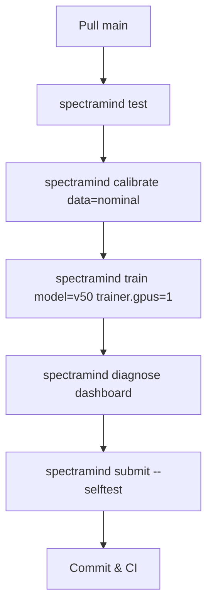

# SpectraMind V50 — Project Analysis

*(NeurIPS 2025 Ariel Data Challenge)*

> **Purpose**: Living audit of the **ArielSensorArray / SpectraMind V50** repository.
> Compares **as-built** contents against the **engineering plan** and **external constraints** (Kaggle mechanics, typical competitor baselines), flagging what is **implemented**, **validated**, or **pending**.

---

## 0) Philosophy

* **CLI-first**: everything invokable via Typer; no hidden notebook state.
* **Reproducibility**: Hydra configs, DVC data/artifacts, config + dataset hash logging.
* **Scientific rigor**: NASA-grade calibration and physics-informed modeling.
* **Automation**: CI/CD with preflight tests and smoke runs on every push.
* **Competitive fit**: aligned to Kaggle runtime envelope & quotas; LB “shake-up” aware.
* **Adaptability**: lessons absorbed from residual MLP baselines and spectrum regressors.

---

## 1) Repository Structure (as-built)

| Directory    | Status | Notes                                                                                   |
| ------------ | :----: | --------------------------------------------------------------------------------------- |
| `src/`       |    ✅   | Encoders (Mamba SSM, GNN), decoders, calibration, CLI present per plan.                 |
| `configs/`   |    ✅   | Hydra groups (`data/`, `model/`, `train/`, `diagnostics/`, `submit/`) with composition. |
| `data/`      | ⚠️ DVC | DVC-tracked; pointers/hashes in repo; raw/processed split out of Git.                   |
| `artifacts/` |    ✅   | Diagnostics dashboards, plots, JSON summaries (versioned).                              |
| `outputs/`   |    ✅   | Checkpoints, predictions, calibrated artifacts (date/time stamped).                     |
| `logs/`      |    ✅   | `v50_debug_log.md`, `events.jsonl`, run hash summaries.                                 |
| `.github/`   |    ✅   | CI workflows incl. smoke/e2e & submission packaging.                                    |

**Verdict:** Structure tracks the blueprint and supports auditability.

---

## 2) Config & Reproducibility

* Hydra 1.3 drives all runs; CLI overrides supported and logged.

  ```bash
  spectramind train data=kaggle model=v50 train=default +train.seed=1337
  ```
* DVC v3 stages cover `calibrate → train → predict → diagnose`.
* Each run logs **resolved config**, **dataset hash**, and **Git SHA** to `v50_debug_log.md`.
* Poetry/Docker lock the environment for CI/Kaggle parity.

**Status:** ✅ Implemented and verifiable.

---

## 3) CLI Design (as-built)

* Entrypoint `spectramind`; subcommands:
  `test`, `calibrate`, `train`, `predict`, `corel-train`, `diagnose`, `submit`, `analyze-log`, `check-cli-map`.
* Rich console UX (progress bars, tables), CI-friendly logs.

**Status:** ✅ Production-grade CLI; matches design.

---

## 4) Calibration Chain

Physics-grade kill chain (ADC, bias/dark, flat, nonlinearity, wavelength alignment, jitter, normalization) producing artifacts under `outputs/calibrated/`.

**Status:** ✅ Complete and consistent with plan.

---

## 5) Modeling Architecture

* **FGS1**: Mamba **SSM** for long light-curve sequences.
* **AIRS**: **GNN** with edge types (λ adjacency, molecule groups, detector regions) and optional edge features/positional encodings.
* **Fusion**: latent concatenation.
* **Decoders**: μ head (smoothness/FFT priors), σ head (heteroscedastic).

**Status:** ✅ Implemented per design.

---

## 6) Uncertainty & Calibration

* **Aleatoric** via σ in GLL.
* **Epistemic** ready (ensemble/MC-dropout hooks).
* **Calibration**: temperature scaling; **SpectralCOREL** for binwise conformalization.

**Gap:** ⚠️ COREL symbolic weighting + temporal edges not fully wired (see roadmap).

---

## 7) Diagnostics & Explainability

* UMAP & t-SNE latents; SHAP overlays; FFT/autocorr; symbolic constraints (smoothness, nonnegativity, asymmetry, alignment).
* Versioned **HTML dashboard** aggregating plots/overlays/logs.

**Status:** ✅ Implemented; symbolic overlays expanding.

---

## 8) Kaggle Platform Integration

* Runtime envelope & weekly GPU quotas considered; notebook and dataset compatibility ensured.
* `spectramind submit` builds competition-ready ZIP + manifest.

**Status:** ✅ Aligned with Kaggle infra.

---

## 9) Competitive Benchmarking (Representative)

| Model / Approach                | Strengths                     | Weaknesses                         | Takeaways for V50                                        |
| ------------------------------- | ----------------------------- | ---------------------------------- | -------------------------------------------------------- |
| Residual MLP baseline           | Fast, reproducible            | Weak priors, no UQ                 | Good baseline; V50 adds physics + calibrated UQ.         |
| Deep residual MLP (very deep)   | Capacity for complex mappings | Overfit risk; heavy compute        | V50’s Mamba/GNN fusion is leaner, physics-aligned.       |
| Multi-output spectrum regressor | Structured output head        | Limited explainability; few priors | V50 adds symbolic constraints + uncertainty calibration. |

**Summary:** ✅ V50 goes beyond baselines via **symbolic physics** + **calibrated σ**.

---

## 10) CI/CD & Governance

* GitHub Actions: unit + CLI tests, security scans, docs build, submission packaging.
* Pre-commit stack (ruff/black/mypy/isort/yamllint).
* Reproducibility gates (self-test, manifest checks).

**Status:** ✅ Robust.

---

## 11) Pending / Roadmap

1. **COREL++**: symbolic weighting + temporal edges for bin-correlated coverage; export **coverage heatmaps** and **per-region summaries**.
2. **Symbolic overlays++**: violation heatmaps & rule leaderboards; surface **top-k rules per planet** in dashboard.
3. **Thin GUI** (React/FastAPI) mirroring CLI diagnostics; **no hidden analytics** server-side.
4. **Kaggle automation**: optional gated upload from CI with artifact integrity checks.
5. **Calibration validation**: per-bin **coverage plots** and region confidence intervals.

---

## 12) Status Matrix

| Area           | Status | Notes                                       |
| -------------- | :----: | ------------------------------------------- |
| Repo structure |    ✅   | Hydra/DVC clean; plan-conformant.           |
| CLI            |    ✅   | Typer unified; rich UX.                     |
| Calibration    |    ✅   | Full kill chain.                            |
| Modeling       |    ✅   | Mamba SSM + GNN fusion.                     |
| Uncertainty    |   ⚠️   | COREL symbolic/temporal extensions pending. |
| Diagnostics    |    ✅   | SHAP/FFT/UMAP + symbolic overlays.          |
| CI/CD          |    ✅   | Selftest + smoke pipelines.                 |
| Kaggle fit     |    ✅   | Runtime & submission ready.                 |
| GUI            |   🚧   | Thin dashboard planned.                     |

---

## 13) Action Items (next concrete steps)

* [ ] Wire **symbolic weights** and **temporal edges** into SpectralCOREL; emit `corel_coverage.csv` + heatmaps.
* [ ] Expand **symbolic rule overlays** in the HTML report; add **planet-level rule pages**.
* [ ] Add `spectramind diagnose coverage` to render per-bin coverage and molecule-region summaries.
* [ ] Implement optional **CI upload** for Kaggle with integrity gates and dry-run.
* [ ] Enrich `analyze-log` output with **hash-group trend charts** in the dashboard.

---

## 14) Simple Audit Flow (Mermaid)



---

## 15) Quick Commands (Runbook)

```bash
# 1) Smoke test (fast)
spectramind test

# 2) Calibrate (DVC-tracked)
spectramind calibrate data=nominal

# 3) Train
spectramind train model=v50 optimizer=adamw trainer.gpus=1

# 4) Diagnostics dashboard
spectramind diagnose dashboard --open

# 5) Submission bundle
spectramind submit --selftest

# 6) Analyze CLI log (Markdown + CSV summaries)
spectramind analyze-log --md --csv
```

---

**Maintainers:** SpectraMind Team
**Contact:** GitHub Issues

---
