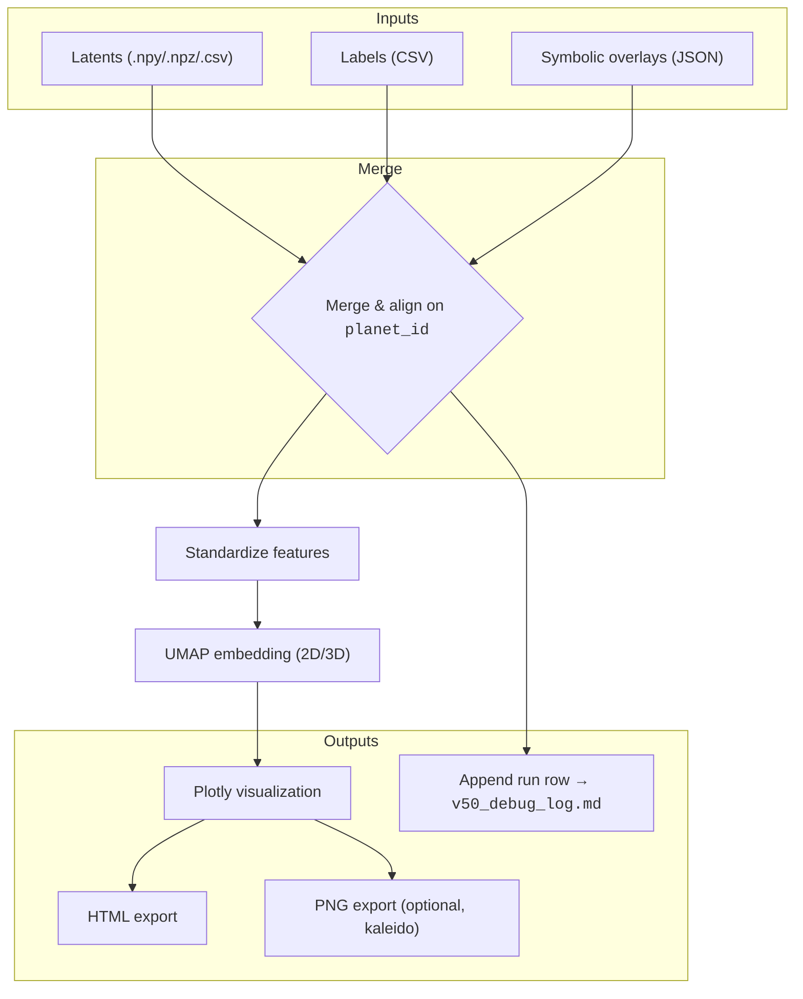

```mermaid
%% SpectraMind V50 — UMAP Plotter Architecture
%% File: docs/diagrams/umap_architecture.mmd

flowchart TD
  %% ---------------------------
  %% Inputs
  %% ---------------------------
  subgraph Inputs
    A["Latents (.npy/.npz/.csv)"]
    B["Labels (CSV)"]
    C["Symbolic overlays (JSON)"]
  end

  %% ---------------------------
  %% Merge/Align
  %% ---------------------------
  subgraph Merge
    M{"Merge & align on <code>planet_id</code>"}
  end

  A --> M
  B --> M
  C --> M

  %% ---------------------------
  %% Processing & UMAP
  %% ---------------------------
  M --> D["Standardize features"]
  D --> U["UMAP embedding (2D/3D)"]
  U --> P["Plotly visualization"]

  %% ---------------------------
  %% Outputs
  %% ---------------------------
  subgraph Outputs
    P --> H1["HTML export"]
    P --> H2["PNG export (optional, kaleido)"]
    M --> L["Append run row → <code>v50_debug_log.md</code>"]
  end

  %% ---------------------------
  %% Notes (rendered as comments for clarity)
  %% - Determinism controlled via seed
  %% - Encodings (color/size/opacity/symbol) bound at plotting stage
  %% - Artifacts written under ${paths.artifacts}
  %% ---------------------------
```
