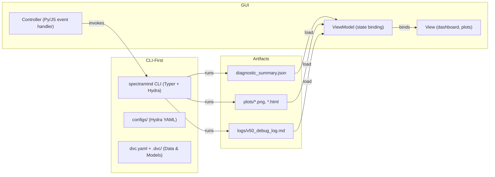

# 🖥️ SpectraMind V50 — GUI Architecture

## 0. Purpose & Scope

This document explains the **architecture of the optional Graphical User Interface (GUI)** layer for SpectraMind V50 (NeurIPS 2025 Ariel Data Challenge).

While the system is **CLI-first** (all operations must be reproducible through `spectramind …` commands), this GUI provides a thin, user-friendly layer for **post-run exploration, diagnostics visualization, and interactive control**.

The design ensures:

* CLI remains the **single source of truth** for reproducibility.
* GUI calls **CLI APIs** or **reads structured artifacts** (JSON, HTML, plots), never bypassing pipeline contracts.
* Users can analyze results visually without sacrificing **NASA-grade reproducibility**.

---

## 1. Architectural Patterns

The GUI follows standard software UI patterns:

* **MVC (Model–View–Controller)**

  * **Model**: Hydra configs, DVC-tracked datasets, JSON/HTML diagnostics.
  * **View**: React/Tk/Qt widgets rendering plots, dashboards, and results.
  * **Controller**: Event handlers invoking CLI commands (`spectramind diagnose dashboard`) or APIs.

* **MVVM (Model–View–ViewModel)** (preferred for modern UIs)

  * **ViewModel** wraps CLI outputs into GUI-friendly state.
  * Enables **data binding** (GUI auto-updates when JSON/diagnostics change).
  * Example: toggling symbolic overlay checkboxes updates UMAP plots live.

---

## 2. Integration with SpectraMind CLI

The GUI is **strictly downstream** of the CLI:

* **Run Control**: GUI buttons → `spectramind` CLI calls.
* **Artifact Load**: GUI plots load from `diagnostic_summary.json` + `plots/`.
* **Logging**: All GUI-triggered actions still append to `logs/v50_debug_log.md`.

---

## 3. GUI Components

### 🔍 Dashboard

* Displays UMAP/t-SNE projections (interactive, confidence overlays).
* Symbolic violation heatmaps & COREL calibration plots.
* Live log viewer tailing `v50_debug_log.md`.

### 📂 Config Explorer

* Tree view of Hydra configs (`configs/model`, `configs/data`).
* Editable fields with validation (writes YAML override files).
* CLI re-invocation triggered on save.

### 🧪 Diagnostics Panel

* HTML report embedding (`generate_html_report.py` output).
* Tabs for **GLL heatmaps**, **symbolic rule tables**, **FFT smoothness maps**.

### 📊 Run History

* Pulls metadata from DVC + log analyzer.
* Displays CLI calls as Markdown tables, grouped by config hash.

---

## 4. Cross-Platform Strategy

SpectraMind GUI is designed to run across **desktop, web, and Kaggle notebooks**:

* **Desktop**: PyQt5 / Qt for native apps.
* **Web**: React + FastAPI backend (mirroring CLI commands).
* **Kaggle/Notebooks**: Streamlit/Gradio mini-GUIs wrapping CLI commands.

Choice of frontend is **pluggable**: all rely on the same CLI + artifact pipeline.

---

## 5. Design Principles

* **Thin GUI Layer**: Never duplicates CLI logic; only visualizes or wraps it.
* **Accessibility**: High-contrast mode, keyboard shortcuts, internationalization hooks.
* **Testability**: GUI separated from backend (ViewModels are unit-testable).
* **Performance**: Uses pre-rendered CLI artifacts (no GPU in GUI).
* **Auditability**: Every GUI action logs the equivalent CLI command to `v50_debug_log.md`.

---

## 6. Future Extensions

* Remote **web dashboard** for team collaboration.
* **Mermaid pipeline DAGs** embedded in the GUI (rendered from Markdown diagrams).
* Live symbolic rule editing + validation in GUI.
* Hugging Face Space integration for public demos.

---

✅ In summary, the SpectraMind V50 GUI is an **optional, cross-platform dashboard**.
It exists to **visualize CLI outputs, not replace them**, ensuring the repository remains CLI-first, Hydra-safe, and Kaggle-compliant.

---
