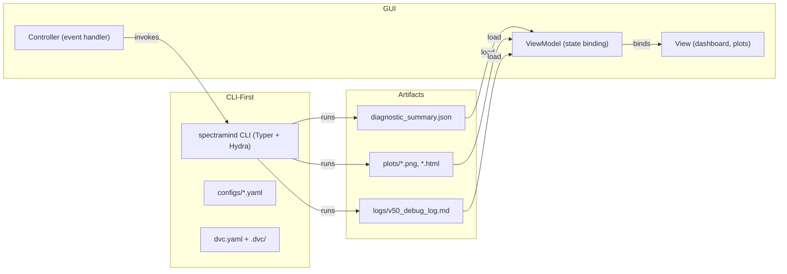

# 🖥️ SpectraMind V50 — GUI Architecture (Upgraded)

## 0. Purpose & Scope

This document details the **optional Graphical User Interface (GUI)** layer for **SpectraMind V50** (NeurIPS 2025 Ariel Data Challenge).

The system remains **CLI-first** — all operations are reproducible via `spectramind …`.
The GUI is a **thin visualization and control layer**, never bypassing the CLI or Hydra/DVC contracts.

Goals:

* CLI = **single source of truth** for reproducibility.
* GUI = **exploration + visualization** (diagnostics, dashboards, config browsing).
* All GUI actions → mirrored as CLI invocations in `logs/v50_debug_log.md`.

This ensures the GUI enhances usability while maintaining **NASA-grade reproducibility**.

---

## 1. Architectural Patterns

The GUI adopts standard software UI paradigms:

### **MVC (Model–View–Controller)**

* **Model**: Hydra configs, DVC-tracked datasets, diagnostic JSON.
* **View**: React/Qt widgets rendering spectra, UMAP/t-SNE, calibration plots.
* **Controller**: Event handlers invoking `spectramind` CLI.

### **MVVM (Model–View–ViewModel)** *(preferred)*

* **ViewModel** = wrapper around CLI artifacts.
* Enables **reactive data binding** → GUI updates live when diagnostics JSON changes.
* Example: toggling symbolic overlay checkboxes auto-updates UMAP plots.

This aligns with mission-grade **decoupling**: Model logic remains CLI/Hydra/DVC; GUI only observes.

---

## 2. CLI–Artifact–GUI Flow

Principles:

* **Run Control**: GUI buttons = `spectramind …` calls.
* **Artifact Load**: GUI visualizes `diagnostic_summary.json` and saved plots.
* **Auditability**: Every GUI action logs equivalent CLI call.

---

## 3. GUI Components

### 🔍 Dashboard

* Interactive UMAP/t-SNE with **confidence shading** + symbolic overlays.
* FFT smoothness, calibration heatmaps, violation matrices.
* Live tail of `v50_debug_log.md`.

### 📂 Config Explorer

* Hydra config tree browser.
* Editable fields → saved as override YAMLs.
* “Apply” triggers CLI rerun with new configs.

### 🧪 Diagnostics Panel

* Embeds `generate_html_report.py` outputs.
* Tabs: **GLL heatmaps**, **symbolic rules**, **spectral overlays**.

### 📊 Run History

* CLI calls parsed into Markdown tables.
* Grouped by Hydra config hash for reproducibility checks.

---

## 4. Cross-Platform Strategy

SpectraMind GUI is **pluggable** across contexts:

* **Desktop**: Qt / PySide (native, scientific apps).
* **Web**: React + FastAPI (mirroring CLI).
* **Kaggle/Notebooks**: Streamlit/Gradio wrappers for competition-safe demos.

Choice depends on runtime — but **all variants use CLI + artifacts** as backend.

---

## 5. Design Principles

* **Thin GUI Layer**: Never re-implements CLI logic.
* **Accessibility**: High-contrast mode, keyboard shortcuts, internationalization hooks.
* **Testability**: ViewModels are unit-testable; GUI state decoupled.
* **Performance**: GUI uses **pre-rendered CLI artifacts** (no GPU).
* **Auditability**: Each GUI action logs → `logs/v50_debug_log.md`.

This enforces **mission-grade reproducibility**.

---

## 6. Future Extensions

* Remote **team web dashboards** (collaborative post-run analysis).
* **Mermaid DAG visualizations** embedded for calibration + training flows.
* Symbolic rule editing / live overlays.
* **Hugging Face Space** integration for public demos.
* Integration with astrophysical forward simulators (e.g. transit spectrum emulators) for **cycle consistency checks**.

---

✅ **Summary**:
SpectraMind V50 GUI = an **optional dashboard**.
It **visualizes CLI outputs, not replaces them**, ensuring the system stays **CLI-first, Hydra-safe, DVC-tracked, and Kaggle-compliant**.

---
