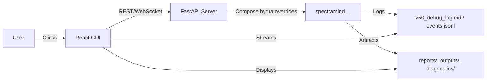

# 🎛️ SpectraMind V50 — GUI (Optional) Layer

> docs/gui/README.md

## 0) Purpose & Scope

This document defines the **optional GUI layer** for SpectraMind V50 (NeurIPS 2025 Ariel Data Challenge).
The GUI is a **thin, reproducible shell** over the CLI/API: it never bypasses Hydra configs, logging, or run hashing.
It exists to:

* Explore diagnostics (UMAP/t-SNE, GLL heatmaps, SHAP × Symbolic overlays, FFT, calibration checks)
* Launch common CLI workflows with explicit, auditable overrides
* Review artifacts (reports, logs, run hashes) in one place
* Aid demos and teaching without compromising **NASA-grade reproducibility**

> Golden rule: **Everything the GUI does must be possible—and logged—via `spectramind …`.**

---

## 1) Principles

* **CLI-first, GUI-optional**
  All scientific operations are defined by CLI + Hydra configs. GUI only **composes** them.

* **Deterministic & auditable**
  GUI actions serialize to: Hydra overrides → CLI invocation → `logs/v50_debug_log.md` → `run_hash_summary_v50.json`.

* **Separation of concerns**
  FastAPI backend = command/asset orchestration. React frontend = views only.

* **Accessibility & testability**
  Keyboard shortcuts, high contrast, screen-reader labels; unit + E2E tests; mockable API.

* **Privacy-respecting diagnostics**
  No implicit telemetry. Explicit toggle → local JSONL. No PII. Redaction filters by default.

* **Kaggle-safe modes**
  Read-only dashboards on Kaggle artifacts; compute-heavy buttons disabled or re-routed to small “CI/fast” presets.

---

## 2) Directory Layout

```
docs/gui/                 # You are here (design docs, playbooks)
src/gui/                  # React app (Vite + Tailwind + shadcn/ui + recharts)
  ├─ app/                 # Routes and layout
  ├─ components/          # Cards, charts, tables, panels
  ├─ features/            # UMAP, t-SNE, GLL, SHAP, Symbolic, FFT, Calibration
  ├─ hooks/               # API, keyboard, a11y, config binding
  ├─ store/               # Zustand or Redux store (lightweight)
  ├─ utils/               # Formatters, schema guards, download helpers
  └─ index.tsx
src/server/               # FastAPI (Python) orchestration server
  ├─ api/                 # REST + WebSocket endpoints
  ├─ cli_bridge.py        # Safe wrappers that call `spectramind ...`
  ├─ artifacts.py         # Locate & stream logs, reports, images
  ├─ authz.py             # Optional local-role authorization
  └─ main.py              # Uvicorn entrypoint
assets/                   # Logos, color tokens, icons
configs/gui/              # GUI presets → Hydra override bundles
tests/gui/                # Jest/RTL + Playwright E2E + server tests
```

---

## 3) End-to-End Architecture



**Invariant:** BE never calls Python internals for core runs; it shells out to the **exact** CLI used in headless mode.
**Result:** GUI and CLI produce identical artifacts and logs for a given config hash.

---

## 4) Key Screens & Widgets

* **Dashboard**
  Cards for: last runs, config hash, duration, status, links to artifacts, CI health.

* **Diagnostics Explorer**

  * UMAP/t-SNE (interactive Plotly) with **symbolic overlays**, confidence shading, planet hyperlinks
  * GLL heatmap per bin, RMSE/MAE, entropy maps
  * SHAP × Symbolic fusion overlays, attention traces
  * FFT power & autocorr; spectral smoothness maps; calibration z-score histograms
  * COREL coverage plots & calibration heatmaps

* **Run Launcher (CLI Shell)**
  Parameter forms → **Hydra override diff** → “Run” → streams logs → artifacts panel.

* **Symbolic Lab**
  Rule leaderboard, per-rule violations, ∂L/∂μ symbolic influence maps, rule masks, program variants.

* **Logs & Reports**
  Rich viewer for `v50_debug_log.md`, `diagnostic_summary.json`, HTML dashboards, CSVs.

* **Config Inspector**
  Hydra tree viewer, diff against presets, export `.yaml` overrides, copy-as-CLI.

---

## 5) Reproducibility Contracts

* **Every action = CLI serialization**
  GUI builds a deterministic **override string** and writes it to the run metadata.

* **Event Log**

  * `logs/v50_debug_log.md`: augmented with GUI run banner (frontend build hash, BE version)
  * `events.jsonl`: GUI user intent, resolved CLI, config hash, timestamps, artifact URIs

* **Config Hashing**
  The same `run_hash_summary_v50.json` mechanism applied for GUI-triggered runs.

* **No hidden state**
  Frontend state never alters execution. Only overrides handed to CLI matter.

---

## 6) Running the GUI (Dev)

### Prereqs

* Python env with **FastAPI** server deps (part of repo’s Poetry env)
* Node ≥ 18, PNPM or NPM
* CUDA optional (backend launches same CLI you would run locally)

### Start Backend (FastAPI)

```bash
# From repo root (activate Poetry/venv as usual)
export SPECTRAMIND_ENV=dev
uvicorn src.server.main:app --reload --host 127.0.0.1 --port 8089
```

### Start Frontend (Vite React)

```bash
# From repo root
cd src/gui
pnpm install    # or npm ci
pnpm dev        # or npm run dev
# Open http://localhost:5173  (backend at http://localhost:8089)
```

**Environment Variables**

* `SM_BACKEND_URL` (frontend) – default `http://127.0.0.1:8089`
* `SM_ARTIFACT_ROOT` (backend) – path to `outputs/` (resolves symlinks/DVC)
* `SM_DISABLE_RUNS` – set `1` to force read-only dashboards

---

## 7) Mapping UI → Hydra/CLI

Each form control maps to a **Hydra path**, e.g.:

* Trainer batch size → `trainer.batch_size=32`
* Disable FFT loss → `loss.composite.fft.enabled=false`
* COREL coverage target → `corel.coverage_target=0.9`
* Use Lookahead → `optimizer=lookahead +optimizer/base@lookahead.base=adamw lookahead.k=6 lookahead.alpha=0.5`

The GUI always shows:

* The **exact CLI command** it will run
* A **read-only diff** versus baseline config
* The **estimated runtime class** (CI-fast, Kaggle-safe, full)

**Copy Buttons**

* “Copy CLI” – copies full `spectramind …` command
* “Copy YAML” – serializes overrides to Hydra-compatible `.yaml`

---

## 8) Backend API (FastAPI)

* `POST /api/run`
  Body: `{ "command": "spectramind", "args": ["train", "data=nominal", ...] }`
  Behavior: spawn subprocess; stream structured logs over WebSocket; persist run meta.

* `GET /api/artifacts`
  Query: `glob=diagnostics/**/*.html` → returns matching paths + signed local URLs.

* `GET /api/logs`
  Streams `v50_debug_log.md` tail and/or parsed table.

* `GET /api/config/tree`
  Hydrated config tree (safe view) resolved from defaults + overrides.

* `WS /ws/logs/{run_id}`
  Live lines + structured events from the run.

**Security note:** default is **localhost-only** dev. For remote use, enable authz (reverse proxy + token).

---

## 9) Accessibility (A11y) & Internationalization (i18n)

* Keyboard map:

  * `g d` → Dashboard
  * `g r` → Run Launcher
  * `g l` → Logs
  * `?` → Shortcuts cheatsheet
* All interactive SVG/Plotly plots include **ARIA labels** and **focus rings**.
* High-contrast theme + font scaling (WCAG AA+ target).
* i18n: `en` default; translations in `src/gui/i18n/`. All user strings centralized.

---

## 10) Testing Strategy

* **Frontend unit**: Jest + React Testing Library (component logic, a11y checks).
* **E2E**: Playwright (route stubs for artifacts; live server for dev runs).
* **Backend**: pytest (API contracts), subprocess mocks for CLI bridge).
* **Golden artifacts**: small fixture bundle for UMAP, GLL, SHAP, FFT panels.

Run locally:

```bash
# Frontend
cd src/gui && pnpm test
pnpm test:e2e   # starts dev server & runs Playwright

# Backend
pytest -q src/server
```

CI integrates GUI tests into the repo’s main pipeline (see `.github/workflows/*`).

---

## 11) Deployment

### Local App (recommended)

* Run FastAPI with Uvicorn/Gunicorn behind Nginx
* Build React to static assets

```bash
# Frontend build
cd src/gui && pnpm build  # emits dist/
# Backend prod example
uvicorn src.server.main:app --host 0.0.0.0 --port 8089
```

### Docker (example)

```Dockerfile
# stage 1: web
FROM node:18 AS web
WORKDIR /app
COPY src/gui/ ./src/gui
WORKDIR /app/src/gui
RUN npm ci && npm run build

# stage 2: api
FROM python:3.11-slim
WORKDIR /srv
COPY pyproject.toml poetry.lock ./
# install deps...
COPY src/server/ ./src/server
COPY --from=web /app/src/gui/dist ./static
ENV SM_STATIC_DIR=/srv/static
CMD ["uvicorn", "src.server.main:app", "--host", "0.0.0.0", "--port", "8089"]
```

> In production, serve `/static/` directly via CDN/reverse proxy; FastAPI just brokers API/WS.

---

## 12) Performance Budget

* First load ≤ 2.0 MB (gz) JS; code-split heavy chart libs
* Plotly/recharts on-demand import per route
* Virtualized tables for large diagnostics (10k+ rows)
* WebSocket backpressure control; line coalescing on log stream
* Memoized transformations (UMAP color maps, symbolic masks)

---

## 13) Security & Privacy

* No default telemetry; explicit opt-in writes to `events.jsonl`
* Redaction hooks strip filesystem paths, usernames in outbound logs
* CORS: default `localhost` only
* Optional auth middleware for shared servers (bearer tokens)
* Never executes arbitrary shell from client; only whitelisted `spectramind` subcommands

---

## 14) Failure Modes & Troubleshooting

* **Runs never start** — check `src/server/cli_bridge.py` PATH to `spectramind` and Python env activation.
* **Artifacts don’t render** — confirm `SM_ARTIFACT_ROOT` and that diagnostics exist (`generate_html_report.py` outputs).
* **Plots blank on Kaggle** — Kaggle-safe mode disables heavy compute; open existing HTML in **view** only.
* **Config diff empty** — ensure at least one override changed; verify Hydra defaults resolution.

---

## 15) Extending the GUI

* Add a feature module in `src/gui/features/<feature>/`
* Define **Schema → Loader → Panel** pattern

  * Schema via Zod/TypeScript
  * Loader hits `/api/artifacts` or parses JSON
  * Panel renders chart/card with a11y labels
* Register route in `app/routes.tsx`
* Optional backend helper in `src/server/artifacts.py`

**Widget Catalog (starter set)**
`Umappanel`, `TsnePanel`, `GllHeatmap`, `ShapSymbolicPanel`, `FftPanel`, `CorelCoveragePanel`, `CalibrationZPanel`.

---

## 16) Example: Launch a Diagnostics Dashboard Run

1. Choose preset: **`configs/gui/presets/dashboard.yaml`**
2. Select projections: UMAP + t-SNE; enable `--no-tsne` if needed
3. Symbolic overlays: `symbolic.show=true`, `symbolic.top_k=5`
4. Click **Run** → GUI shows:

```
spectramind diagnose dashboard \
  diagnostics.umap.enabled=true diagnostics.tsne.enabled=true \
  symbolic.show=true symbolic.top_k=5 \
  outputs.dir=outputs/diag_vX
```

Streamed logs appear live; artifacts panel links `diagnostic_report_vX.html`.

---

## 17) Keyboard Shortcuts

* `Shift + R` – Run current form
* `/` – Quick search command palette
* `g d / g r / g l` – Navigate Dashboard / Run / Logs
* `[` `]` – Cycle recent runs
* `.` – Focus CLI preview; `Enter` copies

---

## 18) Governance & Versioning

* GUI version follows repo `VERSION`; frontend build hash recorded in run banner
* Changes affecting run semantics must update **CHANGELOG** and docs
* New screens require: a11y checklist, tests, and README section update

---

## 19) Roadmap (Suggested)

* Inline diff viewer for `config_v50.yaml` vs overrides
* CLI usage heatmap & trend charts embedded live (from analyze-log)
* Profile switcher visual matrix (symbolic profile × violation heatmap)
* Remote runner queue (submit → watch) with SSH/cluster adapters
* “Explain this run” LLM helper for dashboard tooltips (local/offline mode)

---

## 20) Appendix — Event Schema (JSONL)

```json
{
  "ts": "2025-08-31T13:00:00.000Z",
  "source": "gui",
  "action": "run",
  "cli": "spectramind diagnose dashboard diagnostics.umap.enabled=true ...",
  "overrides": {
    "diagnostics": {"umap": {"enabled": true}, "tsne": {"enabled": true}},
    "symbolic": {"show": true, "top_k": 5}
  },
  "env": {"frontend_hash": "web-2f1a…", "backend": "0.3.1"},
  "paths": {"artifact_root": "outputs/diag_vX"},
  "run_id": "sm-20250831-1300-abc123",
  "config_hash": "h:6f6e…",
  "status": "launched"
}
```

---

## 21) Quick Start — TL;DR

```bash
# 1) Backend
uvicorn src.server.main:app --reload --port 8089

# 2) Frontend
cd src/gui && pnpm i && pnpm dev

# 3) Open
http://localhost:5173
```

* Pick a preset, review CLI preview, click **Run**.
* Watch logs, open generated **HTML dashboard**, compare config hash.
* Everything is saved & auditable.
