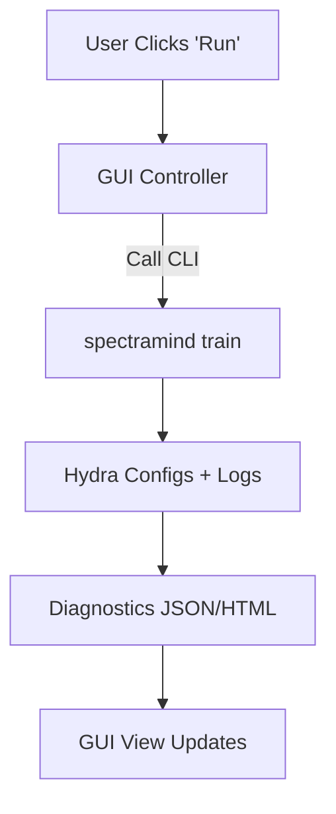

# 🎨 GUI Design Patterns — SpectraMind V50

## 0) Purpose

This document catalogs the **design patterns and architectural strategies** relevant to GUI extensions for **SpectraMind V50**.
Our philosophy is **CLI-first, GUI-optional**: every pipeline action is reproducible and automatable via `spectramind …`, while GUI layers are **thin shells** wrapping CLI/diagnostic outputs for accessibility, visualization, and exploration.

---

## 1) Core GUI Architectural Patterns

### 1.1 Model–View–Controller (MVC)

* **Model**: SpectraMind configs, artifacts, diagnostic JSON.
* **View**: GUI panels (charts, dashboards).
* **Controller**: Maps user actions to CLI commands (e.g., “Run Diagnose” → `spectramind diagnose dashboard`).
* ✅ Good for separation of concerns, testing Models without UI dependencies.

### 1.2 Model–View–Presenter (MVP)

* **Presenter** drives all updates to the View.
* Useful in GUI stubs that **mirror CLI output directly**: the Presenter parses logs/JSON and populates widgets.
* ✅ Ensures GUI remains a passive shell; aligns with reproducibility (no state hidden outside CLI outputs).

### 1.3 Model–View–ViewModel (MVVM)

* **ViewModel** exposes CLI/diagnostic results as bindable properties.
* Frameworks like **Qt QML, SwiftUI, Jetpack Compose**, or **React** support this via declarative binding.
* ✅ Preferred for modern GUI extensions (real-time dashboards, symbolic overlays).

---

## 2) GUI Event & Rendering Patterns

### 2.1 Event-Driven Loop

* GUIs run on an **event loop**: user clicks, timers, file updates.
* For SpectraMind, key events:

  * “Run” → trigger CLI subcommand.
  * “New Diagnostics” → reload `diagnostic_summary.json`.
  * “Refresh Dashboard” → re-render HTML/plots.
* ✅ Mirrors CLI pipeline: events map 1:1 to reproducible commands.

### 2.2 Retained vs Immediate Mode

* **Retained Mode**: Scene graph of widgets (Qt Widgets, DOM).
* **Immediate Mode**: UI redrawn each loop (ImGui, game dashboards).
* For V50:

  * **Retained**: dashboards with long-lived plots.
  * **Immediate**: lightweight overlays (FFT heatmaps, SHAP overlays).

### 2.3 Declarative UIs

* Describe **what** UI should look like given state (e.g., React JSX).
* State = SpectraMind configs + diagnostics.
* Framework handles diffs & updates automatically.
* ✅ Matches SpectraMind’s philosophy: *UI is a function of CLI state*.

---

## 3) Visual & Pattern-Based Design

### 3.1 Patterns in GUI Layout

* **Geometric patterns**: grid-based layouts for dashboards.
* **Temporal patterns**: live training metrics as time-series animations.
* **Fractals/self-similarity**: recursive zoomable spectral plots (FFT ↔ symbolic overlays).
* ✅ Pattern thinking ensures visual coherence and scientific clarity.

### 3.2 GUI as Symbolic/Pattern Explorer

* Symbolic violation maps → colored overlays in UMAP/t-SNE views.
* FFT/autocorrelation patterns → fractal-like diagnostics.
* UI must expose **scientific regularities** clearly, not hide them.

---

## 4) Integration with SpectraMind V50

### 4.1 CLI Binding Pattern

* All GUI actions **wrap CLI calls**:

  * GUI → `spectramind train`
  * GUI → `spectramind diagnose dashboard`
* No silent state mutations outside config/logs.

### 4.2 Reproducibility Guardrails

* GUI reads/writes only to:

  * Hydra configs (`configs/*.yaml`)
  * JSON/CSV/HTML diagnostics (`outputs/…`)
  * CLI logs (`logs/v50_debug_log.md`)
* Ensures GUI never diverges from CLI truth.

### 4.3 Optional Dashboards

* GUI as **“visual tail”**: users can inspect run artifacts interactively, but runs remain headless/CLI-first.
* Future extension: web-based dashboards (React + FastAPI) using same APIs/logs.

---

## 5) Best Practices

* **Thin Layer**: GUI never bypasses pipeline.
* **Binding over Wiring**: use declarative binding (MVVM) when possible.
* **Pattern-Aware Layout**: apply grid, fractal, and temporal design principles.
* **Accessibility**: colorblind-safe palettes, keyboard shortcuts, localization hooks.
* **Testability**: GUI modules unit-tested with mocked CLI outputs.

---

## 6) Example Diagram

---

## ✅ Summary

SpectraMind V50 GUI patterns are **scaffolds around the CLI**:

* MVC/MVP/MVVM ensure separation and binding.
* Event-driven and declarative UIs map directly to reproducible CLI outputs.
* GUI layouts embrace **scientific patterns** (grids, fractals, temporal signals).
* The GUI remains an **optional explorer**—never the source of truth.

---

