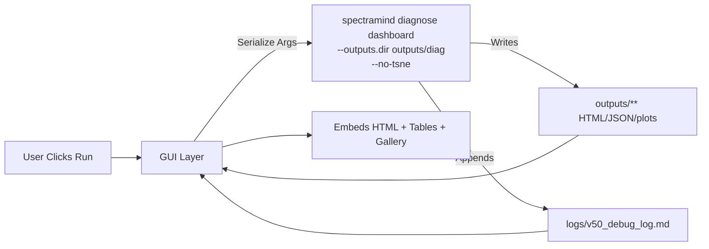

# 🖥️ GUI Frameworks — SpectraMind V50 (Upgraded)

## 0) Purpose & Scope

Survey the **desktop, web, and notebook** GUI options that can wrap the SpectraMind V50 pipeline. The doctrine is unchanged: **CLI-first, GUI-thin.** GUIs **invoke** `spectramind …` and **render** its artifacts (HTML, JSON, PNG) — never replace or fork pipeline logic.

---

## 1) Desktop Frameworks

### 1.1 Qt (PySide6 / PyQt, C++/Python)

* **Strengths:** Mature, cross-platform, native feel, excellent widget set; QML for MVVM; OpenGL/Vulkan rendering; great for “mission control” panels.
* **V50 fits:**

  * Local offline dashboard for labs.
  * Multi-panel diagnostics (UMAP, t-SNE, FFT, SHAP × Symbolic).
  * Stream `v50_debug_log.md` and surface exact CLI commands.
* **Trade-offs:** Packaging size/complexity (PyInstaller), steeper learning curve.

### 1.2 GTK / wxWidgets

* **Strengths:** Lightweight, Linux-centric, stable.
* **V50 fits:** Minimal admin consoles on Linux workstations.
* **Trade-offs:** Smaller ecosystem; less modern theming and extensibility.

### 1.3 Native Stacks (WPF/WinUI on Windows; Cocoa on macOS)

* **Strengths:** Deep OS integration; strong MVVM (WPF).
* **V50 fits:** Institution-locked environments (IT policies, domain join).
* **Trade-offs:** OS-bound; not ideal for cross-platform contributors.

---

## 2) Web Frameworks

### 2.1 React (+ FastAPI backend)

* **Strengths:** Rich ecosystem, component model, MVVM-style state; Plotly/ECharts; WebSocket log streaming.
* **V50 fits:**

  * Production diagnostics portal.
  * Multi-run compare views; artifact browser; UMAP/t-SNE explorers with planet-level links.
  * “Hydra override” forms that serialize **exact** CLI args.
* **Trade-offs:** Separate build/deploy; more moving parts than Streamlit.

### 2.2 Electron (desktop wrapper for web UI)

* **Strengths:** Ship the React dashboard as an installable desktop app (Win/macOS/Linux). Offline-friendly.
* **V50 fits:** Lab desktop tooling when a browser isn’t viable.
* **Trade-offs:** Large binaries; memory overhead.

### 2.3 Streamlit / Gradio

* **Strengths:** Python-native, fast prototyping, zero build step, notebook-friendly.
* **V50 fits:**

  * Rapid internal dashboards and CI/Kaggle introspection.
  * Thin wrappers around `spectramind diagnose dashboard`.
* **Trade-offs:** Limited component control; less “product-grade” than React/Qt.

---

## 3) Mobile Frameworks

### 3.1 Flutter

* **Strengths:** One codebase for Android/iOS/desktop/web; GPU-accelerated rendering.
* **V50 fits:** Read-only “mission status” (metrics, log tail, run list).
* **Trade-offs:** Extra toolchain; lower priority vs. web/desktop.

### 3.2 React Native

* **Strengths:** Leverages React ecosystem; code sharing with web.
* **V50 fits:** Companion app for notifications/logs.
* **Trade-offs:** Secondary to the web dashboard.

---

## 4) Notebook / Hybrid

### 4.1 Jupyter widgets (ipywidgets, Plotly, bqplot)

* **Strengths:** Great for research/teaching; inline visualization.
* **V50 fits:** Tutorial notebooks; symbolic/FFT exploration, small datasets.
* **Trade-offs:** Not ideal for competition-time constraints or long jobs.

### 4.2 Kaggle

* **Fits:** Streamlit/Gradio/Voila mini-apps embedded in notebooks for **interactive reports** that stay within runtime limits.
* **Note:** Still **invoke CLI** where possible and cache artifacts.

---

## 5) Selection Guidelines (V50-specific)

| Goal                     | Best Choice                | Why                                                                    |
| ------------------------ | -------------------------- | ---------------------------------------------------------------------- |
| Prototype quickly        | **Streamlit**              | Python-native; trivial artifact embedding; already implemented in repo |
| Production web dashboard | **React + FastAPI**        | Full control, scalable, WebSocket log streaming, auth ready            |
| Offline desktop control  | **PySide6 (Qt)**           | Robust native shell; MVVM; pack once for lab machines                  |
| Mobile companion         | **Flutter / React Native** | Optional “status only” surfaces                                        |
| Notebook demos/teaching  | **Jupyter + widgets**      | Lowest friction for tutorials                                          |

---

## 6) Patterns & Principles

* **CLI Binding:** All user actions map to **verbatim** `spectramind` commands. Always show the exact command string executed.
* **Thin State:** The GUI mirrors Hydra configs and reads **files** from `outputs/**` and `logs/**`. It does **not** compute or persist alternate truth.
* **MVVM Preferred:** ViewModel exposes observables (`status`, `stdout`, `stderr`, `artifacts`, `runHash`). Views are dumb.
* **Artifact-First:** New visualizations **must** originate from CLI artifacts (e.g., `diagnostic_summary.json`, `*_dashboard.html`, `plots/*.png`).
* **Accessibility:** Keyboard nav, contrast ≥ 4.5:1, screen reader labels, reduced motion options, proper roles/landmarks.

---

## 7) Example Flow (end-to-end)



---

## 8) Engineering Checklists

### 8.1 Reproducibility

* [ ] GUI **prints** and **logs** the exact CLI command (including Hydra overrides).
* [ ] Artifacts rendered are **read-only** from `outputs/**`.
* [ ] GUI dispatches include a “GUI” tag/line in `v50_debug_log.md` (in addition to CLI logging).

### 8.2 Security & Packaging

* [ ] Never embed secrets in GUI code/state; rely on env vars.
* [ ] Sanitize/iframe local HTML only; do not fetch remote HTML.
* [ ] For Electron/Qt, sign binaries where applicable; sandbox renderer.

### 8.3 Performance & UX

* [ ] Non-blocking process execution; line-buffered streaming of stdout/stderr.
* [ ] Pagination/virtualization for large tables; lazy image loading.
* [ ] “Rescan Artifacts” control with cache invalidation.

### 8.4 Testing

* **Unit:** Mock `subprocess`/IPC; test glob scanners, tail readers, argument serializers.
* **E2E:** Playwright/Cypress (web) or `pytest-qt` (Qt) with a **fake CLI** writing fixture artifacts.
* **A11y:** Axe (web) and manual keyboard traversal.

---

## 9) V50 Reference Implementations

* **Streamlit app:** `gui/streamlit_app.py`

  * Live stdout/stderr streaming, artifact selection, log tail slider, recent runs table.
* **Qt shell (optional):** `gui/qt_shell.py` (template)

  * MVC/MVVM hybrid with threaded runner and command echo.
* **Electron shell (optional):** `gui/electron/` (template)

  * IPC contract: `spectramind:run` → `{ code, out, err }`.

> Extend scanners when the CLI emits new artifacts; never embed business logic in the GUI.

---

## 10) Deployment Recipes (quick)

* **Streamlit (dev):**

  ```bash
  streamlit run gui/streamlit_app.py
  ```
* **React + FastAPI (prod):**

  * Build React → `dist/`
  * Serve with FastAPI/uvicorn; reverse-proxy via Nginx; enable WebSocket for logs.
* **Electron:**

  * Wrap the React `dist/` and package via `electron-builder` (targets: win/mac/linux).
* **PySide6:**

  * PyInstaller spec with data files (`outputs/**` read-only); add CLI presence checks.

---

## 11) Risk Register (GUI-specific)

| Risk                           | Avoidance                                                                        |
| ------------------------------ | -------------------------------------------------------------------------------- |
| GUI diverges from CLI features | File-driven visuals; CI test asserts a minimum set of artifacts exist and render |
| Hidden logic introduced        | PR checklist: “No business logic” gate + codeowner review                        |
| Large artifacts freeze UI      | Stream readers, chunked tables, lazy image loading                               |
| OS packaging breaks            | Keep a “run from source” path; docs for env setup                                |

---

## ✅ Summary

Choose the **lightest tool** that cleanly **wraps the CLI** and **renders artifacts**:

* **Streamlit** for rapid internal dashboards and CI/Kaggle inspection.
* **React + FastAPI** for production web portals with log streaming and run comparisons.
* **Qt (PySide6)** for offline, lab-grade native shells.
* **Notebook widgets** for teaching and quick research demos.

Across all choices: **echo the exact CLI command, read artifacts from disk, keep state thin, and prioritize accessibility.**
