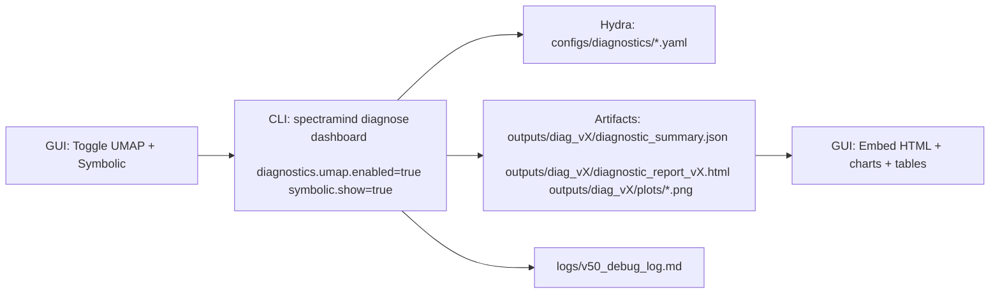
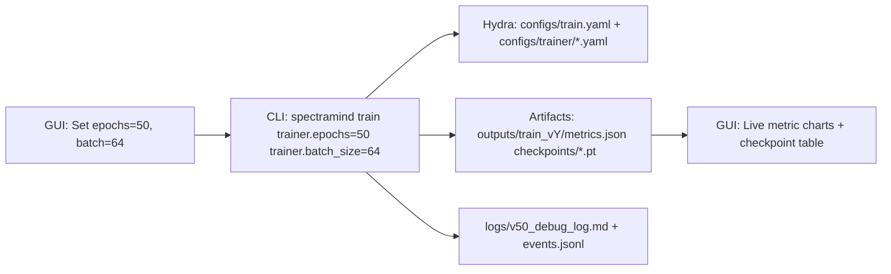
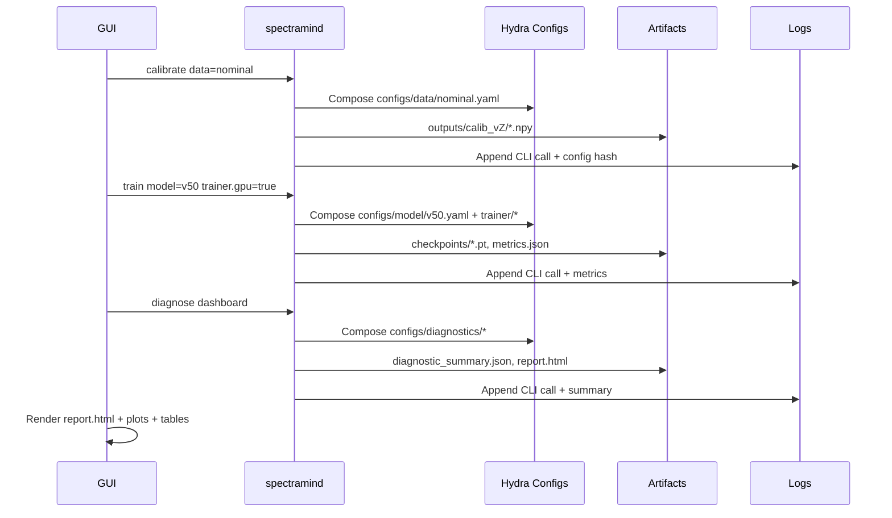
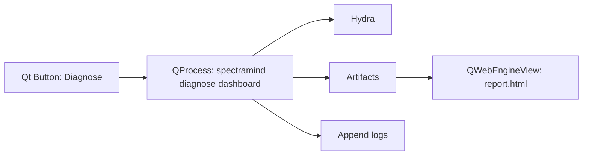

# 🧩 GUI Integration Examples — SpectraMind V50 (Upgraded)

This guide shows **practical, end-to-end** examples of how a thin GUI wraps the **CLI-first** SpectraMind V50 pipeline and then **renders artifacts** (JSON/HTML/plots/logs). Every example preserves **Hydra configs**, **Typer CLI**, and **audit logs** to maintain NASA-grade reproducibility.

---

## 0) Legend (What each box means)

```mermaid
flowchart LR
  subgraph Legend
    A[GUI Action]:::gui --> B[CLI Command]:::cli
    B --> C[Hydra Configs (configs/*.yaml)]:::cfg
    B --> D[Artifacts (JSON/HTML/plots)]:::art
    B --> E[Logs (logs/v50_debug_log.md)]:::log
    D --> F[GUI Rendering]:::view
  end
classDef gui fill:#e3f2fd,stroke:#1565c0,color:#0d47a1;
classDef cli fill:#ede7f6,stroke:#5e35b1,color:#311b92;
classDef cfg fill:#fff3e0,stroke:#ef6c00,color:#e65100;
classDef art fill:#e8f5e9,stroke:#2e7d32,color:#1b5e20;
classDef log fill:#fce4ec,stroke:#ad1457,color:#880e4f;
classDef view fill:#f3e5f5,stroke:#6a1b9a,color:#4a148c;
```

**Principles**

* **CLI-first** guarantees discoverability (`--help`), composition, and scripting.
* **GUI** is a thin shell: *no hidden state; only reflects configs + artifacts*.

---

## 1) Diagnose Dashboard (UMAP + Symbolic)

### 1.1 Flow



**Why this works**
The CLI composes Hydra configs and produces canonical artifacts; the GUI only reads and renders them.

**Serialized CLI (exact echo in the GUI):**

```bash
spectramind diagnose dashboard \
  diagnostics.umap.enabled=true \
  symbolic.show=true \
  --outputs.dir outputs/diag_vX
# Logged in logs/v50_debug_log.md with timestamp & config hash
```

---

## 2) Training Run with Config Overrides

### 2.1 Flow



**Serialized CLI:**

```bash
spectramind train trainer.epochs=50 trainer.batch_size=64
```

**GUI rendering tips**

* Stream stdout/stderr; show ETA if available.
* Plot loss/val-GLL from `metrics.json`.
* Table: `checkpoints/*.pt` (mtime, size, path copy).

---

## 3) Calibration → Training → Diagnostics (Chained)

### 3.1 Flow



**Notes**

* GUI runs each step as an **independent CLI** call; artifacts flow via disk.
* DVC/lakeFS (if enabled) version large outputs; GUI remains read-only.

---

## 4) Streamlit Wrapper (Prototype Pattern)

**Minimal pattern (visible CLI + artifacts)**

```python
# Pseudocode
cmd = ["spectramind","diagnose","dashboard",
       "diagnostics.umap.enabled=true","symbolic.show=true",
       "--outputs.dir", outputs_dir]
run_subprocess(cmd)  # stream to stdout/stderr panels

html = read_text(find("outputs/.../diagnostic_report*.html"))
st.components.v1.html(html, height=900, scrolling=True)

j = json_load("outputs/.../diagnostic_summary.json")
st.dataframe(flatten(j))  # metrics + per_planet

log = tail("logs/v50_debug_log.md", 50000)
st.code(log)
```

**When to use**
Rapid Python-native prototypes (local, CI, Kaggle). Extend **artifact scanners**, not pipeline logic.

---

## 5) React + FastAPI Contracts (Team Dashboard)

### 5.1 Flow & API

```mermaid
flowchart LR
  A[React UI]:::gui -->|POST /api/run| B[FastAPI Backend]:::cli
  B -->|subprocess| C[spectramind …]:::cli
  C --> D[Hydra configs]:::cfg
  C --> E[Artifacts (JSON/HTML/plots)]:::art
  C --> F[Logs]:::log
  A -->|GET /api/artifacts| B
  B -->|Serve| A
```

**Endpoints (minimal)**

* `POST /api/run` → `{ args: string[] }` → spawn `spectramind …`, return `{run_id}`; stream logs via WS.
* `GET /api/artifacts?glob=` → newest matches (path, mtime, size).
* `GET /api/logs/tail?bytes=50000` → tail `v50_debug_log.md`.
* `WS /api/logs/stream?run_id=` → live stdout/stderr.

**Frontend**

* State = artifacts JSON; Components = HTML iframe, metric tables, image gallery.
* Keyboard map + reduced-motion; copyable CLI string.

---

## 6) Qt/PySide (Offline Mission Control)

### 6.1 Flow



**Implementation hints**

* Use `QProcess` (non-blocking) and connect to `readyReadStandardOutput`.
* File watchers (`QFileSystemWatcher`) to refresh artifact lists.
* `QWebEngineView` to embed the local report; link out for full browser.

---

## 7) Notebook / Kaggle

* Launch a Streamlit/Gradio panel in a notebook; still **invoke CLI** and read `outputs/**`.
* Respect runtime limits; keep artifacts small or paginated.

---

## 8) Thin-GUI Compliance Checklist

* [ ] **Echo exact CLI** command (copy button) for every run.
* [ ] Only **Hydra configs/overrides** control parameters (no hidden state).
* [ ] Render **artifacts as-is** (no mutation or recomputation in the GUI).
* [ ] Show **config hash**, **git SHA**, **timestamp**, **run id**; link to `logs/v50_debug_log.md`.
* [ ] Same contract holds across **Streamlit / React / Qt**.
* [ ] Auto-refresh is **user-controlled** (pause/throttle).
* [ ] A11y: keyboard reachability, visible focus, high contrast, color-independent encodings.

---

## 9) Copy-Paste Snippets

**Diagnose (UMAP on, t-SNE off, custom out dir)**

```bash
spectramind diagnose dashboard diagnostics.umap.enabled=true --no-tsne --outputs.dir outputs/diag_umap_only
```

**Train (Kaggle-safe batch/epochs, AMP)**

```bash
spectramind train trainer.epochs=50 trainer.batch_size=64 trainer.amp=true
```

**Predict + Package**

```bash
spectramind submit predict.outputs.dir=outputs/predict_v1 submit.bundle=true
```

**Tail logs**

```bash
tail -n 200 logs/v50_debug_log.md
```

---

## 10) GUI Test Recipes

**Streamlit**

* Unit: mock `subprocess.Popen` and glob helpers; assert command string + artifact discovery.
* E2E: fake CLI writer that emits stdout, writes fixtures, exits with rc=0/1.

**React + FastAPI**

* Unit: `POST /api/run` spawns expected args; mock child process; test WS streaming.
* E2E: Playwright keyboard flows; axe a11y scan on main routes.

**Qt/PySide**

* Unit: `pytest-qt` for signals/slots; simulate click → `QProcess` spawn.
* Integration: fixtures create `outputs/**` and `report.html`; verify UI updates.

---

## 11) One-Screen Summary

```mermaid
flowchart LR
  U[User] -->|Click/Keys| G[GUI Shell]
  G -->|Spawn| C[spectramind …]
  C --> Y[Hydra Configs]
  C --> O[Artifacts (JSON/HTML/plots)]
  C --> L[Audit Log (v50_debug_log.md)]
  O --> G
  L --> G
  G -->|Render| V[Accessible Views (HTML/table/gallery/log)]
```

---

### ✅ TL;DR

Any GUI (Streamlit, React, Qt) must **echo the exact CLI**, **read artifacts from disk**, **keep state thin**, and **show provenance** (hashes, logs, timestamps). That’s how we keep SpectraMind V50 GUI-optional and still **NASA-grade reproducible**.
