# 🧩 GUI Integration Examples — SpectraMind V50

This guide shows **practical, end-to-end** examples of how a thin GUI wraps the **CLI-first** SpectraMind V50 pipeline, and then **renders artifacts** (JSON/HTML/plots/logs). Every example preserves **Hydra configs**, **Typer CLI**, and **audit logs** to maintain NASA-grade reproducibility:contentReference[oaicite:0]{index=0}:contentReference[oaicite:1]{index=1}.

---

## 0) Legend (What each box means)

```mermaid
flowchart LR
  subgraph Legend
    A[GUI Action]:::gui --> B[CLI Command]:::cli
    B --> C[Hydra Configs (configs/*.yaml)]:::cfg
    B --> D[Artifacts (JSON/HTML/plots)]:::art
    B --> E[Logs (v50_debug_log.md)]:::log
    D --> F[GUI Rendering]:::view
  end
classDef gui fill:#e3f2fd,stroke:#1565c0,color:#0d47a1;
classDef cli fill:#ede7f6,stroke:#5e35b1,color:#311b92;
classDef cfg fill:#fff3e0,stroke:#ef6c00,color:#e65100;
classDef art fill:#e8f5e9,stroke:#2e7d32,color:#1b5e20;
classDef log fill:#fce4ec,stroke:#ad1457,color:#880e4f;
classDef view fill:#f3e5f5,stroke:#6a1b9a,color:#4a148c;
````

* **CLI-first** guarantees discoverability (`--help`), composition, and scripting.
* **GUI** is a thin shell: *no hidden state; only reflects configs + artifacts*.

---

## 1) Diagnose Dashboard (UMAP + Symbolic)

### 1.1 Flow

```mermaid
flowchart LR
  A[GUI: Toggle UMAP + Symbolic]:::gui --> B[CLI: spectramind diagnose dashboard \n diagnostics.umap.enabled=true symbolic.show=true]:::cli
  B --> C[Hydra: configs/diagnostics/*.yaml]:::cfg
  B --> D[Artifacts: outputs/diag_vX/diagnostic_summary.json \n outputs/diag_vX/diagnostic_report_vX.html \n outputs/diag_vX/plots/*.png]:::art
  B --> E[logs/v50_debug_log.md]:::log
  D --> F[GUI: Embed HTML + charts + tables]:::view
```

* **Why this works**: CLI composes Hydra configs, produces artifacts; GUI just reads & renders.
* **Artifacts**: JSON/HTML/plots are the **source of truth** for visualization.

### 1.2 Example CLI serialization

```bash
spectramind diagnose dashboard \
  diagnostics.umap.enabled=true \
  symbolic.show=true \
  --outputs.dir outputs/diag_vX
# Logged in logs/v50_debug_log.md with timestamp & config hash
```

---

## 2) Training Run with Config Override

### 2.1 Flow

```mermaid
flowchart LR
  A[GUI: Set epochs=50, batch=64]:::gui --> B[CLI: spectramind train trainer.epochs=50 trainer.batch_size=64]:::cli
  B --> C[Hydra: configs/train.yaml + group overrides \n configs/trainer/*.yaml]:::cfg
  B --> D[Artifacts: outputs/train_vY/metrics.json \n checkpoints/*.pt]:::art
  B --> E[logs/v50_debug_log.md + events.jsonl]:::log
  D --> F[GUI: Live metric charts (loss/val GLL), table of checkpoints]:::view
```

* **Hydra composition** captures run params and isolates outputs per run directory.
* **CLI UX** follows Typer best practices (help, flags, discoverable subcommands).

### 2.2 Example CLI serialization

```bash
spectramind train trainer.epochs=50 trainer.batch_size=64
```

---

## 3) Calibration → Training → Diagnostics (Chained)

### 3.1 Flow


* **End-to-end** remains headless & scriptable; GUI simply sequences CLI calls and renders outputs.
* **DVC (optional)** can version large artifacts for reproducibility across machines.

---

## 4) Streamlit Wrapper (Prototype)

### 4.1 Minimal pattern (visible CLI + artifacts)

```python
# Pseudocode (GUI action)
cmd = ["spectramind", "diagnose", "dashboard",
       "diagnostics.umap.enabled=true",
       "symbolic.show=true", "--outputs.dir", outputs_dir]
run_subprocess(cmd)  # show stdout/stderr panel
html = read_text(find("outputs/.../diagnostic_report*.html"))
st.components.v1.html(html, height=900, scrolling=True)
json = json_load("outputs/.../diagnostic_summary.json")
st.dataframe(flatten(json))
log = tail("logs/v50_debug_log.md", 50000)
st.code(log)
```

* **Pattern**: event-driven GUI → subprocess CLI → render artifacts (no internal algorithm changes).
* **Why Streamlit**: rapid, Python-native prototyping for local/Kaggle environments.

---

## 5) React + FastAPI (Team Dashboard)

### 5.1 Flow & contracts

```mermaid
flowchart LR
  A[React UI]:::gui -->|/api/run| B[FastAPI Backend]:::cli
  B -->|subprocess| C[spectramind …]:::cli
  C --> D[Hydra configs]:::cfg
  C --> E[Artifacts JSON/HTML/plots]:::art
  C --> F[Logs]:::log
  A -->|/api/artifacts| B
  B -->|Serve| A
```



* **Contracts**:

  * `POST /api/run` → runs CLI with validated params → returns run id, streams logs.
  * `GET /api/artifacts?glob=…` → lists artifacts for embedding.
* **Declarative UI (React/MVVM)**: state = diagnostics JSON; component tree renders from state.

---

## 6) Qt / PySide (Offline Mission Control)

### 6.1 Flow


* **Signal/slot** → Observer pattern; **QProcess** isolates CLI; **QWebEngineView** embeds HTML report.
* **Why Qt**: native performance, robust widgets for lab/offline use.

---

## 7) Notebook / Kaggle Example

* In a Kaggle Notebook, launch a **Streamlit** or **Gradio** panel to wrap the same CLI & artifacts (subject to environment rules).
* Keep runs **headless**; GUI only reads files in `/kaggle/working/outputs/...`.

---

## 8) Pattern Checklist (Quick Audit)

* [ ] **Every GUI action maps to a CLI command** (serialized in log)
* [ ] **Hydra configs** are the only knobs for parameters (no hidden GUI state)
* [ ] **Artifacts (JSON/HTML/plots)** are rendered as-is (no data mutation)
* [ ] **Versioning**: run hash + config snapshot stored; logs appended
* [ ] **Framework-agnostic**: Streamlit / React / Qt follow the same boundary contract

---

## 9) Appendix — Why CLI-first + Thin GUI?

* **Discoverability & scripting** via Typer/Click (`--help`, tab-completion)
* **Hydra composition** for config reuse and sweeps (multirun)
* **Artifact-driven visualization** keeps GUI stateless and auditable
* **Event-driven** & **declarative UIs** map naturally to rendering diagnostics from state

```
