# 🧩 GUI Integration Examples — SpectraMind V50 (Upgraded)

> Practical, end-to-end examples showing how a **thin GUI** wraps the **CLI-first** SpectraMind V50 pipeline and **renders artifacts** (JSON/HTML/plots/logs).
> Doctrine: **CLI-first, Hydra-safe, audit-ready** — the GUI never computes pipeline logic, never forks state, and always echoes the exact CLI it runs.

---

## 0) Legend (What each box means)

```mermaid
flowchart LR
  subgraph Legend
    A[GUI Action]:::gui --> B[CLI Command]:::cli
    B --> C[Hydra Configs (configs/*.yaml)]:::cfg
    B --> D[Artifacts (JSON/HTML/plots)]:::art
    B --> E[Logs (logs/v50_debug_log.md)]:::log
    D --> F[GUI Rendering]:::view
  end

  classDef gui fill:#e3f2fd,stroke:#1565c0,color:#0d47a1;
  classDef cli fill:#ede7f6,stroke:#5e35b1,color:#311b92;
  classDef cfg fill:#fff3e0,stroke:#ef6c00,color:#e65100;
  classDef art fill:#e8f5e9,stroke:#2e7d32,color:#1b5e20;
  classDef log fill:#fce4ec,stroke:#ad1457,color:#880e4f;
  classDef view fill:#f3e5f5,stroke:#6a1b9a,color:#4a148c;
```

**Principles**

* **CLI discoverability**: all features visible via `--help`, scriptable, composable.
* **GUI is a shell**: no hidden state; only reflects configs + artifacts.

---

## 1) Diagnose Dashboard (UMAP + Symbolic)


**Serialized CLI (exactly what the GUI must echo):**

```bash
spectramind diagnose dashboard \
  diagnostics.umap.enabled=true \
  symbolic.show=true \
  --outputs.dir outputs/diag_vX
```

**GUI rendering**

* Embed `diagnostic_report_vX.html` (iframe/sandbox)
* Parse and tabulate `diagnostic_summary.json` (`metrics`, `per_planet`)
* Gallery from `outputs/diag_vX/plots/*.png`
* Tail `logs/v50_debug_log.md` with pause/resume

---

## 2) Training Run with Config Overrides


**Serialized CLI:**

```bash
spectramind train trainer.epochs=50 trainer.batch_size=64
```

**GUI rendering**

* Stream stdout/stderr → progress area
* Plot metrics from `outputs/train_vY/metrics.json`
* List `checkpoints/*.pt` with size, mtime, and “copy path” buttons
* Provide “open in file browser” / “download” (where appropriate)

---

## 3) Calibration → Training → Diagnostics (Chained Orchestration)


**Contract**

* Each leg echoes an exact CLI string (copyable) and links to the produced artifacts and log anchors.
* The GUI never “pipes” outputs in-process; it always reads from disk.

---

## 4) Streamlit Wrapper Pattern (Prototype)

**Pseudocode (structure the real app follows):**

```python
cmd = [
  "spectramind","diagnose","dashboard",
  "diagnostics.umap.enabled=true",
  "symbolic.show=true",
  "--outputs.dir", outputs_dir
]
run_subprocess(cmd)  # stream stdout/stderr to panels

html = read_text(find("outputs/.../diagnostic_report*.html"))
st.components.v1.html(html, height=900, scrolling=True)

j = json_load("outputs/.../diagnostic_summary.json")
st.dataframe(flatten(j))  # metrics + per_planet

log = tail("logs/v50_debug_log.md", 50000)
st.code(log)
```

**When to use**

* Rapid Python-native prototypes (research/Kaggle/CI).
* Keep it thin: extend only the **artifact scanner**, not pipeline logic.

---

## 5) React + FastAPI Contracts (Team Dashboard)

```mermaid
flowchart LR
  A[React UI]:::gui -->|POST /api/run| B[FastAPI]:::cli
  B -->|subprocess| C[spectramind …]:::cli
  C --> D[Hydra configs]:::cfg
  C --> E[Artifacts JSON/HTML/plots]:::art
  C --> F[Logs]:::log
  A -->|GET /api/artifacts| B
  B -->|Serve| A
```



**Minimal API endpoints**

* `POST /api/run` → body: `{ args: string[] }` → spawn child process (`spectramind ...`)
* `GET  /api/artifacts?glob=...` → return newest matches with mtime/size
* `GET  /api/logs/tail?bytes=50000` → tail `v50_debug_log.md`
* `WS   /api/logs/stream` → live stdout/stderr

**Frontend rendering**

* React state = artifacts JSON
* Declarative panels: HTML iframe, metrics tables, image gallery
* Shortcuts (`?` overlay), focus management, reduced-motion CSS

---

## 6) Qt/PySide (Offline Mission Control)


**Key pieces**

* `QProcess` (non-blocking) to spawn CLI and stream output to a `QTextEdit`
* `QWebEngineView` to embed local report HTML
* File system watchers to refresh artifact lists
* Keyboard-first navigation; visible focus rings; configurable theme tokens

---

## 7) Pattern Checklist (must pass)

* ✅ GUI action → **verbatim CLI command** (visible + copyable)
* ✅ Parameters only via **Hydra configs/overrides**
* ✅ **Artifacts rendered as-is** (no mutation or recomputation)
* ✅ **Run hashes & logs** captured and visible (link to `v50_debug_log.md`)
* ✅ **Same contract** across Streamlit / React / Qt

---

## 8) Anti-Patterns (never do)

* ❌ Calling internal Python functions to “save time” — **always** go through `spectramind`
* ❌ Deriving “alternative metrics” in the GUI — if needed, add a CLI artifact first
* ❌ Hiding overrides that change results — all inputs must be explicit and echo-able
* ❌ Auto-refresh that can’t be paused — always give users control
* ❌ Relying on color alone — add shapes/labels/tooltips

---

## 9) Copy-Paste Snippets

**Diagnose (UMAP on, t-SNE off, custom out dir)**

```bash
spectramind diagnose dashboard diagnostics.umap.enabled=true --no-tsne --outputs.dir outputs/diag_umap_only
```

**Train (Kaggle-safe batch/epochs, AMP)**

```bash
spectramind train trainer.epochs=50 trainer.batch_size=64 trainer.amp=true
```

**Predict + Package (example)**

```bash
spectramind submit predict.outputs.dir=outputs/predict_v1 submit.bundle=true
```

**Tail logs (CLI helper)**

```bash
tail -n 200 logs/v50_debug_log.md
```

---

## 10) GUI Test Recipes (per framework)

**Streamlit**

* Unit: mock `subprocess.Popen`; assert command string, artifact discovery, tailing
* E2E: run with a **fake CLI** that writes fixture artifacts then exits

**React + FastAPI**

* Unit: test `POST /api/run` spawns expected args; mock process; emit stdout
* E2E: Playwright flows (keyboard-only); axe a11y scan on main routes

**Qt/PySide**

* Unit: `pytest-qt` for signals/slots; simulate button press → QProcess spawn
* Integration: fixtures create `outputs/**` and `report.html`; UI refreshes card list

---

## 11) One-Screen Summary Diagram

```mermaid
flowchart LR
  U[User] -->|Click/Keys| G[GUI Shell]
  G -->|Spawn| C[spectramind …]
  C --> Y[Hydra Configs]
  C --> O[Artifacts (JSON/HTML/plots)]
  C --> L[Audit Log (v50_debug_log.md)]
  O --> G
  L --> G
  G -->|Render| V[Accessible Views (HTML/table/gallery/log)]
```

---

### ✅ TL;DR

Pick any GUI (Streamlit, React, Qt) — the rules stay the same: **echo the exact CLI**, **read artifacts from disk**, **keep state thin**, and **show provenance** (hashes, logs, timestamps). That’s how we keep SpectraMind V50 GUI-optional and still **NASA-grade reproducible**.
