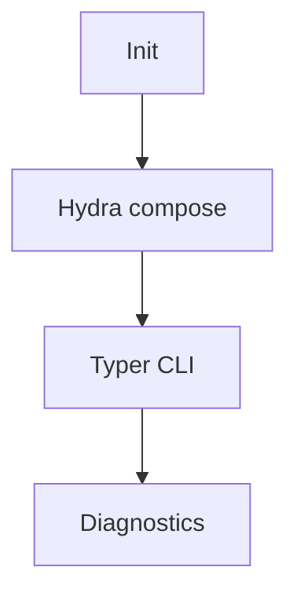

### 2) Inline `init` directive for Markdown (GitHub)

Paste this at the **top of any Mermaid code block** to apply the same settings when you don’t (or can’t) load the JSON file:

```mermaid
%%{init: {
  "theme": "base",
  "securityLevel": "strict",
  "arrowMarkerAbsolute": true,
  "deterministicIds": true,
  "deterministicIDSeed": "spectramind-v50",
  "logLevel": "error",
  "fontFamily": "Inter, Roboto, Segoe UI, Helvetica Neue, Arial, ui-sans-serif, system-ui, sans-serif",
  "themeVariables": {
    "background": "transparent",
    "primaryColor": "#0ea5e9",
    "primaryTextColor": "#0f172a",
    "primaryBorderColor": "#0284c7",
    "lineColor": "#334155",
    "textColor": "#0f172a",
    "tertiaryColor": "#f1f5f9",
    "noteBkgColor": "#fef9c3",
    "noteTextColor": "#1f2937",
    "errorBkgColor": "#fee2e2",
    "errorTextColor": "#991b1b",
    "fontSize": "16px"
  },
  "flowchart": {
    "htmlLabels": false,
    "useMaxWidth": true,
    "diagramPadding": 16,
    "padding": 8,
    "nodeSpacing": 40,
    "rankSpacing": 60,
    "curve": "basis"
  }
}}%%
```

Then your actual diagram goes below:



---

### Heads-up for GitHub rendering

* GitHub renders Mermaid **client-side** and ignores external scripts/styles; stick to the standard init options and theme variables like above.
* **Strict mode + `htmlLabels: false`** keeps things safe and avoids sanitizer issues.
