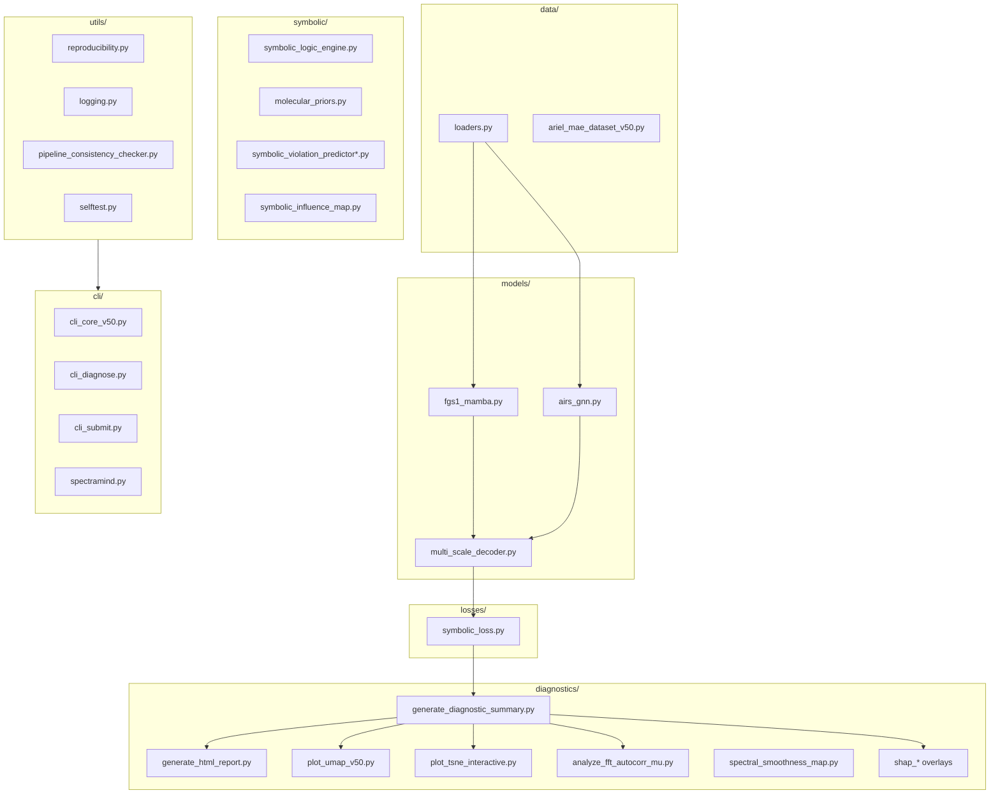

# 📂 `src/` — SpectraMind V50 Architecture

**Mission:** Core source code for the **SpectraMind V50 neuro-symbolic pipeline** (NeurIPS 2025 Ariel Data Challenge).
From **FGS1/AIRS encoders** → **multi-scale decoders** → **symbolic loss layers** → **diagnostics & dashboards** → **Kaggle submission**.

---

## 📑 Directory Map

```
src/
├── train_v50.py                   # Training entrypoint (Hydra, curriculum, checkpoints, metrics)
├── predict_v50.py                 # Inference & submission builder (μ/σ, calibration, bundling)
│
├── models/                        # Encoders & decoders
│   ├── fgs1_mamba.py              # FGS1 encoder (Mamba SSM for long sequences)
│   ├── airs_gnn.py                # AIRS encoder (GNN w/ wavelength, molecule, region edges)
│   └── multi_scale_decoder.py     # Multi-head μ/σ decoder (fusion, symbolic overlays)
│
├── data/                          # Data ingestion
│   ├── loaders.py                 # Train/val/test dataloaders
│   └── ariel_mae_dataset_v50.py   # MAE dataset (masking: random, molecular, symbolic, curriculum)
│
├── losses/                        # Training objectives
│   └── symbolic_loss.py           # GLL + physics-informed priors (smoothness, Voigt, monotonicity)
│
├── symbolic/                      # Symbolic logic modules
│   ├── symbolic_logic_engine.py        # Rule evaluation engine (hard/soft, per-rule masks)
│   ├── symbolic_violation_predictor.py # Rule-based violation scoring
│   ├── symbolic_violation_predictor_nn.py # Neural predictor of violations
│   ├── symbolic_fusion_predictor.py    # Ensemble symbolic violation integrator
│   ├── symbolic_influence_map.py       # ∂L/∂μ symbolic influence & entropy overlays
│   └── molecular_priors.py             # Physics priors (H₂O, CO₂, CH₄ absorption bands)
│
├── diagnostics/                   # Post-hoc diagnostics
│   ├── generate_diagnostic_summary.py # Metrics + overlays → JSON
│   ├── generate_html_report.py        # Interactive diagnostics dashboard (UMAP, t-SNE, FFT, SHAP)
│   ├── plot_umap_v50.py               # UMAP latent embedding w/ symbolic overlays
│   ├── plot_tsne_interactive.py       # Interactive t-SNE (Plotly)
│   ├── analyze_fft_autocorr_mu.py     # FFT & autocorrelation on μ spectra
│   ├── spectral_smoothness_map.py     # Smoothness penalty visualization
│   ├── shap_overlay.py                # SHAP × μ overlays
│   ├── shap_attention_overlay.py      # SHAP × attention fusion
│   └── shap_symbolic_overlay.py       # SHAP × symbolic fusion overlays
│
├── utils/                        # Shared utilities
│   ├── reproducibility.py         # Seed setting, Hydra/DVC/env hashing
│   ├── logging.py                 # Rich + JSONL logging
│   ├── pipeline_consistency_checker.py # CI: validate Hydra/DVC/CLI pipeline integrity
│   └── selftest.py                # Fast/deep self-tests (CLI + CI)
│
└── cli/                          # Unified Typer CLI
    ├── cli_core_v50.py            # Train/predict orchestration
    ├── cli_diagnose.py            # Diagnostics dashboard / symbolic analysis
    ├── cli_submit.py              # Kaggle submission bundle builder
    └── spectramind.py             # Root CLI entrypoint (registers all commands)
```

---

## 🔑 Design Principles

* **Encoders**
  • `fgs1_mamba.py`: handles long FGS1 photometric series with Mamba SSM.
  • `airs_gnn.py`: graph-based AIRS encoder, edges = wavelength, molecule, detector region.

* **Decoder**
  • `multi_scale_decoder.py`: predicts μ/σ jointly; integrates symbolic overlays.

* **Losses & Symbolic**
  • `symbolic_loss.py`: smoothness, molecular priors, non-negativity, Voigt-like band matching.
  • Symbolic predictors detect and score rule violations, feeding into SHAP and diagnostics.

* **Diagnostics**
  • FFT, UMAP, t-SNE, smoothness, SHAP overlays — aggregated into dashboards (`generate_html_report.py`).

* **Reproducibility**
  • Hydra config snapshots, DVC dataset hashing, JSONL logs, `selftest.py` pipeline CI checks.

* **CLI Integration**
  • Unified Typer CLI (`spectramind.py`) with subcommands:
  `train`, `predict`, `diagnose`, `submit`, `test`.

---

## 📊 Visual Overview

<details>
<summary><strong>src/ system overview (Mermaid)</strong></summary>



</details>

---

## ✅ Guarantees

* **Full reproducibility**: Hydra configs, DVC, Git commits, environment captures.
* **Diagnostics-first**: Every run emits JSON summaries + plots for dashboards.
* **Challenge-ready**: Outputs μ/σ for 283 bins in Kaggle submission format.
* **Physics-informed**: Symbolic priors enforce astrophysical plausibility.

---
