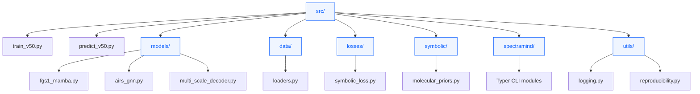

```mermaid
%% SpectraMind V50 — end‑to‑end pipeline (data flow)
flowchart LR
  subgraph Calib[Calibration]
    RAW[Raw FGS1/AIRS] -->|HDF5/NPY| CAL[Calibrated Lightcurves]
  end

  subgraph Data[data/]
    CAL --> LDR[loaders.py]
  end

  subgraph Train[Training]
    LDR --> ENC1[models/fgs1_mamba.py]
    LDR --> ENC2[models/airs_gnn.py]
    ENC1 --> DEC[multi_scale_decoder.py]
    ENC2 --> DEC
    DEC --> LOSS[losses/symbolic_loss.py]
    LOSS --> CKPT[(checkpoints)]
  end

  subgraph Infer[Inference]
    CKPT --> PRED[predict_v50.py]
    PRED --> SUB[submission.csv]
  end

  subgraph Repro[Reproducibility]
    CFG[[Hydra configs]] --> ALL
    LOGS[[utils/logging.py\n+ JSON/JSONL + plots]] --> ALL
  end

  ALL -. tracked .-> Calib
  ALL -. tracked .-> Train
  ALL -. tracked .-> Infer

  classDef node fill:#ffffff,stroke:#94a3b8,stroke-width:1px,color:#0e1116;
  classDef pill fill:#0b5fff10,stroke:#0b5fff,color:#0b5fff,stroke-width:1px;
  class Calib,Data,Train,Infer,Repro pill;
```

## 📦 What’s here (current tree)

> Reflects your repository state in `/src` right now.

- **`asa/`** — Calibration & instrument helpers specific to Ariel Sensor Array (e.g., temperature, photometry).
- **`configs/`** — Hydra YAMLs (training, data, model, logging). Compose & override without code edits:contentReference[oaicite:2]{index=2}.
- **`data/`** — Dataloaders & dataset wrappers (train/val/test builders).
- **`losses/`** — Scientific & symbolic training losses (`symbolic_loss.py`).
- **`models/`** — Model components:
  - `fgs1_mamba.py` (long‑sequence encoder for FGS1),
  - `airs_gnn.py` (AIRS spectral GNN encoder),
  - `multi_scale_decoder.py` (μ/σ heads).
- **`spectramind/`** — CLI modules (Typer commands) & orchestration glue.
- **`symbolic/`** — Molecular priors and symbolic logic utilities (e.g., `molecular_priors.py`).
- **`utils/`** — Logging, reproducibility, and shared utilities.
- **`train_v50.py`** — Hydra‑driven training entrypoint (curriculum ready; AMP, ckpts, JSONL logs).
- **`predict_v50.py`** — End‑to‑end inference → μ/σ arrays, submission & preview plots.

> Design notes: A single, unified CLI with structured configs makes every run discoverable (`--help`) and reproducible; logs include config snapshots and hashed inputs:contentReference[oaicite:3]{index=3}.

---

## 🚀 Quick start

### 1) Train
```bash
# From repo root (or from src/)
python src/train_v50.py --config-path ../configs --config-name config_v50.yaml \
    training.epochs=50 training.optimizer.name=adamw training.optimizer.lr=3e-4
````

Hydra composes the final config at runtime (you can override any field on the CLI).

### 2) Predict & package

```bash
python src/predict_v50.py \
    runtime.weights=outputs/<RUN_HASH>/models/checkpoints/ckpt_best.pt \
    data.test_path=data/test.csv \
    outputs.submission_filename=submission.csv
```

### 3) Diagnostics (mini)

```bash
# Typical patterns: generate HTML dashboard, UMAP/t‑SNE, SHAP overlays, etc.
# (When the CLI modules under spectramind/ are wired)
python -m spectramind diagnose dashboard --open
```

> Why CLI‑first? Text‑only, headless workflows are faster, scriptable, and auditable; progress bars, tables, and JSONL provide a “UI‑light” experience without a heavy GUI,.

---

## 🧰 Reproducibility & Structure

* **Hydra configs** live in `configs/` and are treated as first‑class, versioned artifacts; experiments are parameterized via config, not code edits.
* **CLI orchestration** (Typer) ensures every operation is self‑documented (`--help`) and logged with the exact merged config and dataset hash(es).
* **Headless artifacts**: training/inference write JSON/JSONL metrics, plots, and checkpoints under `outputs/` for CI and offline review.

> The pipeline layout and practices follow the V50 technical plan’s CLI‑first, Hydra‑composed, “glass‑box” approach.

---

## 📚 Directory roles (expanded)

* **`configs/`**
  Hierarchical YAMLs; swap model/data/optimizer blocks, override fields on the command line (e.g., `optimizer.lr=1e-4`). Hydra records the full, merged config per run for traceability.

* **`models/`**
  Encoders for **FGS1** (long sequence; Mamba‑style SSM) and **AIRS** (graph encoder over wavelength/molecule/region edges), plus the multi‑scale decoder for **μ (mean)** and **σ (uncertainty)** outputs.

* **`losses/symbolic_loss.py`**
  Physics‑aware regularization (smoothness, non‑negativity, asymmetry/FFT cues, molecular band consistency) to encourage plausible spectra.

* **`symbolic/`**
  Molecular priors (e.g., H₂O, CO₂, CH₄ bands) and symbolic logic utilities used in loss/diagnostics.

* **`utils/`**

  * `logging.py` — Rich/structured logs with epoch metrics & config snapshots.
  * `reproducibility.py` — seeding, hashing, env/config capture.

* **`spectramind/`** (when fully wired)
  Typer sub‑commands (`train`, `predict`, `diagnose`, `submit`, etc.) with consistent UX, `--help`, and tab completion.

---

## 🏁 Runtime & challenge context

* Built to operate **headless** and reproducibly, suitable for CI or Kaggle environments.
* The **9‑hour GPU** constraint for \~1,100 planets guided the design toward vectorized, parallel, auditable steps.

---

## 🧭 Typical flows

### Training (Hydra overrides)

```bash
python src/train_v50.py \
  training.epochs=30 training.grad_accum_steps=2 training.amp=true \
  training.ckpt_every=5 model.decoder.heads.mu=true model.decoder.heads.sigma=true
```

### Resume or pick a best checkpoint

```bash
python src/train_v50.py training.resume.enabled=true \
  training.resume.path=outputs/<RUN_HASH>/models/checkpoints/ckpt_epoch_25.pt
```

### Inference & submission

```bash
python src/predict_v50.py \
  runtime.weights=outputs/<RUN_HASH>/models/checkpoints/ckpt_best.pt \
  outputs.format=wide outputs.submission_dir=outputs/submission
```

---

## 📘 Visuals

<details>
<summary><strong>Source tree (modules & key files)</strong></summary>



</details>

<br/>

<details>
<summary><strong>Pipeline data‑flow (calibration → training → inference → diagnostics → submission)</strong></summary>



</details>

---

## 📝 Notes & references

* **Hydra configs & overrides** (why/how): flexible composition, per‑run snapshots, and clean experiment control.
* **CLI‑first rationale**: Typer + structured logs keep runs discoverable and auditable; no GUI dependency, but rich console feedback is encouraged,.
* **Ariel challenge constraints**: pipeline optimized for the 9‑hour GPU budget over \~1,100 planets.

---

## ✅ Style & conventions

* Keep config changes in `configs/` (not hard‑coded).
* Prefer CLI overrides for experiments; commit configs for baselines.
* Ensure each run writes:

  * `outputs/<RUN_HASH>/config.yaml`
  * metrics JSON/JSONL
  * plots (`loss_curve.png`, previews)
  * checkpoints under `models/checkpoints/`

---

### Maintainers’ checklist (fast)

* [ ] `train_v50.py` runs with local `configs/` and writes artifacts.
* [ ] `predict_v50.py` loads a checkpoint and writes a submission.
* [ ] Logs include merged Hydra config & seeds.
* [ ] Model heads output **μ** and **σ** (for GLL and calibrated diagnostics).

---

