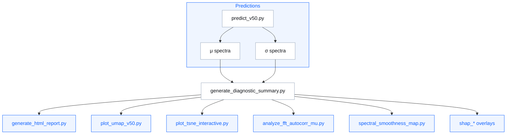

# 🧪 `src/diagnostics/` — SpectraMind V50 Diagnostics Layer

The diagnostics layer provides the **glass-box view** of the SpectraMind V50 pipeline.  
It links **μ/σ predictions**, **symbolic rules**, **SHAP attributions**, and **spectral physics** into a single, interactive, reproducible dashboard.

---

## 📂 Directory Contents

```
diagnostics/
├── generate_diagnostic_summary.py   # Core aggregator: GLL, entropy, calibration, symbolic overlays → JSON
├── generate_html_report.py          # Unified interactive dashboard (UMAP, t-SNE, FFT, SHAP, CLI log)
│
├── plot_umap_v50.py                 # Latent UMAP projections (2D/3D; symbolic overlays, cluster labels)
├── plot_tsne_interactive.py         # Interactive Plotly t-SNE visualizer for dashboard embedding
│
├── analyze_fft_autocorr_mu.py       # FFT + autocorrelation analysis of μ spectra (with symbolic priors)
├── spectral_smoothness_map.py       # Binwise smoothness diagnostics (L2, entropy, violation overlays)
│
├── shap_overlay.py                  # SHAP × μ overlays (per-bin attribution plots)
├── shap_attention_overlay.py        # SHAP × attention fusion overlays (decoder head explainability)
└── shap_symbolic_overlay.py         # SHAP × symbolic fusion overlays (constraint-aware explanations)
```

---

## 🔑 Module Roles

### 📊 Aggregators
- **`generate_diagnostic_summary.py`**  
  - Computes per-planet & per-bin metrics (GLL, MAE, entropy).  
  - Adds symbolic violations, SHAP overlays, FFT/z-score features.  
  - Outputs `diagnostic_summary.json` → consumed by dashboards & CI.

- **`generate_html_report.py`**  
  - Builds interactive HTML dashboards (versioned: `report_v1.html`, `v2.html`, …).  
  - Embeds UMAP/t-SNE plots, SHAP overlays, FFT diagnostics, CLI logs.  
  - Integrates symbolic rule tables, cluster overlays, and submission diagnostics.

---

### 📉 Latent Projections
- **`plot_umap_v50.py`**  
  - UMAP visualization of latent embeddings.  
  - Features: cluster overlays, symbolic color maps, confidence shading, planet-level hyperlinks.

- **`plot_tsne_interactive.py`**  
  - Plotly-based interactive t-SNE visualizer.  
  - Dashboard-ready; supports hover tooltips, symbolic overlays, and linked metrics.

---

### 📡 Spectral / Frequency Diagnostics
- **`analyze_fft_autocorr_mu.py`**  
  - FFT and autocorrelation analysis on μ spectra.  
  - Compares astrophysical transit signals vs. instrument/systematic bands.  
  - Integrates molecular templates (H₂O, CH₄, CO₂) for violation detection.

- **`spectral_smoothness_map.py`**  
  - Smoothness penalty map (per bin).  
  - Computes L2 gradient, entropy, and symbolic overlays.  
  - Used to enforce/visualize symbolic smoothness constraints.

---

### 🔎 Explainability (SHAP)
- **`shap_overlay.py`**  
  - Per-bin SHAP × μ overlay plots.  
  - Summaries saved as PNG + JSON.  

- **`shap_attention_overlay.py`**  
  - Combines SHAP with decoder attention weights.  
  - Explains how attention heads focus across bins & molecules.  

- **`shap_symbolic_overlay.py`**  
  - Fusion: SHAP + symbolic violations.  
  - Highlights bins where attributions overlap with symbolic constraints.  

---

## 🧭 Workflow

1. **Run inference** with `predict_v50.py`.  
2. **Aggregate metrics** via `generate_diagnostic_summary.py`.  
3. **Visualize**:  
   - UMAP/t-SNE → latent structure  
   - FFT/autocorr → spectral frequency integrity  
   - SHAP overlays → binwise feature attributions  
   - Smoothness maps → symbolic penalty validation  
4. **Build dashboard** with `generate_html_report.py`.  
5. **Inspect violations** (symbolic × SHAP × calibration) interactively.

---

## 📘 Visual (Mermaid Overview)

<details>
<summary><strong>Diagnostics flow</strong></summary>


</details>

---

## ✅ Guarantees

* Every diagnostic run produces **JSON + plots + HTML**.
* All scripts support CLI arguments and Hydra configs.
* All visualizations integrate into the unified `generate_html_report.py` dashboard.
* Symbolic overlays are **first-class citizens** in all diagnostics.
* CI workflows call diagnostics to ensure scientific validity before merge.

---

> **North Star:** Diagnostics = **Reproducibility + Explainability + Physics**.  
> They guarantee that μ/σ predictions are not black boxes but **auditable, symbolic, and scientifically grounded**.
