# 📊 SpectraMind V50 — Diagnostics Plotting Modules

This directory hosts all **plotting utilities** for the SpectraMind V50 pipeline.
They generate **scientific visualizations** (UMAP/t-SNE projections, FFT maps, smoothness overlays, SHAP/symbolic fusions, etc.) that are **read-only diagnostics artifacts**.

Golden Rule:

> **Plot modules visualize data and model outputs; they never modify inputs.**
> All outputs are written under `${paths.artifacts}` and logged in `v50_debug_log.md`.

---

## 0) Purpose

The plotting layer provides:

* **Latent space projections**: UMAP & t-SNE for clustering planets, colored by metadata or symbolic overlays.
* **Spectral diagnostics**: FFT power maps, autocorrelation plots, smoothness metrics.
* **Explainability overlays**: SHAP × symbolic fusion, entropy heatmaps.
* **Audit trail logging**: Each run appends to `v50_debug_log.md` for reproducibility.

These plots are integrated into the **unified diagnostics dashboard** (`generate_html_report.py`) and referenced in Hydra configs (`configs/diagnostics/*.yaml`).

---

## 1) Files in this directory

* **`umap/v50.py`** — UMAP embedding of latent vectors with symbolic/color overlays.
* **`tsne/interactive.py`** — Interactive t-SNE plotter with Plotly (HTML + optional PNG).
* **`fft/autocorr/mu.py`** — FFT + autocorrelation diagnostics of μ spectra.
* **`spectral/smoothness/map.py`** — Smoothness maps (L2 gradient, TV norm, Savitzky–Golay baseline).

Each file is both:

1. **Importable API** (functions returning Plotly/Matplotlib figures or result dicts).
2. **Typer CLI** subcommand (`spectramind diagnose …`).

---

## 2) Hydra Integration

All plotting modules align with Hydra configs. Example:

```yaml
# configs/diagnostics/explain.yaml
defaults:
  - override hydra/job_logging: default
  - override hydra/hydra_logging: default

explain:
  tsne:
    n_components: 2
    perplexity: 30
    learning_rate: 200
    n_iter: 1000
    seed: 1337
    html_out: ${paths.artifacts}/tsne_v50.html
    png_out: ${paths.artifacts}/tsne_v50.png
```

CLI override example:

```bash
spectramind diagnose tsne run \
  explain.tsne.perplexity=40 \
  explain.tsne.seed=42
```

---

## 3) Workflow Diagram (Mermaid)

```mermaid
flowchart LR
  subgraph Inputs
    A["Latents (.npy/.npz/.csv)"]
    B["Labels/metrics (CSV)"]
    S["Symbolic overlays (JSON)"]
  end

  subgraph Merge
    C{"Merge & align on planet_id"}
  end

  A --> C
  B --> C
  S --> C

  C --> D["Standardize features"]
  D --> E["Projection (UMAP / t-SNE)"]
  E --> F["Plotly figure"]

  subgraph Outputs
    F --> G["HTML export"]
    F --> H["PNG export (if kaleido)"]
    C --> I["Append run row → v50_debug_log.md"]
  end
```



This diagram follows GitHub’s native Mermaid rendering rules.

---

## 4) Outputs

* **HTML** — Always written (interactive Plotly).
* **PNG** — Optional (`--out-png`, requires `kaleido`).
* **Logs** — Append run row to `v50_debug_log.md` (with timestamp, config hash, and input paths).

---

## 5) Best Practices

* **CLI-first**: Run everything via `spectramind diagnose …`.
* **Hydra overrides**: No hard-coded params; configs control behavior.
* **Read-only**: Inputs are never mutated.
* **Reproducible**: Every run logged with config hash and dataset version.
* **Physics-aware**: Diagnostics are aligned with Ariel mission’s noise & spectral structure.

---

## 6) See also

* `src/diagnostics/generate/html/report.py` — bundles plots into a unified HTML dashboard.
* `configs/diagnostics/report.yaml` — config for dashboard sections.
* SpectraMind V50 technical plan and project analysis for pipeline context.

---

## 7) CI checklist

* [ ] All plot modules run with `--selftest`.
* [ ] Outputs land under `${paths.artifacts}`.
* [ ] Logs appended to `v50_debug_log.md`.
* [ ] No input mutation.
* [ ] Hydra config overrides respected.

---

✅ **End of README**

---
