# 🧭 SpectraMind V50 — Interactive t-SNE Latent Plotter Architecture

> Path: `src/diagnostics/plot/tsne/architecture.md`
> Companion files: `README.md`, `interactive.py`, `docs/diagrams/tsne_architecture.mmd`

---

## 0) Purpose & Scope

This document defines the **system architecture** of the t-SNE latent plotter (`src/diagnostics/plot/tsne/interactive.py`) used in SpectraMind V50 diagnostics. It covers:

* Data flow from **latents → merge → standardize → t-SNE → Plotly HTML/PNG**
* How **Hydra configs** and the **Typer CLI** orchestrate runs
* **Reproducibility** (logging, hashes, DVC-friendly artifacts)
* **Integration** with symbolic overlays and the HTML diagnostics dashboard
* **Testing/CI**, **performance**, **extensibility**, and **error handling**

The module is visualization-only and does not compute scientific analytics; it renders artifacts produced elsewhere in the pipeline and writes an auditable entry to `v50_debug_log.md`.

---

## 1) High-level Pipeline

```mermaid
flowchart LR
  subgraph Inputs
    A["Latents (.npy/.npz/.csv)"]
    B["Labels/metrics (CSV)"]
    S["Symbolic overlays (JSON)"]
  end

  subgraph Merge
    C{"Merge & align on planet_id"}
  end

  A --> C
  B --> C
  S --> C

  C --> D["Standardize features"]
  D --> E["t-SNE (scikit-learn, PCA-init, seeded)"]
  E --> F["Plotly figure"]

  subgraph Outputs
    F --> G["HTML export"]
    F --> H["PNG export (kaleido, optional)"]
    C --> I["Append run row → v50_debug_log.md"]
  end
```



**Inputs**

* Latents (`.npy` 2D array; `.npz` with `X` or `latents` and optional `planet_id`; or `.csv` with numeric columns + optional `planet_id`)
* Labels/metrics CSV (e.g., `label`, `confidence`, `entropy`, `gll`, `split`, `cluster`)
* Symbolic overlays JSON (dict keyed by `planet_id` or list with `planet_id`, e.g., `violation_score`, `top_rule`)

**Outputs**

* `*.html` interactive plot (always)
* `*.png` static export (if `kaleido` is installed and `--out-png` is set)
* A structured **audit row** appended to `v50_debug_log.md` (timestamp, config hash, input paths, output paths, key params)

---

## 2) Module Decomposition

* **`interactive.py`** — top-level CLI + API entry:

  * `run_tsne_pipeline(...)` — orchestrates I/O, merging, standardization, t-SNE, visualization, exports, and logging
  * `TsneParams` — n\_components, perplexity, learning\_rate, n\_iter, early\_exaggeration, angle, init, seed
  * `PlotMap` — visual encodings (`color_by`, `size_by`, `opacity_by`, `symbol_by`, `hover_cols`)
  * `OverlayConfig` — paths/keys and rename mapping for symbolic score/label columns
  * `HyperlinkConfig` — url template and column name (e.g., `/planets/{planet_id}.html`)
  * `OutputConfig` — `out_html`, `out_png`, `open_browser`, `title`, and log path

Support utilities (in-module or nearby `utils` as applicable):

* **IO loaders**: `.npy/.npz/.csv` → `DataFrame` / `ndarray`
* **Merge/align** on `planet_id`, handling missing IDs deterministically
* **Standardize** features with robust scaler or z-score; PCA init for stability
* **Visualizer**: Plotly scatter (2D or 3D if enabled), trace styling, legend, colorbars
* **Exporter**: HTML (always), PNG (optional)
* **Logger**: append row to `v50_debug_log.md` and optionally write a small JSON run record

---

## 3) Configuration (Hydra) & Defaults

The module is configured via Hydra (composable YAML) and the unified CLI. Typical bind points:

```yaml
# configs/diagnostics/explain.yaml
explain:
  tsne:
    enable: true
    input:
      latents: "artifacts/latents_v50.npy"
      labels:  "artifacts/latents_meta.csv"      # optional
      overlays: "artifacts/symbolic_violation_summary.json"  # optional
      planet_id_col: "planet_id"
    tsne:
      n_components: 2
      perplexity: 30
      learning_rate: 200.0
      n_iter: 1000
      early_exaggeration: 12.0
      angle: 0.5
      init: "pca"
      seed: 1337
    plot:
      color_by: "symbolic_label"
      size_by: "confidence"
      opacity_by: "entropy"
      symbol_by: null
      hover_cols: ["planet_id","label","entropy","gll","symbolic_score","symbolic_label"]
    link:
      url_template: "/planets/{planet_id}.html"
      url_col_name: "url"
    overlays:
      score_key_in_json: "violation_score"
      label_key_in_json: "top_rule"
      map_score_to: "symbolic_score"
      map_label_to: "symbolic_label"
    output:
      out_html: "artifacts/tsne_v50.html"
      out_png:  "artifacts/tsne_v50.png"
      open_browser: false
      title: "SpectraMind V50 — t-SNE Latents"
    options:
      dedupe: true
      strict_merge: false   # allow inner/left/outer strategy depending on need
      log_path: "v50_debug_log.md"
      config_hash_path: "run_hash_summary_v50.json"
```

Any field can be overridden from the CLI (example below).

---

## 4) CLI Contract (Typer)

Primary commands:

```bash
# Basic t-SNE run
spectramind diagnose tsne run \
  --latents artifacts/latents_v50.npy \
  --out-html artifacts/tsne_v50.html

# With labels & symbolic overlays + encodings + links + PNG
spectramind diagnose tsne run \
  --latents artifacts/latents_v50.npy \
  --labels artifacts/latents_meta.csv \
  --symbolic-overlays artifacts/symbolic_violation_summary.json \
  --color-by symbolic_label --size-by confidence --opacity-by entropy \
  --url-template "/planets/{planet_id}.html" \
  --out-html artifacts/tsne_v50.html --out-png artifacts/tsne_v50.png
```

Key CLI flags map 1:1 to Hydra fields (all CLI options are optional if Hydra config is supplied).
A `selftest` subcommand generates synthetic data and validates end-to-end export + log append.

---

## 5) Data Contracts

### 5.1 Latents

* `.npy`: 2D float array shape `(n_planets, n_features)`.
* `.npz`: expects `X` or `latents` array; optional `planet_id`.
* `.csv`: numeric latent columns; optional `planet_id` column.

If `planet_id` is missing, a deterministic synthetic ID is generated (`P000001` …) and propagated to outputs.

### 5.2 Labels/metrics CSV (optional)

* Must include `planet_id` to merge; columns are free-form and can be used in encodings/hover.

### 5.3 Symbolic overlays JSON (optional)

Two supported forms:

```json
{ "P0001": {"violation_score":0.42, "top_rule":"SMOOTHNESS"}, "P0002": {...} }
```

or

```json
[ {"planet_id":"P0001","violation_score":0.42,"top_rule":"SMOOTHNESS"}, ... ]
```

Use mapping keys (e.g., `score_key_in_json`, `map_score_to`) to normalize final column names.

---

## 6) Algorithmic Choices & Stability

* **Standardization**: required for stable t-SNE; supports z-score or robust scaler (IQR-based).
* **Initialization**: PCA initialization recommended; reduces crowding artifacts and improves determinism.
* **Seeding**: A fixed `seed` ensures deterministic-ish projections given the same inputs and library versions.
* **Perplexity checks**: Guard that `perplexity < n_samples` and suggest ranges (e.g., 5–50).
* **3D mode (optional)**: `n_components = 3` supported with Plotly 3D scatter if enabled.

---

## 7) Visualization Design

* **Encodings**: `color_by` (categorical/numeric), `size_by` (numeric), `opacity_by` (numeric via percentile clamp \[p5, p95]→\[0.25, 1.0]), `symbol_by` (categorical).
* **Hyperlinks**: `url_template` → `url` column added for potential browser integrations; clicking behavior is left to the dashboard host page.
* **Hover**: `hover_cols` included for quick diagnostics (IDs, metrics, rule names).
* **Legends & colorbars**: auto-configured based on dtype; numeric → continuous; categorical → palette.

---

## 8) Reproducibility, Logging, & Artifacts

Each run appends a row to `v50_debug_log.md` containing:

* Timestamp, CLI command, config snapshot/hash
* Input fingerprint (paths + basic stats)
* t-SNE params
* Output paths (HTML/PNG)
* Notes (e.g., `dedupe applied`, `strict_merge=false`)

Artifacts:

* `*.html` (interactive)
* `*.png` (optional, deterministic canvas size)
* Optional JSON run record for CI parsing

Designed to be **DVC-friendly**: inputs and outputs can be tracked as artifacts; log is append-only for audit trails.

---

## 9) Error Handling & Guardrails

* **Input validation**:

  * Missing or non-numeric latent columns → descriptive error
  * `perplexity ≥ n_samples` → clear corrective message
  * Overlay merge conflicts or ambiguous column names → deterministic renames with a warning
* **Fail-fast** by default; optional `--strict-merge` to enforce inner joins only
* **Robust NaN handling** during standardization and merge phases

---

## 10) Performance Considerations

* Pre-filter rows/columns if user provides a slice (e.g., `--ids-csv` or top-k variance features; optional future flag)
* Prefer `n_components=2` unless 3D is explicitly required
* Reduce `n_iter` for quick looks; use full defaults in nightly/CI or dashboard exports
* Batch PNG export only when needed; HTML is primary artifact

---

## 11) Testing & CI

### 11.1 Self-test

`spectramind diagnose tsne selftest`:

* Generates synthetic latents + labels + overlays
* Runs the full pipeline
* Verifies outputs exist and `v50_debug_log.md` row appended

### 11.2 CI hooks

* Lint/type checks
* Self-test run with pinned seed and stable params
* Artifact checks (HTML produced; optional PNG)
* Optional publish of the HTML to CI artifacts for manual review

---

## 12) Security & Privacy

* No network access required
* Does not embed secrets in outputs
* Paths logged are relative when possible; absolute paths are sanitized in log (configurable)

---

## 13) Integration Points

* **Dashboard**: `generate_html_report.py` embeds generated HTML; multiple t-SNE variants can be listed per run
* **Symbolic system**: overlays (scores/labels) inform color/size; additional explainability layers (e.g., SHAP) can be merged in
* **UMAP counterpart**: consistent encodings and hover semantics with `src/diagnostics/plot/umap/v50.py`
* **CLI core**: registered under `spectramind diagnose tsne`

---

## 14) Extensibility Roadmap

* `--n-components=3` 3D with automatic camera presets
* **Batch grid**: Hydra multirun for seed/perplexity sweeps, auto-collation in dashboard
* **Projection registry**: save/load 2D coordinates to enable consistent point tracking across runs
* **Encoding presets**: `--preset symbolic`, `--preset confidence`, etc., for one-shot styling
* **Click-through**: optional event hooks when embedded in the dashboard to open planet-level pages

---

## 15) Reference Diagram Files

* **Main flow**: `docs/diagrams/tsne_architecture.mmd` (kept in repo; included in CI mermaid checks)
* **Component map** (optional future diagram):


---

## 16) Examples

### 16.1 Minimal run

```bash
spectramind diagnose tsne run \
  --latents artifacts/latents_v50.npy \
  --out-html artifacts/tsne_v50.html
```

### 16.2 With overlays and encodings

```bash
spectramind diagnose tsne run \
  --latents artifacts/latents_v50.npy \
  --labels artifacts/latents_meta.csv \
  --symbolic-overlays artifacts/symbolic_violation_summary.json \
  --color-by symbolic_label --size-by confidence --opacity-by entropy \
  --out-html artifacts/tsne_v50.html --out-png artifacts/tsne_v50.png
```

### 16.3 Hydra override (perplexity sweep)

```bash
spectramind diagnose tsne run tsne.perplexity=15
spectramind diagnose tsne run tsne.perplexity=30
spectramind diagnose tsne run tsne.perplexity=50
```

---

## 17) Non-Goals & Limitations

* Not a **scientific analyzer**; it visualizes existing artifacts
* Does not guarantee projection stability across very different input distributions
* Very large `n` may require pre-downsampling or incremental strategies (future work)

---

## 18) Change Log (Architecture)

* **v1.0**: Initial architecture spec aligned with CLI-first + Hydra configs; added self-test & logging

---

### ✅ Summary

The t-SNE latent plotter is a **reproducible**, **auditable**, and **extensible** visualization subsystem. It mirrors SpectraMind V50’s **CLI-first**, **Hydra-safe**, and **DVC-friendly** philosophy, integrates cleanly with symbolic diagnostics and the HTML dashboard, and ships with self-tests for CI stability.
