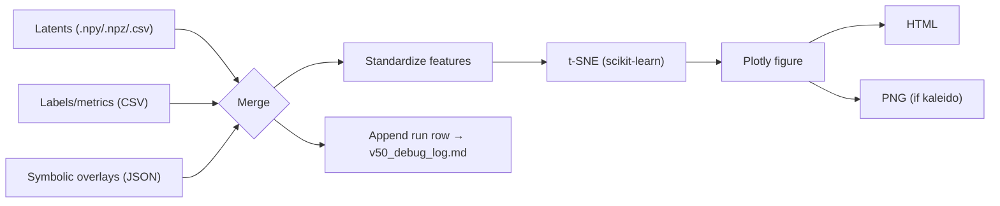

# ✨ SpectraMind V50 — Interactive t-SNE Latent Plotter

This module renders **interactive Plotly projections** of SpectraMind V50 latents using **t-SNE** with optional symbolic, SHAP, entropy, and GLL overlays — all **CLI-first, Hydra-safe, and reproducibility-oriented**.

It is tightly aligned with:

* `configs/diagnostics/explain.yaml` (`explain.tsne.*`)
* The unified diagnostics dashboard (`configs/diagnostics/report.yaml`)
* The UMAP counterpart: `src/diagnostics/plot/umap/v50.py`

> Mission rule: **visualization only**. This tool does **not** compute scientific analytics; it renders artifacts generated elsewhere in the V50 pipeline. It writes clean HTML/PNG and appends a structured entry to `v50_debug_log.md` for auditability.

---

## 0) What this does (and doesn’t)

**Does**

* Loads latents from `.npy` / `.npz` / `.csv` (rows = planets, cols = features).
* Optionally joins **labels/metrics** on `planet_id` (confidence, entropy, gll, etc.).
* Optionally merges **symbolic overlays** (e.g., per-planet `violation_score`, `top_rule`).
* Computes **t-SNE** (scikit-learn) with standardized features, PCA init, seeded runs.
* Falls back to **PCA** if scikit-learn is unavailable.
* Produces **interactive HTML** (always) and **PNG** (if `kaleido` is installed).
* Appends a **Markdown table row** to `v50_debug_log.md`.

**Doesn’t**

* Modify or recompute features, μ/σ, labels, or symbolic data.
* Replace upstream diagnostics (SHAP, symbolic, calibration). It **visualizes** them.

---

## 1) File overview

* **`interactive.py`** — main module (importable API + Typer CLI).
* **Outputs**
  * `artifacts/tsne_v50.html` (default HTML)
  * `artifacts/tsne_v50.png` (optional PNG if `--out-png` and `kaleido` present)
  * `v50_debug_log.md` (append-only, Markdown table row per run)

---

## 2) Quick Start (CLI)

```bash
# basic
spectramind diagnose tsne run \
  --latents artifacts/latents_v50.npy \
  --out-html artifacts/tsne_v50.html

# with labels & symbolic overlays
spectramind diagnose tsne run \
  --latents artifacts/latents_v50.npy \
  --labels artifacts/latents_meta.csv \
  --symbolic-overlays artifacts/symbolic_violation_summary.json \
  --color-by symbolic_label \
  --size-by confidence \
  --opacity-by entropy \
  --url-template "/planets/{planet_id}.html" \
  --out-html artifacts/tsne_v50.html \
  --out-png artifacts/tsne_v50.png
````

**Tip:** All options are available via `spectramind diagnose tsne run --help`.

---

## 3) Typical Inputs

* **Latents** (`--latents`):
  `.npy` (2D array), `.npz` (`X` or `latents`, optional `planet_id` array), or `.csv` with at least one numeric column. If `planet_id` is missing, a synthetic ID is assigned (`P0000…`).
* **Labels** (`--labels`, optional):
  CSV with `planet_id` and any metadata columns you want in hover/encodings (e.g., `label`, `confidence`, `entropy`, `shap`, `gll`, `split`, `cluster`).
* **Symbolic overlays** (`--symbolic-overlays`, optional):
  JSON either as:

  ```json
  { "P0001": { "violation_score": 0.42, "top_rule": "SMOOTHNESS" }, ... }
  ```

  or

  ```json
  [ {"planet_id":"P0001","violation_score":0.42,"top_rule":"SMOOTHNESS"}, ... ]
  ```

  Use `--symbolic-score-key` / `--symbolic-label-key` if your keys differ; the merged columns default to `symbolic_score` and `symbolic_label` (configurable via `--map-score-to`, `--map-label-to`).

---

## 4) Visual Encodings

* `--color-by` — any column in the merged table (e.g., `label`, `symbolic_label`, `split`, `cluster`, or numeric like `symbolic_score`).
* `--size-by` — numeric column for marker size (e.g., `confidence`).
* `--opacity-by` — numeric column normalized to `[0.25, 1.0]` via robust percentiles (e.g., `entropy`).
* `--symbol-by` — categorical column for marker symbol.
* `--hover-cols` — include extra columns in the hover tooltip.

**Hyperlinks:**
Provide `--url-template "/planets/{planet_id}.html"` to write per-point URLs into a `url` column (name configurable with `--url-col-name`). The URL appears in hover; your host page/script can add click bindings if desired.

---

## 5) Reproducibility & Logging

* **Seeded runs:** `--seed` fixes the PRNG used by t-SNE; results remain *deterministic-ish* (t-SNE has known sensitivity — keep inputs/versions stable).
* **Standardization:** rows are standardized (`StandardScaler`) prior to t-SNE/PCA for stability.
* **Audit trail:** appends a line to `v50_debug_log.md` with timestamp, CLI name, config hash (if available), inputs, and outputs.
* **No mutation:** Latents, labels, symbolic JSON are treated **read-only**.

---

## 6) Integration with Hydra configs

This module aligns with `configs/diagnostics/explain.yaml`:

* `explain.tsne.*` maps to CLI flags:

  * `n_components` → `--n-components`
  * `perplexity` → `--perplexity`
  * `learning_rate` → `--learning-rate`
  * `n_iter` → `--n-iter`
  * `early_exaggeration` → `--early-exaggeration`
  * `metric`, `init`, `angle`, `seed`
  * `html_out`, `png_out` map to `--out-html`, `--out-png`
  * Overlays/encodings map to `--color-by`, `--size-by`, `--opacity-by`, `--symbol-by`, `--hover-cols`
* The report generator (`generate_html_report.py`) expects the outputs referenced in `configs/diagnostics/report.yaml → sections.explainability`.

---

## 7) Programmatic API

```python
from pathlib import Path
from src.diagnostics.plot.tsne.interactive import (
    run_tsne_pipeline, TsneParams, PlotMap,
    OverlayConfig, HyperlinkConfig, OutputConfig
)

result = run_tsne_pipeline(
    latents_path=Path("artifacts/latents_v50.npy"),
    out_cfg=OutputConfig(
        out_html=Path("artifacts/tsne_v50.html"),
        out_png=Path("artifacts/tsne_v50.png"),
        open_browser=False,
        title="SpectraMind V50 — t-SNE Latents",
    ),
    tsne_params=TsneParams(n_components=2, perplexity=30.0, learning_rate=200.0, n_iter=1000, seed=1337),
    plot_map=PlotMap(color_by="symbolic_label", size_by="confidence", opacity_by="entropy", symbol_by=None),
    overlay_cfg=OverlayConfig(symbolic_overlays_path=Path("artifacts/symbolic_violation_summary.json")),
    link_cfg=HyperlinkConfig(url_template="/planets/{planet_id}.html"),
    labels_csv=Path("artifacts/latents_meta.csv"),
    dedupe=True,
    planet_id_col="planet_id",
)
print(result)  # {'html': ..., 'png': ..., 'n': ..., 'dims': ..., 'duration_sec': ...}
```

---

## 8) CLI Reference

```bash
spectramind diagnose tsne run --help
```

**Key options (subset)**

* **Inputs**: `--latents PATH` (required), `--labels PATH`, `--symbolic-overlays PATH`
* **Overlay keys**: `--symbolic-score-key`, `--symbolic-label-key`, `--map-score-to`, `--map-label-to`
* **Encodings**: `--color-by`, `--size-by`, `--opacity-by`, `--symbol-by`, `--hover-cols ...`
* **Links**: `--url-template "/planets/{planet_id}.html"`, `--url-col-name url`
* **t-SNE**: `--n-components`, `--perplexity`, `--learning-rate`, `--n-iter`, `--early-exaggeration`, `--metric`, `--angle`, `--init`, `--seed`
* **Outputs**: `--out-html PATH`, `--out-png PATH`, `--open-browser`
* **Utility**: `--dedupe`, `--planet-id-col planet_id`, `--log-path v50_debug_log.md`, `--config-hash-path run_hash_summary_v50.json`

**Self-test**

```bash
spectramind diagnose tsne selftest \
  --tmp-dir artifacts/_tsne_selftest --n 256 --d 16 --seed 1337
```

This generates synthetic data, runs the full pipeline, and writes an HTML+PNG pair to the temp dir, plus a debug-log row.

---

## 9) Workflow diagram



---

## 10) Outputs & paths (defaults)

* **HTML:** `artifacts/tsne_v50.html`
* **PNG:** `artifacts/tsne_v50.png` (only if `--out-png` **and** `kaleido` installed)
* **Log:**  `v50_debug_log.md` (header auto-initialized, then row appended per run)

> All output directories are created on demand.

---

## 11) Troubleshooting

* **“No numeric feature columns found”**
  Your CSV lacks numeric columns (besides `planet_id`). Ensure latent columns are numeric or use `.npy/.npz`.

* **“Perplexity must be < n\_samples”**
  Reduce `--perplexity` or supply more rows. The CLI guards this, but datasets with strong filtering can still hit it.

* **PNG not written**
  Install `kaleido` (`pip install -U kaleido`) or omit `--out-png`.

* **Symbolic JSON not merging**
  Verify structure. If you use different keys (e.g., `score`, `rule`), redirect with `--symbolic-score-key`, `--symbolic-label-key`, or rename to the target columns via `--map-score-to`, `--map-label-to`.

* **Dedupe**
  If multiple rows share the same `planet_id`, pass `--dedupe` to keep the first.

---

## 12) Best practices

* Keep **latents stable** (same model + preprocessing) when comparing runs.
* **Seed** your runs (`--seed`) to reduce variation.
* Use **consistent encodings** (`--color-by`, `--size-by`) across experiments for apples-to-apples dashboards.
* Store artifacts under `${paths.artifacts}` so the **unified HTML report** can bundle them automatically.

---

## 13) Versioning & policy

* The module follows the **CLI-first, GUI-optional** doctrine.
* It’s designed to run on **Kaggle** and local environments where installing optional deps (UMAP, `kaleido`) may vary.
* All runs should appear in `v50_debug_log.md` as a readable table for **audit** and **post-hoc inspection**.

---

## 14) See also

* UMAP counterpart: `src/diagnostics/plot/umap/v50.py`
* Explainability config: `configs/diagnostics/explain.yaml`
* Unified dashboard: `src/diagnostics/generate/html/report.py` + `configs/diagnostics/report.yaml`

---

## 15) Minimal checklist (for CI/self-review)

* [ ] HTML written under `${paths.artifacts}/embeddings/tsne.html` or configured path
* [ ] (Optional) PNG written if requested and `kaleido` present
* [ ] Row appended to `v50_debug_log.md`
* [ ] No mutation of inputs; visualization only
* [ ] Encodings and overlays reflect config/CLI flags correctly

---

**End of README**

```
```
