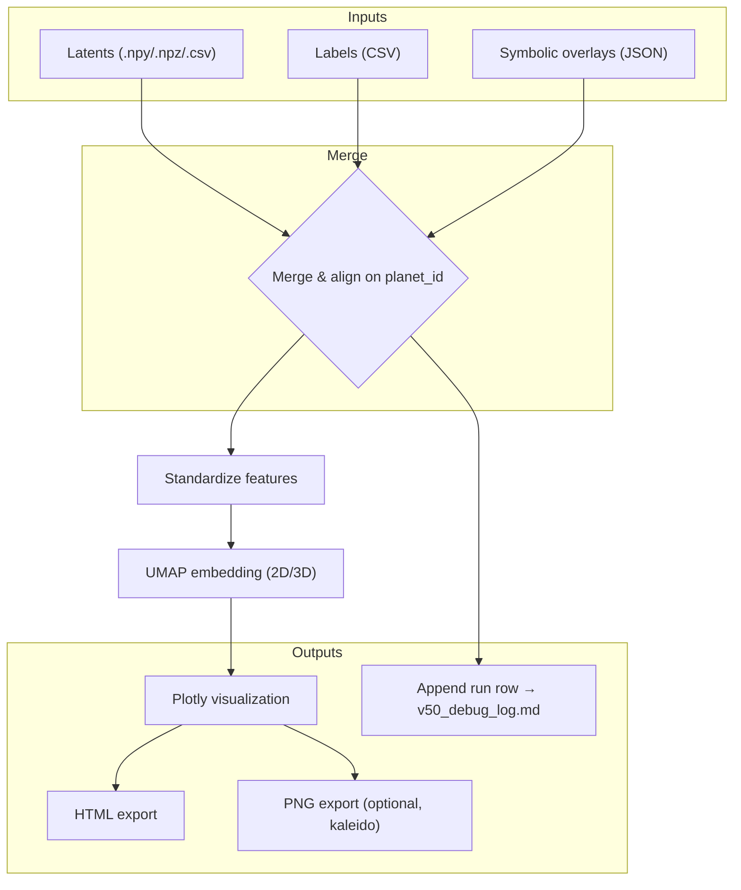

# 🧭 SpectraMind V50 — UMAP Plotter Architecture

> Path: `src/diagnostics/plot/umap/ARCHITECTURE.md`
> Related files: `README.md`, `v50.py`, `src/diagnostics/generate/html/report.py`

---

## 0) Purpose & Scope

This document describes the **architecture of the UMAP latent plotter** used in SpectraMind V50.
It explains:

* How latents, labels, and symbolic overlays flow into the UMAP projection.
* Where Hydra configs and CLI commands integrate.
* What outputs are produced and how they integrate with the diagnostics dashboard.
* How reproducibility and logging are enforced.

The UMAP plotter is a **diagnostics-only visualization module**: it never mutates inputs, it only renders **embeddings and overlays**.

---

## 1) High-Level Workflow



---

## 2) Core Components

* **`v50.py`** — main module (importable API + Typer CLI).
* **Classes & configs**:

  * `UmapParams` → hyperparameters (`n_neighbors`, `min_dist`, `metric`, `dim`, `seed`).
  * `PlotMap` → visual encodings (`color_by`, `size_by`, `opacity_by`, `symbol_by`, `hover_cols`).
  * `OverlayConfig` → symbolic overlays (keys, mapping, merge rules).
  * `HyperlinkConfig` → per-planet URLs (`/planets/{planet_id}.html`).
  * `OutputConfig` → HTML/PNG paths, log path, dashboard title.

---

## 3) Hydra Integration

All UMAP runs are configured via Hydra. Example (`configs/diagnostics/explain.yaml`):

```yaml
explain:
  umap:
    n_neighbors: 15
    min_dist: 0.1
    metric: "euclidean"
    dim: 2
    seed: 1337
    out_html: ${paths.artifacts}/umap_v50.html
    out_png: ${paths.artifacts}/umap_v50.png
```

Overrides are passed at CLI runtime, e.g.:

```bash
spectramind diagnose umap run explain.umap.n_neighbors=50 explain.umap.seed=42
```

---

## 4) CLI Contract

Exposed via Typer as:

```bash
spectramind diagnose umap run [options]
```

Key options:

* `--latents PATH` (required)
* `--labels PATH` (optional)
* `--symbolic-overlays PATH` (optional)
* `--color-by`, `--size-by`, `--opacity-by`, `--symbol-by`, `--hover-cols …`
* `--dim {2,3}` for 2D/3D embedding
* `--out-html`, `--out-png`
* `--url-template` for hyperlinks
* `--selftest` for synthetic-data smoke test

---

## 5) Reproducibility & Logging

* **Determinism**: seed passed to UMAP ensures stable embeddings (given same inputs).
* **Standardization**: latent features normalized before projection for stability.
* **Audit trail**: run metadata appended to `v50_debug_log.md` (timestamp, config hash, inputs, outputs, encodings).
* **DVC-friendly**: outputs tracked in `${paths.artifacts}` so runs are reproducible against a given Git/DVC commit.

---

## 6) Integration Points

* **Diagnostics Dashboard** (`generate_html_report.py`) — bundles UMAP plots into the unified HTML report.
* **Symbolic Engine** — overlays per-rule violations or scores on the embedding.
* **t-SNE counterpart** — aligned with `src/diagnostics/plot/tsne/interactive.py` to provide complementary embeddings.
* **CI pipeline** — `spectramind diagnose umap selftest` runs with synthetic data during CI checks.

---

## 7) Outputs

* **HTML**: always written (interactive Plotly scatter).
* **PNG**: optional static export (requires `kaleido`).
* **Log row**: appended to `v50_debug_log.md`.

---

## 8) Future Extensions

* **3D interactive rotation** (already supported via `--dim 3`).
* **Cluster overlays**: highlight symbolic or physics-based clusters.
* **Batch runs**: Hydra multirun sweeps across seeds/neighbors/min\_dist.
* **Cross-linking**: clickable UMAP points open planet-level diagnostic pages.
* **Fusion plots**: integrate UMAP with FFT/SHAP overlays for multi-modal diagnostics.

---

✅ With this architecture, the **UMAP plotter** is **modular, reproducible, and symbolic-aware**.
It complements t-SNE and other diagnostic modules in SpectraMind V50, feeding into the mission-grade dashboard and CI system.

---
