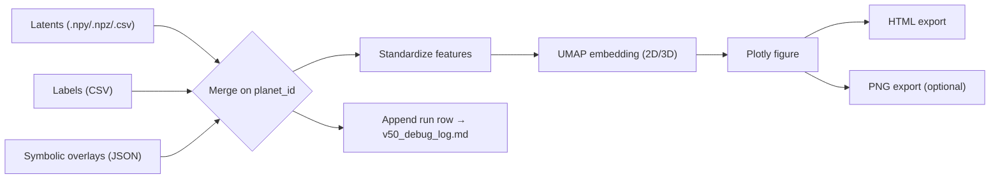

# ✨ SpectraMind V50 — UMAP Latent Plotter

This module renders **interactive Plotly projections** of SpectraMind V50 latent vectors using **UMAP** with optional **symbolic overlays, SHAP values, entropy, and GLL metrics**.
It is fully **CLI-first, Hydra-safe, and reproducibility-oriented** — integrated with the diagnostics dashboard and audit logging.

---

## 0) What this does (and doesn’t)

**Does**

* Loads latents from `.npy` / `.npz` / `.csv` (rows = planets, cols = features).
* Optionally merges labels/metrics on `planet_id`.
* Optionally overlays symbolic violation scores and labels.
* Computes **UMAP embeddings** (2D/3D).
* Standardizes features for stable embeddings.
* Produces **interactive HTML** and optional **static PNG**.
* Appends a **Markdown log row** to `v50_debug_log.md`.

**Doesn’t**

* Alter upstream latents or features.
* Replace scientific diagnostics — it only visualizes existing artifacts.

---

## 1) File overview

* **`v50.py`** — UMAP plotter (importable API + Typer CLI).
* **Outputs**:

  * `artifacts/umap_v50.html` (interactive Plotly HTML).
  * `artifacts/umap_v50.png` (optional static PNG, if `kaleido` is installed).
  * `v50_debug_log.md` (append-only row with run metadata).

---

## 2) Quick Start (CLI)

```bash
# Basic UMAP projection
spectramind diagnose umap run \
  --latents artifacts/latents_v50.npy \
  --out-html artifacts/umap_v50.html

# With labels + overlays + 3D projection
spectramind diagnose umap run \
  --latents artifacts/latents_v50.npy \
  --labels artifacts/latents_meta.csv \
  --symbolic-overlays artifacts/symbolic_violation_summary.json \
  --color-by symbolic_label \
  --size-by confidence \
  --opacity-by entropy \
  --dim 3 \
  --out-html artifacts/umap_v50.html \
  --out-png artifacts/umap_v50.png
```

---

## 3) Typical Inputs

* **Latents (`--latents`)**:
  `.npy` (2D array), `.npz` with `latents` key, or `.csv` with numeric columns.
  If `planet_id` is missing, synthetic IDs (`P0001…`) are assigned.

* **Labels (`--labels`)**: CSV keyed on `planet_id`, with columns for hover/encoding (e.g., `confidence`, `entropy`, `split`, `cluster`).

* **Symbolic overlays (`--symbolic-overlays`)**: JSON in either dict or list form:

  ```json
  { "P0001": {"violation_score": 0.42, "top_rule": "SMOOTHNESS"} }
  ```

  or

  ```json
  [ {"planet_id":"P0001","violation_score":0.42,"top_rule":"SMOOTHNESS"} ]
  ```

  Keys can be remapped via `--symbolic-score-key`, `--symbolic-label-key`, `--map-score-to`, `--map-label-to`.

---

## 4) Visual Encodings

* `--color-by` → categorical/numeric column (e.g., `split`, `symbolic_label`, `entropy`).
* `--size-by` → numeric column for marker size (e.g., `confidence`).
* `--opacity-by` → numeric column mapped to `[0.25, 1.0]`.
* `--symbol-by` → categorical column for marker symbol.
* `--hover-cols` → extra columns shown in tooltips.

**Hyperlinks**:
Use `--url-template "/planets/{planet_id}.html"` to generate per-point links, stored in a `url` column.

---

## 5) Reproducibility & Logging

* **Determinism**: fixed seed ensures consistent UMAP initialization.
* **Standardization**: latents normalized before UMAP for stability.
* **Audit trail**: every run appends to `v50_debug_log.md` with timestamp, config hash, inputs, outputs.

---

## 6) Hydra Config

Example (`configs/diagnostics/explain.yaml`):

```yaml
explain:
  umap:
    n_neighbors: 15
    min_dist: 0.1
    metric: "euclidean"
    dim: 2
    seed: 1337
    out_html: ${paths.artifacts}/umap_v50.html
    out_png: ${paths.artifacts}/umap_v50.png
```

---

## 7) Programmatic API

```python
from pathlib import Path
from src/diagnostics/plot.umap.v50 import run_umap_pipeline, UmapParams, PlotMap

result = run_umap_pipeline(
    latents_path=Path("artifacts/latents_v50.npy"),
    labels_csv=Path("artifacts/latents_meta.csv"),
    out_html=Path("artifacts/umap_v50.html"),
    out_png=Path("artifacts/umap_v50.png"),
    umap_params=UmapParams(n_neighbors=15, min_dist=0.1, dim=2, seed=1337),
    plot_map=PlotMap(color_by="symbolic_label", size_by="confidence", opacity_by="entropy"),
)
```

---

## 8) Workflow diagram



---

## 9) Outputs

* **HTML** → `${paths.artifacts}/umap_v50.html`
* **PNG** → `${paths.artifacts}/umap_v50.png` (optional)
* **Log** → `v50_debug_log.md`

---

## 10) Best Practices

* Always run via CLI (`spectramind diagnose umap run …`).
* Store outputs under `${paths.artifacts}` for dashboard bundling.
* Keep seeds fixed (`--seed`) for reproducibility.
* Use consistent encodings across experiments for comparability.

---

## 11) See also

* t-SNE counterpart: `src/diagnostics/plot/tsne/interactive.py`
* FFT diagnostics: `src/diagnostics/plot/fft/autocorr/mu.py`
* Smoothness maps: `src/diagnostics/plot/spectral/smoothness/map.py`
* Dashboard integration: `src/diagnostics/generate/html/report.py`

---

✅ **End of README**

---
