# 🧭 SpectraMind V50 — Diagnostics Plotting Architecture

> Path: `src/diagnostics/plot/ARCHITECTURE.md`
> Related: `README.md`, `umap/v50.py`, `tsne/interactive.py`, `fft/autocorr/mu.py`, `spectral/smoothness/map.py`

---

## 0) Purpose & Scope

This document defines the **architecture of plotting modules** in SpectraMind V50.

The plotting layer is responsible for **diagnostic visualization only** — it consumes latent vectors, μ/σ spectra, symbolic overlays, and metadata, then produces **HTML/PNG artifacts** and structured **debug log entries**.

It is fully **CLI-first, Hydra-safe, DVC-friendly, and reproducibility-oriented**.

---

## 1) High-Level Workflow

```mermaid
flowchart TD
  subgraph Inputs
    A["Latents (.npy/.npz/.csv)"]
    B["Labels/metrics (CSV)"]
    C["Symbolic overlays (JSON)"]
    D["μ spectra (CSV/NPZ)"]
  end

  subgraph Merge
    M{"Merge & align on planet_id"}
  end

  A --> M
  B --> M
  C --> M
  D --> M

  M --> UMAP["UMAP projection"]
  M --> TSNE["t-SNE projection"]
  M --> FFT["FFT + autocorr μ"]
  M --> SMOOTH["Spectral smoothness map"]

  UMAP --> F1["Plotly/Matplotlib Figure"]
  TSNE --> F2["Plotly (interactive)"]
  FFT --> F3["FFT/autocorr plots"]
  SMOOTH --> F4["Smoothness heatmaps"]

  subgraph Outputs
    F1 --> H1["HTML/PNG export"]
    F2 --> H2["HTML/PNG export"]
    F3 --> H3["HTML/PNG export"]
    F4 --> H4["HTML/PNG export"]

    M --> LOG["Append run row → v50_debug_log.md"]
  end
```



---

## 2) Modules

* **`umap/v50.py`**

  * Embeds latent vectors (2D/3D UMAP).
  * Overlays: symbolic rule violations, SHAP, entropy.
  * Outputs Plotly figures (`.html` + optional `.png`).

* **`tsne/interactive.py`**

  * Deterministic t-SNE with PCA init, seeded runs.
  * Encodings: `color_by`, `size_by`, `opacity_by`, `symbol_by`.
  * Produces fully interactive Plotly HTML.

* **`fft/autocorr/mu.py`**

  * FFT spectrum power & autocorrelation.
  * Aligns with Ariel physics: detect periodic noise/jitter.
  * Outputs plots + CSV summaries.

* **`spectral/smoothness/map.py`**

  * Smoothness diagnostics (L2 gradient, TV norm, Savitzky–Golay ref).
  * Highlights symbolic smoothness violations.

---

## 3) Hydra Integration

Each plotter aligns with `configs/diagnostics/*.yaml`:

* `configs/diagnostics/explain.yaml` → UMAP/t-SNE params.
* `configs/diagnostics/smoothness.yaml` → smoothness λ, thresholds.
* `configs/diagnostics/fft.yaml` → FFT windowing, autocorr depth.
* `configs/diagnostics/report.yaml` → HTML dashboard sections.

Overrides are supported via CLI, e.g.:

```bash
spectramind diagnose tsne run explain.tsne.perplexity=40
spectramind diagnose smoothness smoothness.l2.lambda=0.05
```

---

## 4) CLI Integration

All plotting modules register under:

```bash
spectramind diagnose umap …
spectramind diagnose tsne …
spectramind diagnose fft …
spectramind diagnose smoothness …
```

Each subcommand:

1. Loads config via Hydra.
2. Consumes artifacts (latents/μ/overlays).
3. Produces plots (`.html`, `.png`).
4. Appends structured row to `v50_debug_log.md`.

This enforces a **single entrypoint** and guarantees **reproducibility**.

---

## 5) Outputs & Logging

* **Artifacts** under `${paths.artifacts}/diagnostics/plots/*`
* **Log entries** appended to `v50_debug_log.md` (timestamp, CLI args, config hash, inputs, outputs)
* **Dashboard integration**: HTML plots bundled via `generate_html_report.py`

---

## 6) Integration Points

* **Diagnostics Dashboard** (`src/diagnostics/generate/html/report.py`) — embeds UMAP/t-SNE/FFT/smoothness HTML.
* **Symbolic Engine** — overlays violation scores/labels on UMAP/t-SNE.
* **Kaggle/CI** — all plots run in headless mode for reproducibility.

---

## 7) CI & Self-Test

Each module provides a `--selftest` flag:

```bash
spectramind diagnose tsne selftest
spectramind diagnose fft selftest
```

CI runs minimal tests to confirm:

* [ ] Outputs generated (`.html`, `.png`).
* [ ] Logs appended to `v50_debug_log.md`.
* [ ] Hydra overrides respected.
* [ ] No mutation of inputs.

---

## 8) Future Extensions

* **3D UMAP + 3D t-SNE** with interactive rotation.
* **Symbolic × SHAP overlays** with dual encodings.
* **Batch sweeps** (Hydra multirun) for perplexity, FFT window sizes.
* **Cycle-consistency tests**: symbolic/physics rules cross-validated against plots.

---

✅ With this design, the plotting subsystem is **modular, reproducible, and physics-aware**.
It supports mission-grade diagnostics while remaining CLI-first and Hydra-safe.

---
