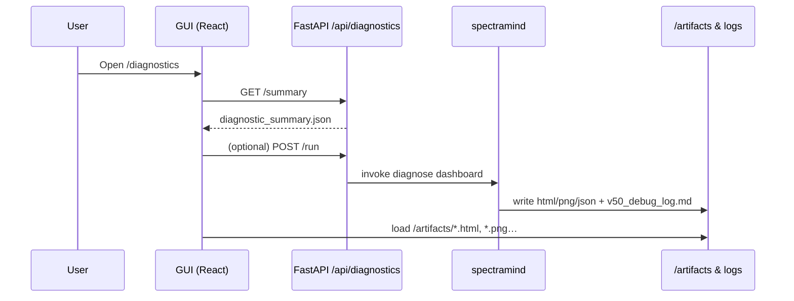
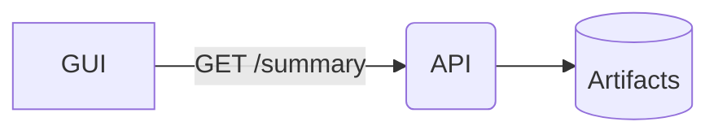
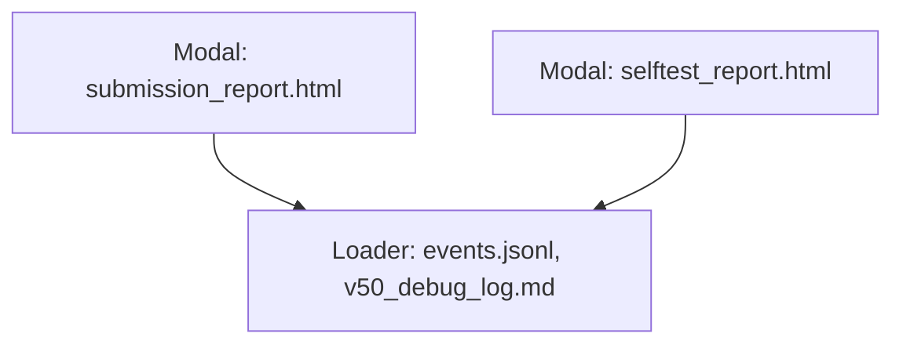

# 🧭 SpectraMind V50 — GUI Architecture (Upgraded)

## 0) Purpose

The GUI is a **thin, optional visualization layer** over the **CLI-first** SpectraMind V50 pipeline.
It never computes analytics itself; it **renders CLI-produced artifacts** and **calls server APIs** that orchestrate the CLI, preserving **NASA-grade reproducibility** (Hydra config snapshots, DVC-tracked artifacts, structured run logs).

---

## 1) High-Level Architecture

```mermaid
flowchart LR
  %% ---------- LAYERS ----------
  subgraph Client["Client (React/Vite)"]
    R[Routes: /diagnostics, /reports]
    S[State: run meta & filters]
    V[Views: tables, charts, iframes]
  end

  subgraph Server["Server (FastAPI)"]
    A[/"/api/diagnostics/*"/]:::api
    M[/"/api/authz/*"/]:::api
    X[(Static "/artifacts")]:::static
  end

  subgraph Pipeline["CLI & Pipeline"]
    C["spectramind diagnose dashboard"]:::cli
    H[(Hydra configs)]:::cfg
    D[(DVC data/models)]:::cfg
    L["v50_debug_log.md"]:::log
  end

  %% ---------- FLOWS ----------
  R --> A
  V --> X
  A --> C

  C --> X
  C --> L
  C --> H
  C --> D

  %% ---------- STYLES ----------
  classDef api fill:#e8f4ff,stroke:#2a7bd3,color:#0b4080
  classDef static fill:#f9f7e8,stroke:#bb9b0b,color:#6e5800
  classDef cli fill:#f3e8ff,stroke:#7f3fbf,color:#3e1f63
  classDef cfg fill:#eefaf0,stroke:#2f9e44,color:#125c2b
  classDef log fill:#fbe9e9,stroke:#c73636,color:#5a1c1c
```

**Key properties**

* **CLI-first:** all heavy work is delegated to `spectramind …`; the GUI only triggers and reads results.
* **Reproducible:** every run is tied to Hydra config snapshots and DVC-tracked artifacts.
* **Air-gapped friendly:** no third-party SaaS required; HTTP header auth is local and file/env-configurable.

---

## 2) Routing & Views

* **`/diagnostics`** — `GET /api/diagnostics/summary` to list recent artifacts (PNG/HTML/JSON) and link/embed content under `/artifacts/*`.
  Optionally `POST /api/diagnostics/run` to trigger `spectramind diagnose dashboard` **without** any analytics in the browser.
* **`/reports`** — browse static HTML reports (e.g., `submission_report.html`, `selftest_report.html`) and other outputs published to `/artifacts/*`.

> The GUI **does not** bypass the CLI/Hydra/DVC flow; it merely reflects pipeline outputs for audits and exploration.

---

## 3) Data Flow



**Inputs:** summary JSON from Diagnostics API; static HTML/PNG under `/artifacts/`
**Outputs:** none from the GUI (all artifacts are produced by the CLI and logged with run hashes).

---

## 4) State Management

* **Local, view-scoped state only** (filters, sort order, open panels).
* **No derived computation** (e.g., SHAP, FFT) is done in the browser; those arrive as already-computed artifacts/JSON from the pipeline.

---

## 5) Security & Authorization

* **Header-based auth**: `X-API-Key` or `Authorization: Bearer …` (if enabled) with simple local RBAC (users/roles/scopes) via env or a YAML/JSON policy file.
* **Scopes:** endpoints can require `diagnostics:read` / `diagnostics:run`; the GUI forwards credentials only, never stores secrets in code.
* **No direct file writes:** GUI reads `/artifacts/*` via the server’s static mount; upload/mutation is out of scope, preserving immutability.

---

## 6) Performance & UX Notes

* **Static-first rendering:** prefer prebuilt HTML/plots to minimize client CPU.
* **Avoid long requests:** dispatch `POST /api/diagnostics/run`, reflect status with follow-up `GET`s; keep polling gentle (e.g., backoff intervals).
* **Lightweight stack:** React + Vite + Tailwind + shadcn/ui; avoid heavyweight charting unless the artifact demands it (e.g., embed Plotly HTML).

---

## 7) Build & Deploy

* **Dev:** `npm run dev` (Vite).
* **Prod:** `npm run build` → serve static assets alongside FastAPI or behind a static CDN; FastAPI exposes `/api` and mounts `/artifacts`.
* **Server contract:** CLI writes artifacts under the mounted `/artifacts` path that the GUI reads.

---

## 8) Reproducibility & Auditability

* **Hydra:** each CLI run records the composed config & version/hash (expose a link/download next to each report).
* **DVC:** raw/calibrated data & model checkpoints are versioned; the GUI renders **current** run outputs without mutating lineage.
* **Logs:** `v50_debug_log.md` and `events.jsonl` provide run history and streaming; the GUI can tail or summarize recent events.

---

## 9) Diagramming in Docs

All diagrams are **Mermaid** blocks rendered by GitHub automatically.



**Mermaid hardening tips (GitHub):**

* Don’t add trailing semicolons to lines.
* Prefer quoted labels for paths and commands (e.g., `["/api/diagnostics/*"]`).
* Escape vertical bars as `&#124;` (or use `<br/>`).
* Create separate edges (avoid `A --> B & C`; write two lines).
* Comments start with `%%`.

---

## 10) Non-Goals

* No model training/inference in the browser.
* No ad-hoc computation paths diverging from the CLI.
* No persistence of secrets or writable artifact stores in the GUI app.

---

## 11) Why this design?

* **CLI-first** ensures **every** result is tied to an auditable, versioned config and data snapshot—critical for scientific credibility and competition audit trails.
* A thin GUI **reduces drift** between “what ran” and “what’s shown,” since both consume the same artifacts and logs that the pipeline produced.

---

## 12) Appendix — Hardened mini-diagrams

### Diagnostics page wiring (no raw `|` chars)

```mermaid
flowchart TD
  T1["Tabs: FFT &#124; GLL &#124; UMAP &#124; t-SNE &#124; Dashboard"]
  C1[Card: Section]
  CH[Chart: PNG/HTML]
  TB[Table: diagnostic_summary.json]
  PL[Panel: symbolic overlays]
  L1[Loader: events.jsonl]

  T1 --> C1
  C1 --> CH
  C1 --> TB
  C1 --> PL
  L1 --> C1
```



### Reports page wiring



---

## 13) Minimal Server Bridge API

* `GET /api/diagnostics/summary` → `{ runs: Array<RunSummary>, artifacts: Array<Artifact>, lastUpdated }`
* `POST /api/diagnostics/run` → `{ runId, startedAt }` (invokes Typer CLI with argv, **no** `shell=true`; streams logs to `events.jsonl`)
* `GET /api/artifacts/list?glob=...` → `{ files: string[] }` (allow-listed globs only)
* `GET /api/artifacts/file?path=...` → streams artifact (allow-listed path under `/artifacts`)

**Artifact readiness contract:** server sets component props `{ available, url, reason? }`; GUI shows a **Placeholder** with the exact CLI command to produce missing artifacts and a **Retry** button that calls `/api/diagnostics/run`.
