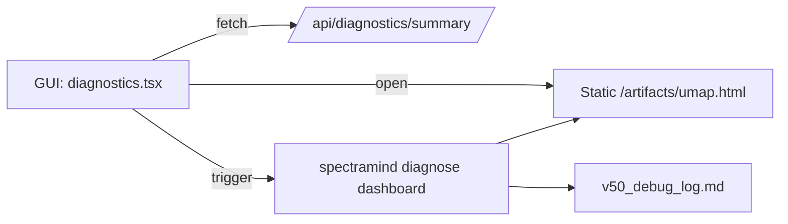
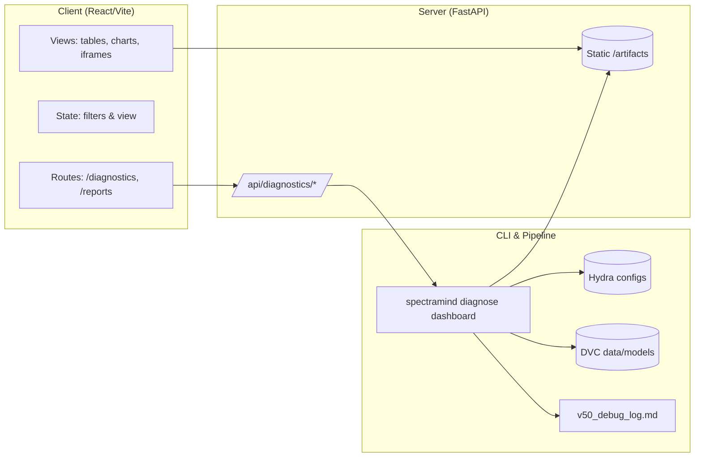

# 📂 `src/gui/app/` — GUI App Layer

## 🎯 Purpose & Scope

This folder contains the **React-based GUI routes and layout** for **SpectraMind V50**.
It is a **thin, optional visualization layer** that sits **on top of the CLI-first pipeline**.
All analytics, training, and diagnostics are executed by the `spectramind …` CLI and FastAPI server;
the GUI simply loads those **CLI-generated artifacts** (`.json`, `.html`, `.png`) and presents them interactively.

> Golden rule: **No hidden logic here** — the GUI must only reflect outputs produced by the CLI, ensuring **NASA-grade reproducibility** and zero drift between GUI and CLI workflows.

---

## 📁 Files (key pages)

* **`index.tsx`** — App entrypoint (router, theming, toasts, lazy routes).
* **`layout.tsx`** — Global shell (sidebar + topbar + content, command palette, theme toggle).
* **`dashboard.tsx`** — One-screen overview; embeds CLI artifacts (UMAP/t-SNE HTML, PNG plots).
* **`diagnostics.tsx`** — Artifact browser + summary JSON viewer + quick-look charts.
* **`reports.tsx`** — Saved HTML/MD report browser for files under `/artifacts/`.

> Feature pages live in `../features/*` (UMAP, t-SNE, SHAP, Symbolic, FFT, Calibration).

---

## 🖼️ Design Principles

* **CLI-first, GUI-optional**
  Every GUI action corresponds to a CLI command (e.g., `spectramind diagnose dashboard`).
  GUI never bypasses Hydra configs, run hashes, or DVC lineage.

* **Reproducibility by construction**
  GUI renders artifacts under `/artifacts/` that were produced by versioned CLI runs.

* **Lightweight & air-gapped friendly**
  Built with **React + Vite + Tailwind + shadcn/ui**; no telemetry; works offline with the local FastAPI + static mount.

* **Stateless analytics**
  Components do not perform ML or calibration in the browser; they only *display* precomputed outputs.

---

## 🔗 API Integration (contract)

* `GET /api/diagnostics/summary` → summary JSON for **Diagnostics** and **Dashboard**.
* `GET /api/diagnostics/health` → quick connection check.
* `POST /api/diagnostics/run` → (optional) trigger `spectramind diagnose dashboard`.
* Static mount `/artifacts/*` → the CLI’s HTML/PNG/JSON outputs.

If auth is enabled, use request headers like `X-API-Key` or `Authorization: Bearer …`.

---

## 🗺️ Routing Overview

```mermaid
flowchart LR
    A[App Router]
    B[Dashboard (/dashboard)]
    C[Diagnostics (/diagnostics)]
    D[Reports (/reports)]
    E[UMAP (/umap)]
    F[t-SNE (/tsne)]
    G[SHAP (/shap)]
    H[Symbolic (/symbolic)]
    I[FFT (/fft)]
    J[Calibration (/calibration)]

    A --> B
    A --> C
    A --> D
    A --> E
    A --> F
    A --> G
    A --> H
    A --> I
    A --> J
```

---

## 📊 Example Workflow



1. User clicks **Run Diagnostics** → server invokes `spectramind diagnose dashboard`.
2. CLI (Hydra/DVC) writes `diagnostic_summary.json` and HTML/plots into `/artifacts`.
3. GUI fetches `/api/diagnostics/summary` and embeds HTML/PNG from `/artifacts`.
4. Runs are logged in `v50_debug_log.md` for auditability.

---

## ⚙️ Environment Variables

* `VITE_API_BASE` — e.g., `""` (same origin) or `/api-gateway`
* `VITE_ARTIFACTS_BASE` — default `/artifacts`
* `VITE_BASE_PATH` — router base (if hosting under a subpath), e.g. `/spectramind`

> The theme is stored under `localStorage` key: `spectramind-theme`.

---

## 🛠️ Development

```bash
# from repo root or src/gui
cd src/gui
npm install
npm run dev   # Vite dev server (hot reload)
```

**Requirements**

* `spectramind …` CLI available in your environment
* FastAPI server running (`src/server/main.py`) to serve `/api/*` and mount `/artifacts`
* Tailwind + shadcn/ui configured

---

## 🔒 Security & Authorization

* Header-based auth supported by server; GUI just forwards credentials and never stores secrets in code.
* GUI is **read-only**: no file uploads or mutations of artifacts.
* Links with `target="_blank"` include `rel="noreferrer"`.

---

## ♿ Accessibility

* Keyboard: ⌘/Ctrl + K command palette, skip-to-content link, focus styles.
* `aria-live` route announcements, accessible loaders, descriptive labels.

---

## 📈 Performance Notes

* Route-level code splitting with `React.lazy`.
* Prefer **embedding prebuilt HTML/plots** over re-charting in the browser.
* Gentle polling/backoff if you add auto-refresh (off by default).

---

## 🧪 Troubleshooting

* **Mermaid diagrams not rendering on GitHub**

  * Use fenced blocks with \`\`\`mermaid and no trailing semicolons.
  * Avoid unsupported syntax; declare nodes before edges.
  * Escape pipes as `&#124;` if needed.

* **Artifacts show as “Missing”**

  ```bash
  spectramind diagnose dashboard
  ```

  Ensure the server mounts the artifact directory at `/artifacts`.

* **CORS or 404 on `/api/*`**

  * Verify `VITE_API_BASE` and the server’s base path.
  * Confirm FastAPI is running and exposing `/api/diagnostics/*`.

---

## 🧭 Mini Architecture Diagram (safe for GitHub)



---

✅ In short: **`src/gui/app/` is presentation-only.**
It visualizes CLI results and never generates them — keeping **SpectraMind V50 reproducible, auditable, and Kaggle-safe**.

---
