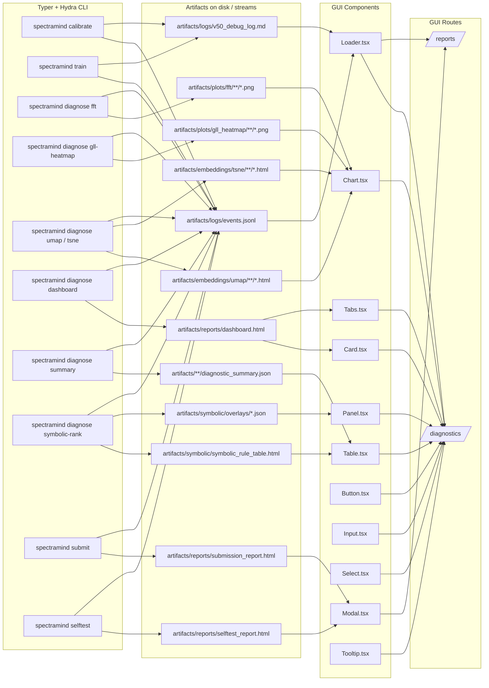
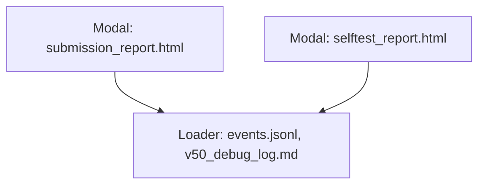

# 🧭 GUI Components × CLI Crosswalk — SpectraMind V50 (Upgraded)

This document maps the **end-to-end flow** from a user action (CLI/Typer + Hydra) → **artifact(s)** written by the pipeline → **GUI component(s)** that render those artifacts → the **GUI route/page** where they appear. The GUI remains a **thin, optional shell** over the CLI, preserving the project’s **CLI-first, Hydra-configured, DVC-versioned** reproducibility guarantees. All diagrams are **GitHub-native Mermaid** and render directly in Markdown.

---

## 0) Legend

* **CLI**: `spectramind …` Typer subcommands (Hydra overrides allowed)
* **Artifact**: files/streams under `artifacts/**` (JSON, PNG, HTML, CSV) or logs (`events.jsonl`, `v50_debug_log.md`)
* **Component**: React UI component under `src/gui/components/`
* **Page**: GUI route (e.g. `/diagnostics`, `/reports`) that composes components

> **Pro tip:** The GUI **never** computes analytics; it only reads verified artifacts produced by the CLI.

---

## 1) End-to-End Flow (High-Level)



**Why this wiring?** The CLI is the **only** place analytics and artifacts are produced (Typer + Hydra, saved to disk/logs). The GUI only **reads and renders** those artifacts, preserving the CLI-first reproducibility model with immutable logs and config snapshots.

---

## 2) Crosswalk Table (CLI → Artifact → Component → Page)

> **Mermaid & table hardening:** no multi-targets in edges, proper semicolons, page nodes use `[/text/]`, table pipes are escaped via `<code>` & line breaks where needed.

| CLI (Typer/Hydra)                    | Primary Artifacts (examples)                                                                           | Component(s)     | Page(s)                    |
| ------------------------------------ | ------------------------------------------------------------------------------------------------------ | ---------------- | -------------------------- |
| `spectramind diagnose dashboard`     | `artifacts/reports/dashboard.html`                                                                     | `Card`, `Tabs`   | `/diagnostics`             |
| `spectramind diagnose fft`           | `artifacts/plots/fft/**/*.png`                                                                         | `Chart`          | `/diagnostics`             |
| `spectramind diagnose gll-heatmap`   | `artifacts/plots/gll_heatmap/**/*.png`                                                                 | `Chart`          | `/diagnostics`             |
| `spectramind diagnose umap` / `tsne` | <code>artifacts/embeddings/umap/**/\*.html</code><br><code>artifacts/embeddings/tsne/**/\*.html</code> | `Chart`          | `/diagnostics`             |
| `spectramind diagnose summary`       | `artifacts/**/diagnostic_summary.json`                                                                 | `Table`          | `/diagnostics`             |
| `spectramind diagnose symbolic-rank` | `artifacts/symbolic/symbolic_rule_table.html`, `artifacts/symbolic/overlays/*.json`                    | `Table`, `Panel` | `/diagnostics`             |
| `spectramind submit`                 | `artifacts/reports/submission_report.html`                                                             | `Modal`          | `/reports`                 |
| `spectramind selftest`               | `artifacts/reports/selftest_report.html`                                                               | `Modal`          | `/reports`                 |
| any run                              | `artifacts/logs/events.jsonl`, `artifacts/logs/v50_debug_log.md`                                       | `Loader`         | `/diagnostics`, `/reports` |

**Notes**

* Tabs gate **what** the Card/Chart/Table render (switching UMAP vs t-SNE vs GLL) using available artifacts.
* `Button`, `Input`, `Select`, `Tooltip` are **UX helpers**: Buttons trigger server-side CLI calls; Input/Select bind Hydra fields/groups; Tooltip shows cached CLI `--help`.
* All artifacts/paths may be DVC-versioned; logs/configs are persisted per run ensuring traceability.

---

## 3) Component Responsibilities (I/O Contracts)

* **Chart.tsx** — Accepts a file URL (PNG/HTML). **Never** computes; it only embeds images or iframes (UMAP/t-SNE, FFT, GLL).
* **Table.tsx** — Loads JSON/HTML/CSV from `diagnostic_summary.json`, `symbolic_rule_table.html`, or metrics CSVs; renders an accessible table.
* **Card.tsx** — Composes child visuals (Table, Chart, Panel) around a section heading and notes; can embed `dashboard.html`.
* **Panel.tsx** — Hosts overlays (`symbolic/overlays/*.json`) and grouped controls.
* **Tabs.tsx** — Presents “FFT / GLL / UMAP / t-SNE / Dashboard”; disables tabs with missing artifacts.
* **Modal.tsx** — Displays HTML reports (submission/selftest) in a focus-managed overlay.
* **Loader.tsx** — Streams `events.jsonl` and tails `v50_debug_log.md` to mirror CLI Rich output.
* **Button.tsx** — Triggers **server-side** calls that run the CLI; GUI never runs analytics in-browser.
* **Input.tsx / Select.tsx** — Bind **Hydra** overrides/groups (e.g., `optimizer=adamw`, `trainer.epochs=20`).
* **Tooltip.tsx** — Shows `--help` excerpts (pre-cached into `cache/help/*.txt`) for discoverability.

---

## 4) Page Layouts

### `/diagnostics` (Artifacts explorer)

```mermaid
flowchart TD
  T1[Tabs: FFT | GLL | UMAP | t-SNE | Dashboard];
  C1[Card: Section];
  CH[Chart: PNG/HTML];
  TB[Table: diagnostic_summary.json];
  PL[Panel: symbolic overlays];
  L1[Loader: events.jsonl];

  T1 --> C1;
  C1 --> CH;
  C1 --> TB;
  C1 --> PL;
  L1 --> C1;
```

**Behavior**

* Tabs enable/disable based on artifact presence.
* Card shows current tab’s artifact(s).
* Loader streams live CLI events/logs for transparency.

### `/reports` (Reports & logs)



**Behavior**

* Reports open in modal; Loader tails logs.
* No analytics executed here; pure viewing.

---

## 5) Artifact Readiness & Fault Tolerance

**Artifact existence contract (server-side):**

* Before rendering, the server bridge must:

  * `stat()` the file(s);
  * set props `{available: boolean, url: string | null, reason?: string}`;
  * return **friendly diagnostics** when missing (e.g., “Run `spectramind diagnose fft` to produce FFT plots”).

**Graceful UI behavior:**

* `Chart` / `Table` show a compact **Placeholder** component when `available=false`, with:

  * the exact CLI command to run,
  * the expected output path,
  * a **Retry** `Button` that re-invokes the CLI.
* `Tabs` disable tabs with missing artifacts and display a hover Tooltip explaining which CLI command to run.

---

## 6) Security, Paths & Sandbox

* All artifact reads occur via **server-side allow-listed** paths under `artifacts/**`.
* The bridge must **reject** `..` traversals, absolute paths outside the workspace, or non-allow-listed globs.
* Only `GET`/read operations are exposed to the browser; CLI invocations are **POST** to the server and run **out-of-process**, with a timeout and redacted env.

---

## 7) Reproducibility & Guardrails

1. **CLI-First** — All analytics/artifacts come from `spectramind …` with **Hydra** configs/overrides; GUI never computes analytics in-browser.
2. **Immutable Artifacts** — GUI only renders files under `artifacts/**` or logs in `artifacts/logs/**` (DVC-friendly).
3. **Mermaid-in-Markdown** — Architecture diagrams render natively on GitHub.
4. **Auditability** — Every run writes `events.jsonl` and `v50_debug_log.md` with configs & hashes, enabling end-to-end traceability.

---

## 8) Server Bridge API (minimal contract)

* `GET /api/artifacts/list?glob=...` → returns `{ files: string[] }`
* `GET /api/artifacts/file?path=...` → streams artifact (with allow-listing)
* `POST /api/diagnostics/run` with body `{ cmd: string, hydra?: Record<string, string|number|boolean> }`

  * Runs Typer CLI with explicit argv (no `shell=true`), logs streamed to `events.jsonl`.
  * Returns `{ runId, startedAt }`, client polls `events.jsonl`.

---

## 9) Quick Reference — CLI → Component

* **FFT / GLL / UMAP / t-SNE** → `Chart` on `/diagnostics`
* **Summary / Rule Table** → `Table` on `/diagnostics`
* **Symbolic Overlays** → `Panel` on `/diagnostics`
* **Dashboard** → `Card` + `Tabs` on `/diagnostics`
* **Submission / Selftest Reports** → `Modal` on `/reports`
* **Logs / Events** → `Loader` (both pages)

---

## 10) Troubleshooting (Mermaid & Markdown)

* End each Mermaid node/edge with `;`.
* Use `[/text/]` for subroutine page nodes (both slashes).
* No multi-target edges like `A --> B & C`; declare separate edges.
* Use `<code>…</code>` in tables to avoid pipe conflicts (e.g., paths with `/*`).

---

## 11) Optional Extensions (roadmap stubs)

You can wire new CLI surfaces in the same pattern:

* `spectramind explain` → `artifacts/explainability/**/*.html|png` → `Chart`/`Table` → `/diagnostics`
* `spectramind simulate` → `artifacts/simulations/**/*.html|png|json` → `Chart`/`Table` → `/diagnostics`
* `spectramind tune` → `artifacts/tuning/**/leaderboard.csv|html` → `Table`/`Card` → `/diagnostics`

---

## 12) Mini-Glossary

* **Typer** — Python CLI library (Click-based) used to expose pipeline subcommands.
* **Hydra** — Structured config system; all runs are launched with explicit config snapshots.
* **DVC** — Data Version Control; tracks datasets/artifacts, enabling reproducible retrieval.
* **Rich** — Fancy terminal logging used by the CLI; mirrored via `events.jsonl` + `v50_debug_log.md`.

---
