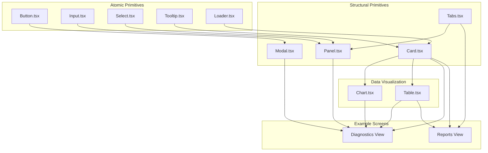
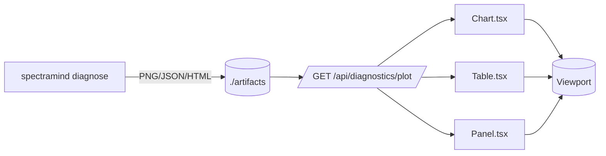

# 🧩 SpectraMind V50 — GUI Components Architecture

## 0) Purpose & Scope

This document defines the **architecture of the React component layer** under `src/gui/components/`.
It maps atomic → structural → visualization → composite usage, explains integration with the **CLI-first pipeline**, and links each component to its **corresponding CLI artifact(s)**.

The GUI layer is **optional and thin**: all scientific functionality lives in CLI + Hydra configs.
Components here **only render CLI-produced artifacts** (JSON, PNG, HTML, CSV) and provide ergonomic composition for dashboards, reports, and teaching.

---

## 1) Directory Map

```
src/gui/components/
├─ Button.tsx
├─ Input.tsx
├─ Select.tsx
├─ Tooltip.tsx
├─ Loader.tsx
├─ Tabs.tsx
├─ Modal.tsx
├─ Card.tsx
├─ Panel.tsx
├─ Chart.tsx
├─ Table.tsx
├─ index.ts
├─ *.test.tsx               # Jest/RTL unit tests
├─ README.md                # Usage-level guide
└─ ARCHITECTURE.md          # ← this file
```

---

## 2) Component ↔ CLI Artifact Mapping

| Component   | CLI Artifact(s) Rendered                                              | Source Command(s)                                    | Notes                                                                |
| ----------- | --------------------------------------------------------------------- | ---------------------------------------------------- | -------------------------------------------------------------------- |
| **Card**    | Container for summaries, static PNG/HTML reports                      | Any (`diagnose`, `calibrate`, `train`)               | Used to wrap tables/plots.                                           |
| **Chart**   | `fft_plot.png`, `gll_heatmap.png`, `umap_plot.html`, `tsne_plot.html` | `spectramind diagnose fft`, `… umap`, `… tsne`       | Wraps Recharts/Plotly. Plots always come from saved CLI outputs.     |
| **Table**   | `diagnostic_summary.json`, `symbolic_rule_table.html`, CSV exports    | `spectramind diagnose dashboard`                     | Tabular summaries of symbolic rules, metrics, or violations.         |
| **Panel**   | Grouped diagnostics (per-planet JSON, symbolic overlays)              | `diagnose symbolic-rank`, `diagnose cluster-overlay` | Collapsible section for clusters/profiles.                           |
| **Tabs**    | Switch between artifact types (UMAP, t-SNE, SHAP, Symbolic)           | `diagnose dashboard --html-out`                      | Controlled/uncontrolled tab state reflects available artifact files. |
| **Button**  | Triggers CLI via API bridge                                           | All subcommands                                      | Logs action → CLI run → artifact refresh.                            |
| **Input**   | Hydra override injection (e.g. `trainer.epochs=20`)                   | All training/inference commands                      | Bound to Hydra field paths.                                          |
| **Select**  | Hydra config group selection (e.g. `model=resnet50`)                  | `train`, `predict`                                   | Lists available YAML configs.                                        |
| **Tooltip** | Help text (CLI flags, Hydra field docs)                               | `--help` output from CLI                             | Auto-syncs from Typer help + Hydra schema.                           |
| **Loader**  | Progress feedback (Rich logs → JSON stream)                           | Any long-running command                             | Mirrors CLI Rich console spinners.                                   |
| **Modal**   | Renders `submission_report.html`, confirmation dialogs                | `spectramind submit`, `selftest`                     | Blocks UI until CLI completes, shows outputs.                        |

---

## 3) Component Hierarchy Diagram



---

## 4) Artifact Flow (CLI → GUI)



**Principle:** The GUI **never computes analytics**. It only renders CLI artifacts.

---

## 5) Design Principles

* **CLI-first, GUI-optional** — reproducibility enforced at CLI layer.
* **Declarative React** — components map directly to CLI artifacts.
* **Hydra integration** — inputs & selects bind to config groups/fields.
* **Accessibility** — ARIA + focus-visible patterns for all interactives.
* **Scientific fidelity** — GUI components display outputs of physics-informed, symbolic-aware pipeline.
* **Mermaid-native docs** — diagrams here render automatically on GitHub.

---

✅ With this mapping, GUI developers know exactly:

1. **Which CLI command produces each artifact**
2. **Which component is responsible for rendering it**
3. **How Hydra overrides flow through inputs/selects into CLI calls**

This keeps the GUI aligned with SpectraMind V50’s **NASA-grade reproducibility** and ensures the GUI is a **safe, optional extension**, never a divergence.

---
