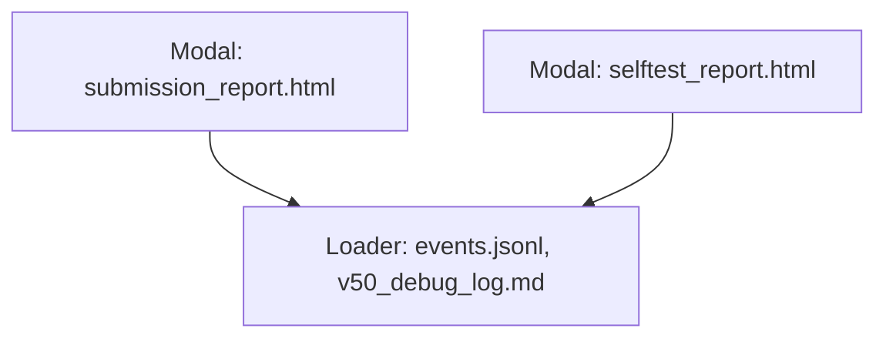

# 🧭 GUI Components × CLI Crosswalk — SpectraMind V50

This document maps the **end-to-end flow** from a user action (CLI/Typer + Hydra) → **artifact(s)** written by the pipeline → **GUI component(s)** that render those artifacts → the **GUI route/page** where they appear. It keeps the GUI a **thin, optional shell** over the CLI, preserving the project’s CLI-first, Hydra-configured, DVC-versioned reproducibility guarantees. Diagrams are GitHub-native **Mermaid** so they render directly in Markdown.

---

## 0) Legend

* **CLI**: `spectramind …` Typer subcommands (Hydra overrides allowed)
* **Artifact**: files/streams under `artifacts/**` (JSON, PNG, HTML, CSV) or logs (`events.jsonl`, `v50_debug_log.md`)
* **Component**: React UI component under `src/gui/components/`
* **Page**: GUI route (e.g. `/diagnostics`, `/reports`) that composes components

---

## 1) End-to-End Flow (High-Level)

```mermaid
flowchart LR
  subgraph CLI[Typer + Hydra CLI]
    C1[spectramind calibrate]
    C2[spectramind train]
    C3[spectramind diagnose fft]
    C4[spectramind diagnose gll-heatmap]
    C5[spectramind diagnose umap / tsne]
    C6[spectramind diagnose dashboard]
    C7[spectramind diagnose summary]
    C8[spectramind diagnose symbolic-rank]
    C9[spectramind submit]
    C10[spectramind selftest]
  end

  subgraph ARTIFACTS[Artifacts on disk / streams]
    A1[artifacts/reports/dashboard.html]
    A2[artifacts/plots/fft/**/*.png]
    A3[artifacts/plots/gll_heatmap/**/*.png]
    A4[artifacts/embeddings/umap/**/*.html]
    A5[artifacts/embeddings/tsne/**/*.html]
    A6[artifacts/**/diagnostic_summary.json]
    A7[artifacts/symbolic/symbolic_rule_table.html]
    A8[artifacts/symbolic/overlays/*.json]
    A9[artifacts/reports/submission_report.html]
    A10[artifacts/reports/selftest_report.html]
    A11[artifacts/logs/events.jsonl]
    A12[artifacts/logs/v50_debug_log.md]
  end

  subgraph UI[GUI Components]
    U1[Card.tsx]
    U2[Chart.tsx]
    U3[Table.tsx]
    U4[Panel.tsx]
    U5[Tabs.tsx]
    U6[Modal.tsx]
    U7[Button.tsx]
    U8[Input.tsx]
    U9[Select.tsx]
    U10[Loader.tsx]
    U11[Tooltip.tsx]
  end

  subgraph PAGES[GUI Routes]
    P1[/diagnostics]
    P2[/reports]
  end

  %% CLI -> Artifacts
  C6 --> A1
  C3 --> A2
  C4 --> A3
  C5 --> A4
  C5 --> A5
  C7 --> A6
  C8 --> A7
  C8 --> A8
  C9 --> A9
  C10 --> A10
  C1 --> A11
  C2 --> A11
  C3 --> A11
  C4 --> A11
  C5 --> A11
  C6 --> A11
  C7 --> A11
  C8 --> A11
  C9 --> A11
  C10 --> A11
  C1 --> A12
  C2 --> A12

  %% Artifacts -> Components
  A1 --> U1 & U5
  A2 --> U2
  A3 --> U2
  A4 --> U2
  A5 --> U2
  A6 --> U3
  A7 --> U3
  A8 --> U4
  A9 --> U6
  A10 --> U6
  A11 --> U10
  A12 --> U10

  %% Components -> Pages
  U1 --> P1
  U2 --> P1
  U3 --> P1
  U4 --> P1
  U5 --> P1
  U6 --> P2
  U7 --> P1
  U8 --> P1
  U9 --> P1
  U10 --> P2
  U10 --> P1
  U11 --> P1
```

*Why this wiring?* The CLI is the **only** place analytics and artifacts are produced (Typer + Hydra, saved to disk/logs). The GUI only **reads and renders** those artifacts in components and pages, preserving the CLI-first reproducibility model with immutable logs and config snapshots.

---

## 2) Crosswalk Table (CLI → Artifact → Component → Page)

| CLI (Typer/Hydra)                    | Primary Artifacts (examples)                                                        | Component(s)         | Page(s)                    |                |
| ------------------------------------ | ----------------------------------------------------------------------------------- | -------------------- | -------------------------- | -------------- |
| `spectramind diagnose dashboard`     | `artifacts/reports/dashboard.html`                                                  | `Card`, `Tabs`       | `/diagnostics`             |                |
| `spectramind diagnose fft`           | `artifacts/plots/fft/**/*.png`                                                      | `Chart`              | `/diagnostics`             |                |
| `spectramind diagnose gll-heatmap`   | `artifacts/plots/gll_heatmap/**/*.png`                                              | `Chart`              | `/diagnostics`             |                |
| `spectramind diagnose umap` / `tsne` | \`artifacts/embeddings/(umap                                                        | tsne)/\*\*/\*.html\` | `Chart`                    | `/diagnostics` |
| `spectramind diagnose summary`       | `artifacts/**/diagnostic_summary.json`                                              | `Table`              | `/diagnostics`             |                |
| `spectramind diagnose symbolic-rank` | `artifacts/symbolic/symbolic_rule_table.html`, `artifacts/symbolic/overlays/*.json` | `Table`, `Panel`     | `/diagnostics`             |                |
| `spectramind submit`                 | `artifacts/reports/submission_report.html`                                          | `Modal`              | `/reports`                 |                |
| `spectramind selftest`               | `artifacts/reports/selftest_report.html`                                            | `Modal`              | `/reports`                 |                |
| any run                              | `artifacts/logs/events.jsonl`, `artifacts/logs/v50_debug_log.md`                    | `Loader`             | `/diagnostics`, `/reports` |                |

> Notes
> • Tabs gate **what** the Card/Chart/Table render (switching UMAP vs t-SNE vs GLL) using available artifacts.
> • `Button`, `Input`, `Select`, `Tooltip` are **action or UX helpers**: Buttons trigger CLI calls; Input/Select bind Hydra fields/groups; Tooltip shows cached CLI `--help`.
> • All artifacts/paths can be versioned via DVC; logs/configs are persisted per run ensuring traceability.

---

## 3) Component Responsibilities (I/O Contracts)

* **Chart.tsx**: Accepts a file URL (PNG/HTML). Never computes; it only embeds images or iframes for HTML plots (UMAP/t-SNE) produced by CLI.
* **Table.tsx**: Loads JSON/HTML/CSV from `diagnostic_summary.json`, `symbolic_rule_table.html`, or metrics CSVs and renders an accessible table.
* **Card.tsx**: Composes child visuals (Table, Chart, Panel) around a section heading and notes; can embed `dashboard.html`.
* **Panel.tsx**: Hosts overlays (`overlays/*.json`) and grouped controls.
* **Tabs.tsx**: Presents “FFT / GLL / UMAP / t-SNE / Dashboard” tabs; disabled when corresponding artifact is absent.
* **Modal.tsx**: Displays HTML reports (submission/selftest) in a focus-managed overlay.
* **Loader.tsx**: Streams `events.jsonl` and tails `v50_debug_log.md` to show progress consistent with the Rich console output.
* **Button.tsx**: Triggers a **server-side** call that runs the corresponding CLI; GUI never runs analytics itself.
* **Input.tsx / Select.tsx**: Bind **Hydra** overrides and group selections (e.g., `optimizer=adamw`, `trainer.epochs=20`).
* **Tooltip.tsx**: Shows `--help` excerpts (pre-cached into `cache/help/*.txt`) for discoverability.

---

## 4) Page Layouts

### `/diagnostics` (Artifacts explorer)

```mermaid
flowchart TD
  T1[Tabs: FFT | GLL | UMAP | t-SNE | Dashboard]
  C1[Card: Section]
  CH[Chart: PNG/HTML]
  TB[Table: diagnostic_summary.json]
  PL[Panel: symbolic overlays]
  L1[Loader: events.jsonl]
  T1 --> C1
  C1 --> CH
  C1 --> TB
  C1 --> PL
  L1 --> C1
```

*Behavior*

* Tabs enable/disable based on artifact presence.
* Card shows current tab’s artifact(s).
* Loader streams live CLI events/logs for transparency.

### `/reports` (Reports & logs)



*Behavior*

* Reports open in modal; Loader tails logs.
* No analytics executed here; pure viewing.

---

## 5) Reproducibility & Guardrails

1. **CLI-First**: All analytics/artifacts come from `spectramind …` with **Hydra** configs and overrides; GUI never computes analytics in-browser.
2. **Immutable Artifacts**: GUI only renders files under `artifacts/**` or streams logs from `artifacts/logs/**`; these can be versioned with DVC for full lineage.
3. **Mermaid-in-Markdown**: Architecture diagrams render natively on GitHub, keeping design docs executable and always-up-to-date.
4. **Auditability**: Every run writes `events.jsonl` and `v50_debug_log.md` with configs and hashes, enabling end-to-end traceability of GUI views back to CLI runs.

---

## 6) Quick Reference — CLI to Component

* **FFT / GLL / UMAP / t-SNE** → `Chart` on `/diagnostics`
* **Summary / Rule Table** → `Table` on `/diagnostics`
* **Symbolic Overlays** → `Panel` on `/diagnostics`
* **Dashboard** → `Card` + `Tabs` on `/diagnostics`
* **Submission / Selftest Reports** → `Modal` on `/reports`
* **Logs / Events** → `Loader` (both pages)

---

### Sources

* SpectraMind V50 CLI-first architecture, Hydra/DVC/CI integration, artifact & log model
* Strategy extensions & CLI subcommand surface (diagnostics, explainability, simulate, tune)
* Mermaid in GitHub Markdown (rendering guidance)

---
