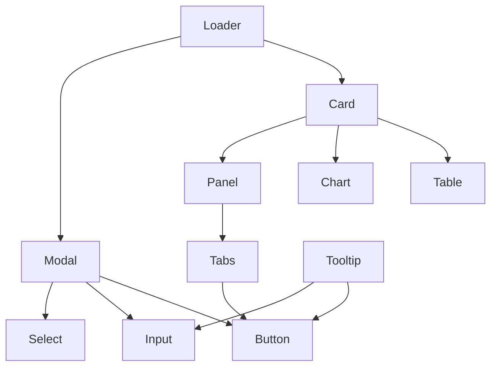
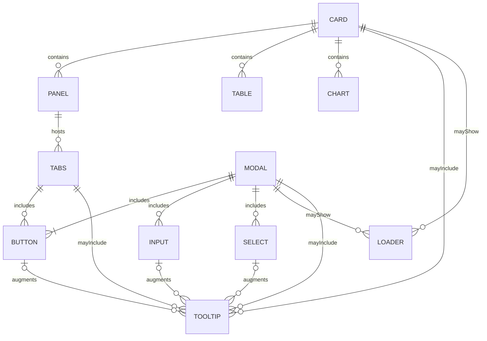

# 🎨 GUI Components — SpectraMind V50

This directory contains the **reusable React components** that form the building blocks of the optional SpectraMind V50 GUI.  
The GUI is a **thin, reproducible shell** over the CLI — all functionality is ultimately backed by CLI commands and Hydra configs.

---

## 📂 Components

Each component lives in its own file under `src/gui/components/` and is exported from `index.ts` for convenient imports.

- **Card.tsx** — Container for grouping content with padding, shadow, and rounded corners.
- **Chart.tsx** — Wrapper around Recharts or other plotting libraries, styled for diagnostics.
- **Table.tsx** — Data table with accessible headers, rows, and styling.
- **Panel.tsx** — Collapsible panel for grouping related settings or diagnostics.
- **Button.tsx** — Reusable button with variants (`default`, `secondary`, `outline`, `ghost`, `destructive`, `link`) and sizes (`sm`, `md`, `lg`).
- **Input.tsx** — Text input with label, helper text, and error state.
- **Select.tsx** — Dropdown select with options, helper text, and error state.
- **Tabs.tsx** — Accessible tabbed navigation with controlled/uncontrolled state.
- **Modal.tsx** — Accessible modal dialog with focus management, ESC/overlay close, and subcomponents (`Header`, `Body`, `Footer`).
- **Loader.tsx** — Loading indicators:
  - `Loader.Spinner`
  - `Loader.Dots`
  - `Loader.Bar`
  - `Loader.Skeleton`
  - `Loader.Overlay`
- **Tooltip.tsx** — Accessible tooltip with hover/focus triggers, ESC close, smart placement, and arrow.

---

## 📦 Usage

You can import components individually or via the barrel file:

```tsx
import { Button, Card, Table, Loader } from "@/gui/components";

export default function Example() {
  return (
    <Card>
      <h2 className="text-lg font-bold mb-2">Diagnostics</h2>
      <Table>
        {/* rows */}
      </Table>
      <Loader.Spinner showLabel />
      <Button variant="primary" size="lg">
        Run Pipeline
      </Button>
    </Card>
  );
}
````

---

## 🧪 Testing

Each component has a matching test file under `src/gui/components/__tests__/` (or next to it).
Tests are written with **Vitest + Testing Library** and check:

* Rendering and accessibility (roles, aria attributes)
* Variants and states (error, disabled, active, etc.)
* Interactive behavior (click, hover, focus, ESC close)

Example run:

```bash
pnpm test src/gui/components
```

---

## 🛠️ Design Principles

* **CLI-first, GUI-optional** — GUI calls CLI commands via the server bridge; no analytics are computed in-browser.
* **Accessibility** — All components include ARIA roles, focus-visible styles, keyboard support.
* **Theming** — Tailwind + shadcn/ui conventions with dark mode support.
* **Reproducibility** — GUI never bypasses configs/logs; all actions produce Hydra configs and CLI logs.

---

## 📑 Component Relationships

The diagram below shows how components relate to each other in the GUI:



* **Card** often wraps `Table`, `Chart`, and `Panel`.
* **Panel** can contain `Tabs`, which group related content.
* **Modal** usually contains `Button`, `Input`, and `Select`.
* **Tooltip** is commonly attached to `Button` or `Input`.
* **Loader** is used inside `Card` or `Modal` for async operations.

---

## 🧭 ER-style Diagram (Containers ↔ Interactives)

The following ER-style diagram clarifies **which interactive components are typically hosted by which containers**.
Cardinality guidance:

* `||` = exactly one, `o|` = zero or one, `|{` = one or more, `o{` = zero or more.



**Interpretation highlights**

* A **Card** can contain multiple `Panel`, `Table`, `Chart`, `Tooltip`, and optionally show `Loader`.
* A **Panel** can host `Tabs` (which in turn can include interactive controls like `Button`).
* A **Modal** commonly includes `Button`, `Input`, `Select`, and can show `Loader` while actions run.
* **Tooltip** augments `Button`, `Input`, and `Select` without changing layout flow.

> Use this as a reference when composing new views: prefer **Card → Panel → Tabs** for structured pages, and **Modal** for transactional flows.

---

✅ With this structure, SpectraMind V50 has a **clean, tested, reusable component library** for its optional GUI layer, with clear relationships and composition rules between container and interactive components.

```
```
