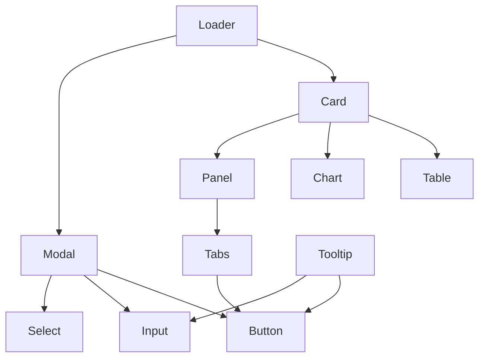

# 🎨 GUI Components — SpectraMind V50

This directory contains the **reusable React components** that form the building blocks of the optional SpectraMind V50 GUI.
The GUI is a **thin, reproducible shell** over the CLI — all functionality is ultimately backed by CLI commands and Hydra configs.

---

## 📂 Components

Each component lives in its own file under `src/gui/components/` and is exported from `index.ts` for convenient imports.

* **Card.tsx** — Container for grouping content (renders reports, plots, JSON summaries).
  *CLI Artifacts:* `diagnostic_summary.json`, `dashboard.html`, plots (`artifacts/plots/**/*.png`).
* **Chart.tsx** — Wrapper around Recharts or Plotly, styled for diagnostics.
  *CLI Artifacts:* FFT plots (`spectramind diagnose fft`), GLL heatmaps (`diagnose gll-heatmap`), UMAP/t-SNE HTML (`diagnose umap/tsne`).
* **Table.tsx** — Data table with accessible headers, rows, and styling.
  *CLI Artifacts:* `diagnostic_summary.json`, `symbolic_rule_table.html`, metrics CSVs (`diagnose export-metrics`).
* **Panel.tsx** — Collapsible panel for overlays or grouped diagnostics.
  *CLI Artifacts:* Symbolic overlays (`diagnose symbolic-rank`), cluster overlays (`diagnose cluster-overlay`).
* **Button.tsx** — Reusable button with variants (`default`, `secondary`, `outline`, `ghost`, `destructive`, `link`) and sizes (`sm`, `md`, `lg`).
  *CLI Commands:* `spectramind calibrate`, `train`, `diagnose dashboard`, `submit`.
* **Input.tsx** — Text input with Hydra binding.
  *Hydra Keys:* `trainer.epochs`, `optimizer.lr`, `model.name`, `data.split`, `diagnostics.max_planets`.
* **Select.tsx** — Dropdown select for Hydra config groups.
  *CLI Commands:* `spectramind --list model|data|optimizer`.
* **Tabs.tsx** — Accessible tabbed navigation with controlled/uncontrolled state.
  *CLI Artifacts:* `dashboard.html`, UMAP/t-SNE HTML, GLL heatmap PNGs.
* **Modal.tsx** — Accessible modal dialog with focus management, ESC/overlay close, and subcomponents (`Header`, `Body`, `Footer`).
  *CLI Artifacts:* `submission_report.html`, `selftest_report.html`.
* **Loader.tsx** — Loading indicators:

  * `Loader.Spinner`
  * `Loader.Dots`
  * `Loader.Bar`
  * `Loader.Skeleton`
  * `Loader.Overlay`
    *CLI Artifacts:* event log (`events.jsonl`), audit log (`v50_debug_log.md`).
* **Tooltip.tsx** — Accessible tooltip with hover/focus triggers, ESC close, smart placement, and arrow.
  *CLI Artifacts:* CLI `--help` extracts (cached in `cache/help/*.txt`).

---

## 📦 Usage

```tsx
import { Button, Card, Table, Loader } from "@/gui/components";

export default function Example() {
  return (
    <Card>
      <h2 className="text-lg font-bold mb-2">Diagnostics</h2>
      <Table />
      <Loader.Spinner showLabel />
      <Button variant="primary" size="lg">
        Run Pipeline
      </Button>
    </Card>
  );
}
```

---

## 🧪 Testing

Each component has a matching test file under `src/gui/components/__tests__/`.
Tests use **Vitest + Testing Library** and cover:

* Rendering & accessibility (roles, aria attributes)
* Variants & states (error, disabled, active, etc.)
* Interactive behavior (click, hover, focus, ESC close)

Run:

```bash
pnpm test src/gui/components
```

---

## 🛠️ Design Principles

* **CLI-first, GUI-optional** — GUI renders CLI artifacts (PNG, JSON, HTML), never computes analytics.
* **Accessibility** — ARIA roles, keyboard navigation, focus-visible styles across all widgets.
* **Declarative UI + Retained Mode** — Components mirror CLI/Hydra artifacts; no hidden state.
* **Theming & Responsiveness** — Tailwind + shadcn/ui conventions, dark mode.
* **Reproducibility** — Every GUI action logs a CLI call, configs, and artifacts.

---

## 📑 Component Relationships



---

## 🔬 Integration with SpectraMind V50

* GUI components are **direct reflections of CLI diagnostics**:

  * `Chart` shows FFT/GLL/UMAP plots
  * `Table` renders diagnostic summaries & rule tables
  * `Modal` surfaces reports (`submission_report.html`)
  * `Loader` streams logs (`events.jsonl`, `v50_debug_log.md`)
* GUI actions are **declarative wrappers** for Typer/Hydra CLI invocations.
* Reproducibility is **NASA-grade**: all GUI interactions produce the same logs, configs, and artifacts as CLI runs.

---

✅ With this mapping, `src/gui/components/` is a **clean, reusable, test-covered, CLI-linked GUI library** for SpectraMind V50, with every component explicitly tied to the artifacts or commands it visualizes.

---
