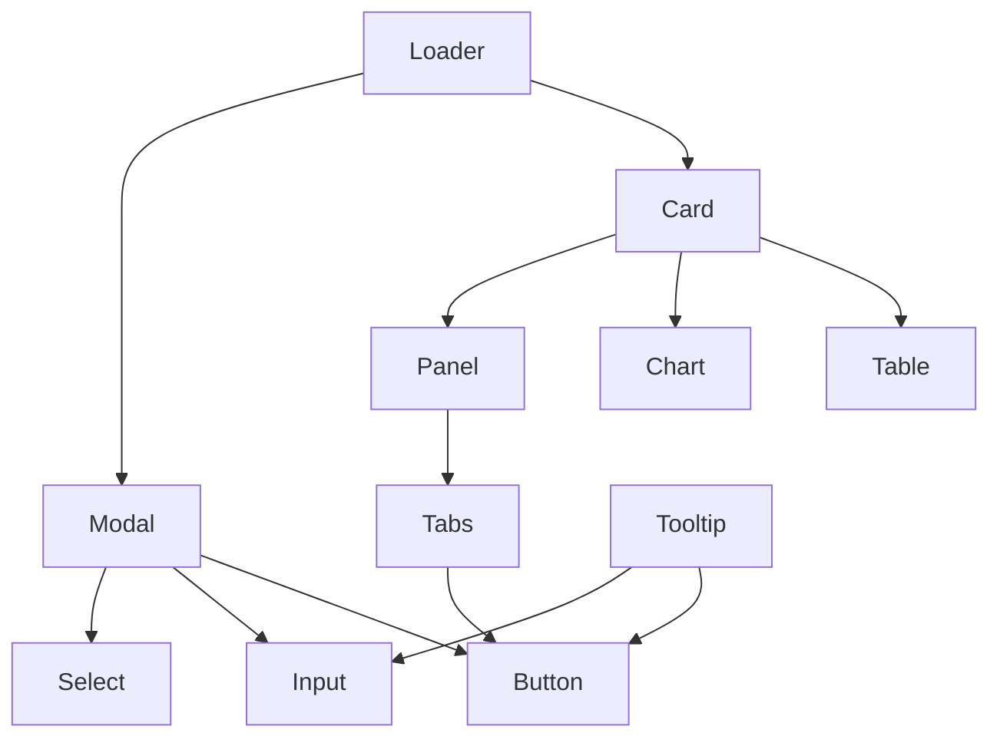
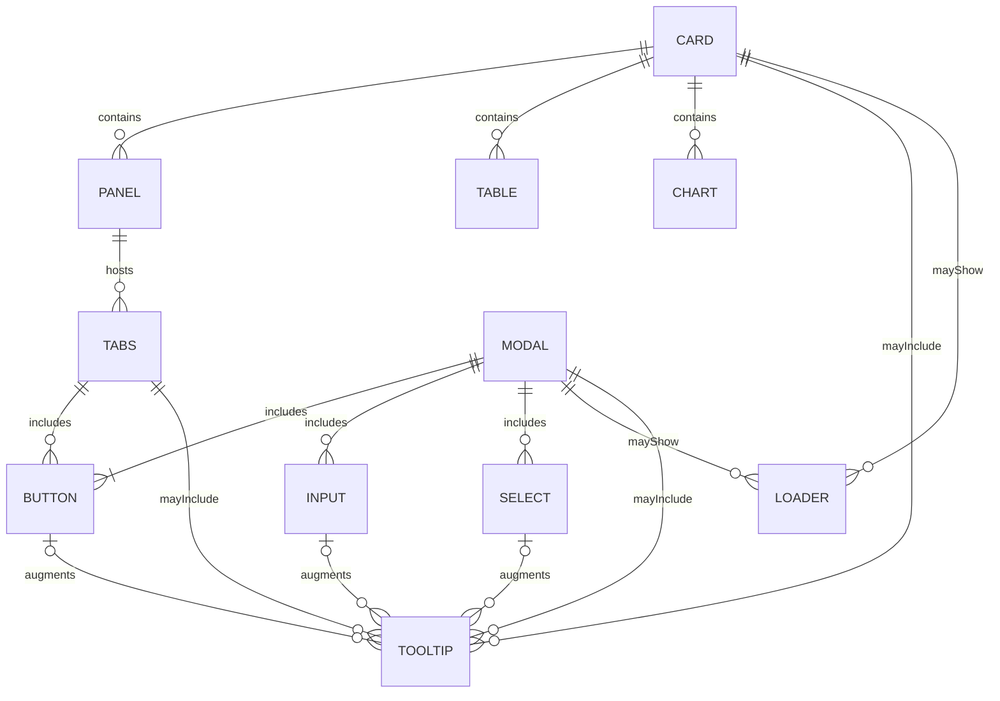

# 🎨 GUI Components — SpectraMind V50

This directory contains the **reusable React components** that form the building blocks of the optional SpectraMind V50 GUI.
The GUI is a **thin, reproducible shell** over the CLI — all functionality is ultimately backed by CLI commands and Hydra configs.

---

## 📂 Components

Each component lives in its own file under `src/gui/components/` and is exported from `index.ts` for convenient imports.

* **Card.tsx** — Container for grouping content with padding, shadow, and rounded corners.
* **Chart.tsx** — Wrapper around Recharts or other plotting libraries, styled for diagnostics.
* **Table.tsx** — Data table with accessible headers, rows, and styling.
* **Panel.tsx** — Collapsible panel for grouping related settings or diagnostics.
* **Button.tsx** — Reusable button with variants (`default`, `secondary`, `outline`, `ghost`, `destructive`, `link`) and sizes (`sm`, `md`, `lg`).
* **Input.tsx** — Text input with label, helper text, and error state.
* **Select.tsx** — Dropdown select with options, helper text, and error state.
* **Tabs.tsx** — Accessible tabbed navigation with controlled/uncontrolled state.
* **Modal.tsx** — Accessible modal dialog with focus management, ESC/overlay close, and subcomponents (`Header`, `Body`, `Footer`).
* **Loader.tsx** — Loading indicators:

  * `Loader.Spinner`
  * `Loader.Dots`
  * `Loader.Bar`
  * `Loader.Skeleton`
  * `Loader.Overlay`
* **Tooltip.tsx** — Accessible tooltip with hover/focus triggers, ESC close, smart placement, and arrow.

---

## 📦 Usage

```tsx
import { Button, Card, Table, Loader } from "@/gui/components";

export default function Example() {
  return (
    <Card>
      <h2 className="text-lg font-bold mb-2">Diagnostics</h2>
      <Table>
        {/* rows */}
      </Table>
      <Loader.Spinner showLabel />
      <Button variant="primary" size="lg">
        Run Pipeline
      </Button>
    </Card>
  );
}
```

---

## 🧪 Testing

Each component has a matching test file under `src/gui/components/__tests__/` (or adjacent).
Tests use **Vitest + Testing Library** and cover:

* Rendering & accessibility (roles, aria attributes)
* Variants & states (error, disabled, active, etc.)
* Interactive behavior (click, hover, focus, ESC close)

Run all component tests with:

```bash
pnpm test src/gui/components
```

---

## 🛠️ Design Principles

* **CLI-first, GUI-optional** — GUI renders CLI artifacts (PNG, JSON, HTML), never computes analytics.
* **Accessibility** — ARIA roles, keyboard navigation, focus-visible styles across all interactive widgets.
* **Declarative UI + Retained Mode** — React components mirror Hydra/CLI artifacts; no hidden state.
* **Theming & Responsiveness** — Tailwind + shadcn/ui conventions, dark mode, and layout managers over absolute positioning.
* **Reproducibility** — Every GUI action logs a CLI call with configs, ensuring deterministic Hydra/DVC trails.

---

## 📑 Component Relationships



---

## 🧭 ER-style Diagram (Containers ↔ Interactives)



---

## 🔬 Integration with SpectraMind V50

* GUI components display **CLI diagnostics** (UMAP, t-SNE, SHAP overlays, calibration heatmaps).
* They render **scientific visualizations** aligned with physics-informed modeling.
* Optional GUI dashboards are backed by Typer/Hydra configs — ensuring every run is reproducible, logged, and version-controlled.
* GUI patterns (e.g., MVVM, reactive bindings) ensure separation of concerns and align with modern GUI engineering.

---

✅ With this structure, `src/gui/components/` serves as a **clean, reusable, and test-covered component library** for SpectraMind V50’s GUI, while maintaining the **NASA-grade reproducibility standards** of the CLI-first pipeline.

---
