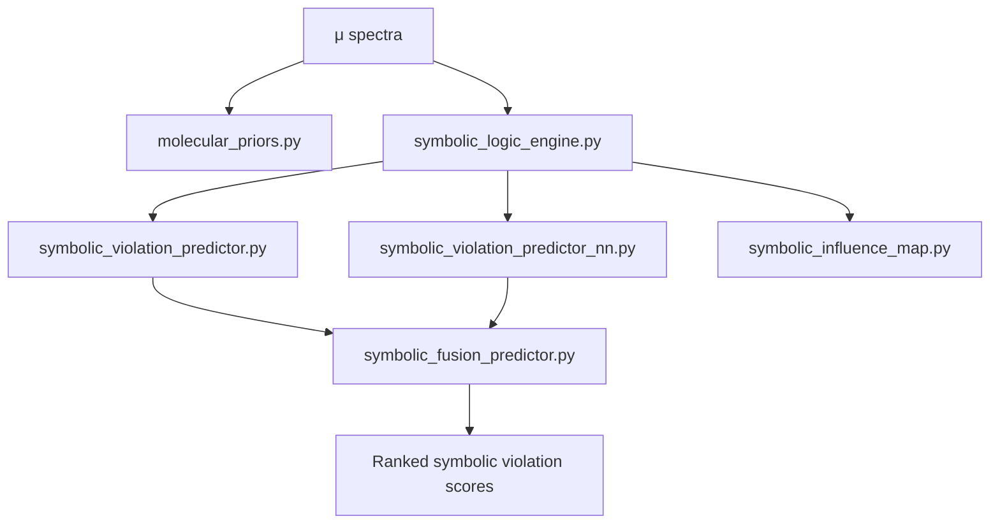

## 📂 Directory Contents

```

models/
├── fgs1\_mamba.py          # FGS1 encoder (Mamba state-space model for long photometric sequences)
├── airs\_gnn.py            # AIRS encoder (Graph Neural Network over spectral bins with edge features)
└── multi\_scale\_decoder.py # Multi-head decoder for μ/σ outputs (supports symbolic overlays)

````

---

## 🔑 Modules

### **`fgs1_mamba.py`**
- Encoder for **FGS1 photometric time series** (shape ~135k × 32 × 32).  
- Uses **Mamba SSM** architecture for efficient long-sequence modeling.  
- Handles temporal jitter and photometric alignment.  
- Outputs compressed latent representations aligned with AIRS encodings.

### **`airs_gnn.py`**
- Encoder for **AIRS spectral channels** (shape ~11k × 32 × 356).  
- Graph nodes = wavelength bins; edges =  
  - spectral proximity,  
  - molecular co-bands (H₂O, CO₂, CH₄, …),  
  - detector region adjacency.  
- Supports edge features (distance, molecule type, detector segment).  
- Configurable GNN backends (GATConv, RGCNConv, NNConv, etc.).

### **`multi_scale_decoder.py`**
- Fusion decoder combining FGS1 and AIRS latent embeddings.  
- Outputs:
  - **μ (mean transmission spectrum)**  
  - **σ (uncertainty estimate)**  
  - Optional quantile/diffusion heads for advanced uncertainty modeling.  
- Symbolic overlays: smoothness, priors, attention fusion.  
- Supports **explainability** (attention weight tracing, symbolic overlays).

---

## 🧭 Data Flow

```mermaid
flowchart LR
  FGS1[FGS1 raw time series] --> ENC1[fgs1_mamba.py]
  AIRS[AIRS spectral frames] --> ENC2[airs_gnn.py]
  ENC1 --> DEC[multi_scale_decoder.py]
  ENC2 --> DEC
  DEC --> MU[μ spectra]
  DEC --> SIG[σ spectra]
````

---

## ✅ Guarantees

* **Physics-informed**: models aligned with telescope data structures (FGS1 = time-series, AIRS = spectral bins).
* **Symbolic-ready**: decoders natively support symbolic priors & overlays.
* **Reproducible**: Configurable via Hydra (`configs/config_v50.yaml`).
* **CI-tested**: Shapes, outputs, and symbolic hooks validated in `selftest.py`.

---

# SpectraMind V50 — `src/symbolic/`

**Neuro-symbolic reasoning modules**: priors, rule engines, violation predictors, and symbolic influence maps.
These integrate astrophysical knowledge (molecular bands, smoothness) into both **training losses** and **diagnostics dashboards**.

---

## 📂 Directory Contents

```
symbolic/
├── molecular_priors.py            # Differentiable masks for molecular bands (H₂O, CO₂, CH₄, …)
├── symbolic_logic_engine.py       # Core symbolic logic engine (per-rule evaluation, masks, losses)
├── symbolic_violation_predictor.py # Rule-based symbolic violation scoring
├── symbolic_violation_predictor_nn.py # Neural predictor of symbolic violations
├── symbolic_fusion_predictor.py   # Ensemble: combines rule-based + neural violation predictors
└── symbolic_influence_map.py      # ∂L/∂μ symbolic influence visualization/export
```

---

## 🔑 Modules

### **`molecular_priors.py`**

* Defines wavelength masks for known absorption bands (e.g., H₂O, CO₂, CH₄).
* Computes differentiable **prior losses**:

  * band consistency,
  * smoothness,
  * monotonic edges,
  * Voigt-like line shape matching.

### **`symbolic_logic_engine.py`**

* Core symbolic reasoning layer.
* Supports **soft** and **hard** evaluation of rules.
* Vectorized per-rule masks & weights.
* Diagnostics outputs: entropy, top-rule, per-planet violation counts.

### **`symbolic_violation_predictor.py`**

* Applies symbolic rules to μ spectra.
* Scores violations per planet/bin.
* Exports CSV/JSON/masks for downstream analysis.

### **`symbolic_violation_predictor_nn.py`**

* Neural version of the violation predictor.
* Learns violation likelihood directly from μ spectra.
* Outputs interpretable per-rule scores.

### **`symbolic_fusion_predictor.py`**

* Hybrid ensemble combining rule-based and neural violation predictors.
* Produces **ranked symbolic violation scores**.
* Dashboard-ready integration for HTML diagnostics.

### **`symbolic_influence_map.py`**

* Computes per-rule ∂L/∂μ gradients.
* Aggregates into influence maps (max, sum, weighted).
* Exports JSON + visual overlays for dashboards.

---

## 🧭 Symbolic Integration Flow



---

## ✅ Guarantees

* **Astrophysics-grounded**: priors reflect real molecular absorption bands.
* **Differentiable**: symbolic losses integrate into PyTorch training.
* **Explainable**: violation scores and influence maps exported for dashboards.
* **Flexible**: rule-based, neural, and hybrid predictors supported.
* **Reproducible**: integrated into Hydra configs and logged via `selftest.py`.

---

> Together, `models/` and `symbolic/` define the **neuro-symbolic heart of V50** — blending deep learning encoders with astrophysical priors and interpretable symbolic overlays.

```
