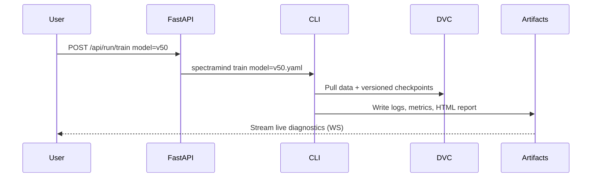

# 🛰️ SpectraMind V50 — Server Architecture (src/server)

## 0) Purpose

This document defines the **server-side architecture** for SpectraMind V50, supporting the
**NeurIPS 2025 Ariel Data Challenge**.

It governs how the **FastAPI orchestration layer** (`src/server/`) integrates with the **Typer CLI (`spectramind …`)**, **Hydra configs**, **DVC data lineage**, and **diagnostics dashboards** to achieve:

* 🧑‍🚀 **NASA-grade reproducibility**
* 🔬 **Physics-informed modeling & symbolic overlays**
* ⚙️ **Modular automation & CI coverage**
* 🖥 **GUI-optional architecture**
* 🏆 **Kaggle-safe runtime** (≤9h GPU jobs, deterministic outputs)

---

## 1) High-Level Layout

```mermaid
flowchart TD
    A0[CLI User]:::cli -->|Typer + Hydra| A1[FastAPI Server]:::srv
    A1 --> B1[cli_bridge.py]:::mod
    A1 --> B2[artifacts.py]:::mod
    A1 --> B3[authz.py]:::mod
    A1 --> B4[main.py]:::mod

    B1 --> C1[SpectraMind CLI (calibrate/train/diagnose/submit)]:::cli
    B2 --> C2[Artifacts (logs, reports, plots, HTML, JSON)]:::data
    B3 --> C3[Role/Access Control (optional)]:::sec
    B4 --> C4[Uvicorn Entrypoint]:::infra

    A1 --> D1[GUI App (React, src/gui/)]:::gui

classDef cli fill:#e3f2fd,stroke:#1565c0,color:#0d47a1;
classDef srv fill:#ede7f6,stroke:#5e35b1,color:#311b92;
classDef mod fill:#fff3e0,stroke:#ef6c00,color:#e65100;
classDef data fill:#f3e5f5,stroke:#6a1b9a,color:#4a148c;
classDef gui fill:#e8f5e9,stroke:#2e7d32,color:#1b5e20;
classDef infra fill:#ede7f6,stroke:#5e35b1,color:#4527a0;
classDef sec fill:#ffebee,stroke:#c62828,color:#b71c1c;
```

---

## 2) Core Modules

### `cli_bridge.py`

* **Role**: Safe wrapper to invoke CLI commands from FastAPI.
* **Features**:

  * Executes `spectramind calibrate|train|diagnose|submit` with Hydra overrides.
  * Returns **structured JSON** (stdout, stderr, exit code).
  * Enforces **reproducibility guardrails** (logs to `v50_debug_log.md`, hashes configs).

### `artifacts.py`

* **Role**: Artifact discovery & streaming service.
* **Artifacts managed**:

  * `v50_debug_log.md`, `diagnostic_summary.json`, HTML dashboards.
  * Plot outputs (UMAP/t-SNE, SHAP overlays, FFT, symbolic maps).
* Provides REST/WS APIs for GUI streaming (charts, logs, live diagnostics).

### `authz.py`

* **Role**: Lightweight role enforcement.
* Supports optional `--role admin|viewer|ci` for local multi-user or CI/CD control.
* Guards artifact access and CLI execution.

### `main.py`

* **Role**: FastAPI + Uvicorn entrypoint.
* Routes:

  * `/api/run/{command}` → CLI bridge.
  * `/api/artifacts/{id}` → Stream logs/reports.
  * `/api/gui` → Optional React GUI bootstrap.

---

## 3) Integration Contracts

* **CLI**: Typer ensures all commands (`calibrate`, `train`, `diagnose`, `submit`) are self-tested.
* **Configs**: Hydra YAMLs in `/configs/` enforce **configuration-as-code**.
* **Data**: DVC versions all raw & processed inputs.
* **Models**: Encoders (Mamba for FGS1, GNN for AIRS), fusion modules, decoders, symbolic loss.
* **Diagnostics**: HTML dashboards embed UMAP/t-SNE, SHAP, symbolic overlays, FFT.
* **Kaggle runtime**: CLI ensures ≤9h walltime, GPU ≤16GB.

---

## 4) Design Principles

1. **CLI-first, GUI-optional**

   * GUI (`src/gui/`) is a **thin shell** over CLI.
   * All actions log to `v50_debug_log.md`.

2. **Symbolic + Physics-informed**

   * Smoothness, non-negativity, FFT, and molecular fingerprint rules are enforced at loss level.

3. **Reproducibility & Auditability**

   * Hydra + DVC + Git commit hash tie every artifact to exact configs and data.
   * CI runs pipeline consistency checks.

4. **Extensibility**

   * Hugging Face pretrained integration.
   * Config groups for calibration, uncertainty, symbolic overlays.
   * Easy swap: add new `configs/model/*.yaml` and CLI picks it up.

---

## 5) Example Workflow



---

## 6) Roadmap

* 🔭 **Experiment tracking**: MLflow/W\&B integration
* 🖥 **GUI expansion**: React dashboards for non-CLI users
* 🧩 **Advanced uncertainty**: COREL conformal prediction
* 🌌 **Physics overlays**: Gravitational lensing & radiation priors
* 🏆 **Leaderboard readiness**: Kaggle submission auto-packaging

---

✅ With this design, `src/server/` acts as the **mission-control bridge** between CLI reproducibility and GUI accessibility, ensuring physics-aware, symbolic, and Kaggle-safe execution.

---
