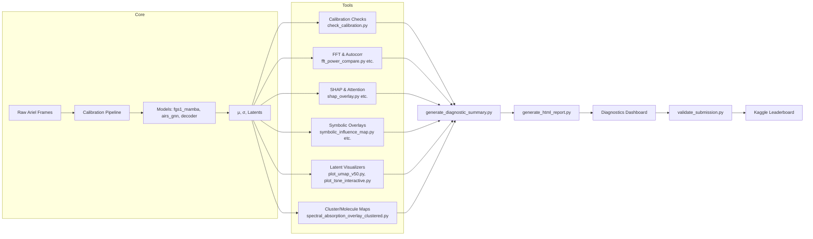

# 🏗️ Architecture — Tools Directory

**SpectraMind V50** · *Neuro-symbolic, physics-informed AI pipeline for the NeurIPS 2025 Ariel Data Challenge*

The `tools/` directory provides the **diagnostics, calibration, visualization, and symbolic overlay layer** on top of the **core modeling pipeline (`src/`)**.
It ensures that every μ/σ prediction is scientifically interpretable, symbolically constrained, and leaderboard-ready.

---

## 🔌 System Position

```
src/models/        → produce μ (mean), σ (uncertainty), latents
src/symbolic/      → supply symbolic constraints, priors, violation predictors
src/utils/         → handle logging, reproducibility, selftests
tools/             → diagnostics, dashboards, ablations, submission validation
spectramind.py     → CLI orchestrator linking everything
```

---

## 🧩 Tools Layer Breakdown

### Calibration & Frequency-Domain

* `check_calibration.py` — validates σ with coverage/z-scores/COREL.
* `fft_power_compare.py`, `analyze_fft_autocorr_mu.py`, `generate_fft_alignment.py`, `generate_fft_autocorr.py` — FFT/Welch/autocorrelation utilities.
* `generate_calibration_preview.py` — bias/dark/flat quicklook plots.

### Symbolic & Explainability

* `symbolic_influence_map.py`, `symbolic_violation_overlay.py`, `symbolic_rule_table.py` — symbolic overlays, rule diagnostics, ∂L/∂μ influence.
* `shap_overlay.py`, `shap_attention_overlay.py`, `shap_symbolic_overlay.py`, `explain_shap_metadata_v50.py` — SHAP + symbolic fusion analysis.

### Visualization

* `plot_umap_v50.py`, `plot_tsne_interactive.py`, `plot_umap_fusion_latents_v50.py` — latent projections with symbolic/SHAP overlays.
* `spectral_absorption_overlay_clustered.py`, `spectral_smoothness_map.py`, `spectral_shap_gradient.py` — molecular overlays, smoothness/gradient maps.

### Aggregation & Dashboards

* `generate_diagnostic_summary.py` — unify diagnostics into JSON.
* `generate_html_report.py` — interactive dashboard bundling UMAP, SHAP, symbolic, FFT, logs.

### Experimentation

* `auto_ablate_v50.py` — config mutation engine with symbolic-aware metrics.
* `config_grid_launcher.py` — Hydra grid search launcher.

### Submission

* `validate_submission.py` — Kaggle-ready CSV validator.
* `generate_dummy_data.py` — dummy dataset generator for testing.
* `review_and_compile.sh` — script to compile diagnostics & submission bundles.

---

## 📊 Architecture Flow



---

## 📐 Design Principles

* **One-way flow**: models → tools → dashboards → submission.
* **Immutable logging**: all runs append to `logs/v50_debug_log.md`.
* **Symbolic fusion**: overlays from `src/symbolic/` integrate into every visualization.
* **Hydra safety**: all configs YAML-driven, reproducible via hash in `run_hash_summary_v50.json`.
* **Leaderboard readiness**: `validate_submission.py` ensures outputs are Kaggle-compliant.

---

## ✅ Integration Standards

* DVC/lakeFS for dataset versioning
* Hydra configs for all parameter sets
* CI smoke tests include tools layer checks
* Unified CLI via `spectramind diagnose ...` and `spectramind submit ...`

---
