# 🛠️ ArielSensorArray — Tools Directory

**SpectraMind V50** · *Neuro-symbolic, physics-informed AI pipeline for the NeurIPS 2025 Ariel Data Challenge*

This directory contains the **extended toolkit** of SpectraMind V50:  
diagnostics, calibration, visualization, and ablation utilities that sit **on top of** the core `src/` pipeline.  
Every tool follows the same standards:

✅ **CLI-ready** (Typer/argparse with `--help`)  
✅ **Hydra-compatible** (configurable, reproducible)  
✅ **Reproducibility-safe** (logs to `logs/v50_debug_log.md` and syncs hashes)  
✅ **CI-tested** (smoke + integration coverage)  

---

## 📂 File Index (36 tools)

📌 Note: The `/tools` directory has **38 files total**. Two (`README.md` and `ARCHITECTURE.md`) are documentation; the rest are **36 CLI-ready tools**.

| Script                                     | Purpose                                                                                 |
| ------------------------------------------ | --------------------------------------------------------------------------------------- |
| `analyze_fft_autocorr_mu.py`               | FFT + autocorrelation diagnostics on μ spectra with symbolic overlays.                  |
| `auto_ablate_v50.py`                       | Symbolic-aware ablation: run sweeps, log metrics, export HTML/Markdown leaderboard.     |
| `check_calibration.py`                     | Evaluate σ calibration (coverage, z-scores, quantiles, COREL checks).                   |
| `config_grid_launcher.py`                  | Launch Hydra grid sweeps with logging, hashing, and parallel job support.               |
| `explain_shap_metadata_v50.py`             | SHAP × metadata × symbolic fusion explainer.                                            |
| `fft_power_compare.py`                     | Compare FFT/Welch power spectra pre/post calibration (FGS1 & AIRS).                     |
| `generate_calibration_preview.py`          | Quick-look plots of bias/dark/flat calibration frames.                                  |
| `generate_coverage_heatmap.py`             | Heatmap of uncertainty coverage across spectral bins.                                   |
| `generate_diagnostic_summary.py`           | Aggregate per-planet diagnostics (GLL, entropy, SHAP, symbolic overlays).               |
| `generate_dummy_data.py`                   | Produce synthetic Ariel-like test data for debugging and demos.                         |
| `generate_fft_alignment.py`                | Verify calibration via FFT alignment across lightcurves.                                |
| `generate_fft_autocorr.py`                 | Auto-generate FFT + autocorrelation reports.                                            |
| `generate_fft_symbolic_fusion.py`          | Fuse FFT PCA with symbolic fingerprints; output clusters and UMAP plots.                |
| `generate_html_report.py`                  | Full interactive diagnostics dashboard (UMAP, t-SNE, SHAP, symbolic, logs).             |
| `generate_lightcurve_preview.py`           | Visualize raw vs calibrated lightcurves.                                                |
| `generate_phase_alignment.py`              | Phase-fold and align lightcurves for inspection.                                        |
| `gll_error_localizer.py`                   | Localize bin-wise GLL errors in spectra.                                                |
| `plot_benchmarks.py`                       | Compare benchmark runs and models visually.                                             |
| `plot_fft_power_cluster_compare.py`        | Compare FFT power across planet clusters.                                               |
| `plot_gll_heatmap_per_bin.py`              | Heatmap of GLL scores per wavelength bin.                                               |
| `plot_tsne_interactive.py`                 | Interactive latent-space t-SNE visualization.                                           |
| `plot_umap_fusion_latents_v50.py`          | UMAP visualization with symbolic overlays & fusion labels.                              |
| `plot_umap_v50.py`                         | UMAP projection of latent encodings with symbolic coloring.                             |
| `review_and_compile.sh`                    | Meta-script to gather results and compile reports.                                      |
| `shap_attention_overlay.py`                | Fuse SHAP attributions with decoder attention weights.                                  |
| `shap_overlay.py`                          | SHAP × μ overlays; entropy scoring and anomaly flags.                                   |
| `shap_symbolic_overlay.py`                 | SHAP × symbolic fusion overlays for interpretability.                                   |
| `simulate_lightcurve_from_mu.py`           | Generate synthetic lightcurves from μ predictions.                                      |
| `spectral_absorption_overlay_clustered.py` | Cluster spectral overlays by molecular absorption bands.                                |
| `spectral_shap_gradient.py`                | Gradient-based SHAP diagnostics (∂μ/∂input, ∂σ/∂input).                                |
| `spectral_smoothness_map.py`               | Visualize spectral smoothness & symbolic smoothness penalties.                          |
| `symbolic_influence_map.py`                | ∂L/∂μ symbolic influence maps across rules/planets.                                     |
| `symbolic_rule_table.py`                   | Generate symbolic rule leaderboard in HTML/CSV.                                         |
| `symbolic_violation_overlay.py`            | Overlay symbolic violations on predicted spectra.                                       |
| `validate_submission.py`                   | Kaggle submission validator (CSV schema, hash, runtime).                                |

---

## 🔗 Workflow Integration

```text
Raw Frames → Calibration → μ/σ Prediction
             ↘ tools/diagnostics ↙
generate_diagnostic_summary.py → generate_html_report.py → dashboard.html
````

All diagnostic outputs are linked back into the **SpectraMind V50 dashboard** for inspection, validation,
and Kaggle submission prep.

---

## 📊 Architecture Diagram

```mermaid
flowchart TD
    A[Raw Frames] --> B[Calibration]
    B --> C[Prediction (μ, σ)]
    C --> D[Tools Layer]

    subgraph Tools
      T1[FFT<br/>fft_power_compare.py]
      T2[Calibration<br/>check_calibration.py]
      T3[SHAP<br/>shap_overlay.py]
      T4[Symbolic<br/>symbolic_influence_map.py]
      T5[Latents<br/>plot_umap_v50.py<br/>plot_tsne_interactive.py]
      T6[Clusters<br/>spectral_absorption_overlay_clustered.py]
    end

    D --> T1 & T2 & T3 & T4 & T5 & T6

    T1 & T2 & T3 & T4 & T5 & T6 --> E[generate_diagnostic_summary.py]
    E --> F[generate_html_report.py]
    F --> G[Diagnostics Dashboard (HTML)]
    G --> H[validate_submission.py]
    H --> I[Kaggle Leaderboard]
```

---

## 🗺️ Diagnostics Constellation Map

A bird’s-eye view of the tool families (as “constellations”) that orbit the V50 core.

```mermaid
graph TB
  subgraph "Calibration & FFT"
    CF1[generate_fft_alignment.py]
    CF2[generate_fft_autocorr.py]
    CF3[fft_power_compare.py]
    CF4[analyze_fft_autocorr_mu.py]
  end

  subgraph "SHAP & Attention"
    SA1[shap_overlay.py]
    SA2[shap_attention_overlay.py]
    SA3[explain_shap_metadata_v50.py]
    SA4[spectral_shap_gradient.py]
  end

  subgraph "Symbolic & Rules"
    SY1[symbolic_violation_overlay.py]
    SY2[symbolic_influence_map.py]
    SY3[symbolic_rule_table.py]
    SY4[generate_fft_symbolic_fusion.py]
  end

  subgraph "Latents & Clusters"
    LC1[plot_umap_v50.py]
    LC2[plot_tsne_interactive.py]
    LC3[plot_umap_fusion_latents_v50.py]
    LC4[spectral_absorption_overlay_clustered.py]
  end

  subgraph "Packaging & Submission"
    PS1[generate_diagnostic_summary.py]
    PS2[generate_html_report.py]
    PS3[validate_submission.py]
    PS4[review_and_compile.sh]
  end

  Core[μ/σ Prediction]:::core

  Core --- CF1 & CF2 & CF3 & CF4
  Core --- SA1 & SA2 & SA3 & SA4
  Core --- SY1 & SY2 & SY3 & SY4
  Core --- LC1 & LC2 & LC3 & LC4
  CF1 & SA1 & SY1 & LC1 --> PS1
  PS1 --> PS2 --> PS3

  classDef core fill:#0b5fff,stroke:#0b5fff,color:#fff,font-weight:700;
```



---

## 🧭 Standards & Best Practices

* **Hydra configs**: all tools configurable & reproducible
* **DVC + lakeFS**: dataset version control for calibration & diagnostics
* **CI coverage**: unit + smoke tests for every script
* **Append-only logs**: `logs/v50_debug_log.md` for immutable history
* **Submission compatibility**: Kaggle CSV schema enforced by `validate_submission.py`

---

## 🌌 Why These Tools Matter

Each tool extends the V50 pipeline’s **NASA-grade reproducibility** and **challenge-grade rigor**:
FFT tools confirm calibration, SHAP/symbolic tools ensure explainability, UMAP/t-SNE reveal latent physics,
and ablation utilities push configs toward **leaderboard-winning performance**.

Together, they form a **diagnostics constellation** orbiting the V50 core.

---

```
```
